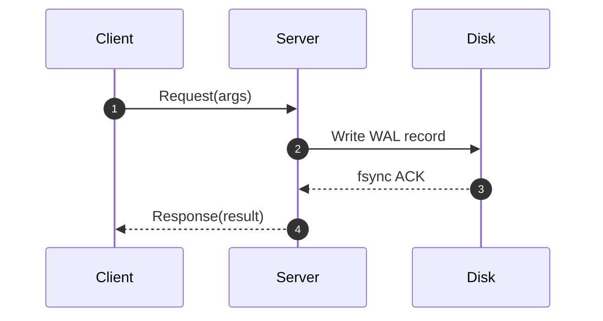
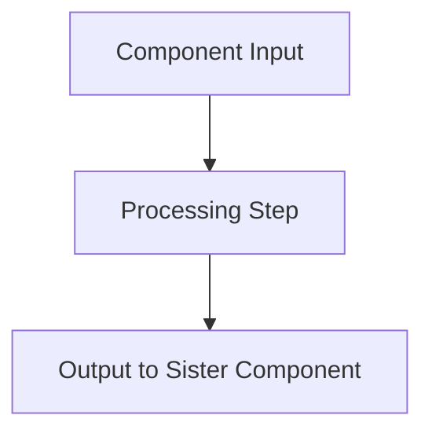

# UW CSE Notes - Agent Rules & Repository Standards

This document defines the universal repository conventions, note structures, and operational workflows for all AI coding agents working within this Obsidian vault. It serves as the single source of truth for repository guidelines.

---

## Agent Interoperability & File Architecture

- **Canonical Configuration**: `AGENT.md` is the primary and canonical specification file.
- **Symlinks**: Assistant-specific configuration files (`CLAUDE.md`, `GEMINI.md`) must be symbolic links pointing directly to `AGENT.md` to guarantee that rules never drift across different AI platforms or models.
- **Rule Precedence**: All agents must adhere strictly to the rules codified here. When creating or modifying files in this vault, consistency with existing notes and established course terminology takes absolute priority.

---

## Standard Note Templates & Scaffolds

Every note created in this repository must follow a standardized structure depending on its type. Agents must not invent arbitrary layouts.

### 1. Detailed Topic Note (Primary Template)

Use this template for all standard lecture notes, algorithm explanations, and technical topic pages.

```markdown
# Course: Topic Name

Brief 1–2 sentence orientation statement introducing what problem this abstraction or algorithm solves and where it fits within the system hierarchy.

## [Topic Name] Motivation & Overview

Detailed explanation of the problem context.
- Why this abstraction or mechanism is necessary.
- Fundamental limitations or failure modes of naive approaches.
- Constraints and assumptions of the system environment.

---

## Architecture & Core Mechanics

Detailed technical explanation of the internal mechanism.
- Core data structures, state machines, invariants, and memory/disk layouts.
- Step-by-step algorithmic logic and message flows.
- Always explain both the **how** and the **why** behind architectural decisions.



---

## Concrete Walkthrough & Execution Trace

Step-by-step trace through a concrete, realistic scenario with real values or states.
- Initial state ($t = 0$).
- Chronological execution steps, showing state transitions at each stage.
- Final state and post-conditions.

```
Initial State:
  Node A: Primary, Term 1, Log Index 0
  Node B: Backup, Term 1, Log Index 0

Trace:
  1. Client sends write X = 5 to Node A
  2. Node A appends <T1, Index 1, Write X=5> to WAL
  3. Node A replicates to Node B via RPC
  4. Node B flushes to disk and sends ACK
  5. Node A marks entry CHOSEN and replies to Client
```

---

## Edge Cases, Failure Modes & Mitigations

Comprehensive breakdown of failure modes and edge scenarios:
- Node crashes, network partitions, message drops, or out-of-order deliveries.
- Concurrency races, deadlock potential, and split-brain risks.
- Concrete recovery mechanisms and invariants preserved during recovery.

---

## Formal Analysis / Protocol Specification

*(Include this section ONLY when there is a formal mathematical definition, state machine invariant, notation, or protocol pseudocode. Omit for purely descriptive topics.)*

### Formal Definition
$$TS(T) < WT(X)$$
$$\forall k \in Keys, \quad \text{Replicas}(k) \cap \text{Quorum} \neq \emptyset$$

### Simplified Explanation
Plain-English intuitive summary explaining the mathematical or algorithmic rule without dense notation.

---

## Deep Dive

*(Include this section ONLY when adding material beyond what was taught in class. Omit entirely if no external material is introduced.)*

Supplemental technical context, real-world industry implementations, modern research paper extensions, or underlying hardware interactions that expand upon the lecture material without cluttering the core class notes.

---

## Industry Standard Terms

A structured mapping from course-specific terminology to industry-standard and real-world equivalents:

| Course Term | Industry / Standard Term |
| :--- | :--- |
| **Course-Specific Name** | Industry Equivalent / Production Term |

---

## Related

- [[Disambiguated/Path/To/Related Note|Link Label]] — Brief 1-line description of how this note connects to the current topic
- [[Disambiguated/Path/To/Prerequisite Note|Link Label]] — Brief 1-line description of the conceptual dependency
```

---

### 2. Component Note Template (`*Components/`)

Use this template for sub-files located in a `*Components/` directory when a complex topic has been split according to the Encapsulation rules.

```markdown
# Course: Parent Topic — Component Name

Brief 1–2 sentence contextual statement linking this component back to the parent topic and explaining its exact role in the broader system.

## Role & Core Mechanics

- In-depth technical breakdown of this specific sub-mechanism.
- Data structures, state transitions, and interactions with sister components.



## Concrete Execution & Failure Behavior

- Detailed trace of this component in action.
- How this component handles anomalies, timeouts, or partial failures.

---

## Related

- [[Disambiguated/Path/To/Parent Topic|Parent Topic]] — Primary navigation hub for this subsystem
- [[Disambiguated/Path/To/Sister Component|Sister Component]] — Parallel component handling related functionality
```

---

### 3. Topic Hub Note Template

Use this template for top-level navigation files that serve as index hubs for a major subsystem (short, 2–10 lines).

```markdown
# Course: Topic Hub

Brief 1–2 sentence overview defining the topic domain and high-level responsibilities.

## Core Concepts & Subtopics

- [[Disambiguated/Path/To/Topic A|Topic A]] — 1-line summary of role and responsibilities
- [[Disambiguated/Path/To/Topic B|Topic B]] — 1-line summary of role and responsibilities
- [[Disambiguated/Path/To/Topic C|Topic C]] — 1-line summary of role and responsibilities

---

## Related
- [[Disambiguated/Path/To/Parent Index|Course Index]] — Master course navigation hub
```

---

### 4. Definition Note Template (`Definitions/`)

Use this template for entries in `Definitions/` folders (short, 1–3 sentences each). Only extract to `Definitions/` if referenced by 2 or more files.

```markdown
# Course: Term Name

**[[Term Name]]**: Concise 1–3 sentence definition establishing the exact technical meaning, core invariants, and primary operational context of the term.

---

## Related
- [[Disambiguated/Path/To/Primary Context|Primary Topic]] — Main system context where this term is applied
```

---

### 5. Course Master Index Template (`Index.md`)

Master navigation hub for each course directory.

```markdown
# Course Name: Index

Brief description of the course scope, fundamental problems covered, and core system abstractions.

- [[README|Course Introduction]] — Overview of course structure, labs, and reference materials

---

## Topics

### Topic Area 1
- [[Disambiguated/Path/To/Note 1|Display Label]] — Brief description of key concepts covered
- [[Disambiguated/Path/To/Note 2|Display Label]] — Brief description of key concepts covered

### Topic Area 2
- [[Disambiguated/Path/To/Note 3|Display Label]] — Brief description of key concepts covered
```

---

## Note Conventions & Quality Rules

### 1. Progressive Narrative Flow
- Sections within a detailed file **must build on each other logically**, like a mathematics textbook where foundational principles precede advanced theorems.
- Follow this progression where applicable:
  $$\text{Core Motivation} \longrightarrow \text{Architecture / Mechanics} \longrightarrow \text{Walkthrough / Trace} \longrightarrow \text{Physical Details} \longrightarrow \text{Edge Cases / Trade-offs}$$
- Never backtrack or scatter related concepts across disparate sections.

### 2. Deep Technical Detail ("Not Sparknotes")
- Explanations must be thorough and uncompromisingly rigorous. Always explain the underlying **how** and **why** (e.g., physical storage mechanics, cache invalidation protocols, disk sector layouts, algorithmic invariants).
- **Never sacrifice technical depth for brevity.** The objective is to expand notes with explanatory rigor, never to summarize or condense them into superficial outlines.

### 3. Strictly Class Notes — No New Content in the Main Body
- The **main body** of every note reflects strictly what was taught in class, lecture slides, or official course readings.
- Do not introduce outside concepts, unmentioned algorithms, or alternative frameworks into the main narrative. You may explain the "how" and "why" of existing lecture concepts, but do not branch into tangential topics.
- **Deep Dive Section for External Additions**: Any material that goes *beyond* class coverage (modern production systems, hardware-level nuances, cross-course tie-ins, extended formal proofs) **must be placed in a dedicated `## Deep Dive` section at the bottom of the file** (after the main narrative, before Industry Standard Terms / Related). If no external content is added, omit the `## Deep Dive` heading entirely.

### 4. Strict Course Terminology
- Strictly adopt the exact terminology used in the course lectures, assignments, and labs.
  - *Example*: In CSE 452, use **ShardMaster** and **ShardKV Group**, not generic industry terms like "Control Plane" or "Data Plane".
  - *Example*: In database recovery, preserve the exact log record syntax used in class (e.g., `<COMMIT T>`, `<ABORT T>`, `CLR` with `undoNextLSN`), rather than generic descriptions.
- Consult existing files in that course directory to verify established naming before creating or editing notes.
- Bridge course terminology to real-world equivalents in the dedicated **Industry Standard Terms** section at the bottom.

### 5. Dual-Layer Explanations
- Apply whenever there is a formal mathematical or algorithmic definition (equations, inequalities, state machine transitions, formal protocol steps).
- Place dual-layer explanations near the bottom under `## Formal Analysis` or `## Protocol Specification`.
- Provide two complementary views:
  1. `### Formal Definition`: Precise mathematical or algorithmic rigor ($LaTeX$ equations, invariants).
  2. `### Simplified Explanation`: High-intuition, plain-English summary.
- *Example Format:*
  ```markdown
  ### Formal Definition
  $TS(T) < WT(X)$

  ### Simplified Explanation
  Someone from the future already changed it.
  ```

### 6. Robust Mermaid Diagrams
- Include a Mermaid diagram whenever it clarifies flows, timelines, network exchanges, state machines, or protocol sequences.
- **Mandatory Diagram Rule**: Always add a Mermaid diagram when the note lacks lecture slide PNG screenshots, serving as the primary visual model.
- Formatting requirements:
  - Sequence diagrams: `sequenceDiagram` with explicit participant aliases.
  - Flowcharts / State diagrams: `flowchart TD`, `flowchart LR`, or `stateDiagram-v2`.
  - Arrow labels: Use `-->|label|` or `==>|label|`.
  - **Avoid leading numbers followed by a period in labels** (e.g., use `(1) Step` or `1: Step`, never `1. Step` which breaks Markdown parsers).
  - Use `subgraph ID [Title]` syntax for clustering.
  - Quote labels containing parentheses or special characters: `id["Label (Context)"]`.

### 7. Encapsulation & Knowledge Graph (DRY Architecture)
- Treat the entire vault as an interconnected knowledge graph.
- **Definitions**: Only extract terms into a `Definitions/` directory if referenced by **2 or more files**. Otherwise, define them inline in the topic file.
- **Components**: Split a topic into a main hub file and a `*Components/` directory when it contains **3 or more distinct sub-concepts that each require multi-paragraph treatment**. Keep minor sub-concepts inline.
- **DRY Rule**: If a concept is explained across **2 or more other files**, extract it into a single dedicated file and link to it. Maintain a single source of truth.
- **No God Files**: Never create monolithic files that attempt to cover entire domains. Split excessively large files. Avoid nesting deeper than 3 levels of heading hierarchy within a single document.

### 8. Linking & References
- **Obsidian Wiki-Links**: Use `[[Target Note]]`.
- **Disambiguated Links**: Use full relative vault paths when ambiguity exists: `[[CSE451/Virtualization/Memory/Virtual Memory]]`.
- **Display Text Overrides**: `[[Course/Topic/Long Note Name|Short Label]]`.
- **Embedded Screenshots**: Store images in the course `Screenshots/` directory and embed via `![[Screenshots/filename.png]]`.
- **Cross-Course References**: Freely link across courses when concepts intersect: `[[CSE351/System Programming/Exceptions]]`.
- **Linking Density Rule**: Cross-link on **first mention per section only** — avoid spamming links on every repeated word, but re-link when a term appears in a new major section.
- **No Dangling or Dead Links**: **NEVER create a wiki-link (`[[Target Note]]`) unless the target note actually exists on disk in the vault or is actively being created.** Do not invent speculative links for general terms or words (e.g., do not write `[[Rust]]` or `[[Concurrency]]` if no dedicated note file exists for them). Always verify target paths against real files on disk before adding links.

### 9. Typography & Professional Formatting
- **Bold on First Introduction**: Use `**Term**: Definition text` when a concept is first defined. Only wrap the term in a wiki-link (`**[[Term]]**: Definition text`) if a dedicated note file actually exists for that term in the vault.
- **Acronyms**: Always state the full name first with parenthetical acronym, e.g., `Cyclic Redundancy Check (CRC)`, `Two-Phase Locking (2PL)`.
- **Math & Equations**: Render all math via LaTeX using `$...$` inline and `$$...$$` display blocks.
- **Comparison Tables**: Use markdown tables with aligned pipes (`| :--- | :--- |`) for contrasting models, trade-offs, or protocols.
- **Strictly No Emojis**: Enforce a clean, academic, professional tone. Strictly eliminate emojis from headings, lists, and body copy.
- **Personal Annotations**: Student personal thoughts or annotations must use the prefix `Me: ...`.
- **Source Attributions**: Cite textbook or lecture slide sources at the bottom (e.g., OSTEP Chapter references, paper citations).

---

## Directory & File Organization

- **Course Directories**: Flat root folders for each course (e.g., `Distributed Systems/`, `Database Internals/`, `Operating Systems/`).
- **File Naming**: Title Case, multi-word descriptive filenames (e.g., `Two-Phase Commit.md`, `External Merge Sort.md`). Avoid ambiguous abbreviations.
- **Subdirectories**:
  - `*Components/`: Sub-topic breakdown files.
  - `Definitions/`: Short 1–3 sentence glossary terms.
  - `Screenshots/`: PNG/JPG images referenced in notes.
- **Navigation Hubs**:
  - Master repository index: `Vault Index.md`.
  - Course-level index: `Index.md` in every course folder.
  - Course README: `README.md` introducing course details.
- **Master Index Invariant**: **Always update the corresponding course `Index.md`** immediately whenever a note is created, renamed, moved, or split.

---

## Workflow: Creating or Refactoring Notes (18-Step Pipeline)

When processing raw lecture transcript dumps or creating notes from scratch, follow this exact 18-step checklist:

1. **Fix Grammar & Typos**: Clean up transcription errors, typos, and fragmented lecture phrasing.
2. **Add `# Course: Topic` Title**: Ensure line 1 begins with the standardized title heading (e.g., `# Distributed Systems: Two-Phase Commit`).
3. **Add Wiki-Links**: Insert `[[Target Note]]` cross-links on first mention per section, linking to specific headings (`[[Page#Heading]]`) when applicable. Always verify target notes exist in the vault—**never introduce dead or phantom links**.
4. **Bold Key Terms**: Bold terms upon their initial definition in the text (`**Term**`). Do not wrap terms in `[[...]]` unless a dedicated note file actually exists for them.
5. **Delete Empty Stubs**: Remove empty or near-empty stub files (1–2 lines of no substantive value).
6. **Consolidate Redundancies**: If two files cover identical material, merge them into the more comprehensive file and update references.
7. **Organize Images**: Move loose image files into the course `Screenshots/` directory and update embed links.
8. **Add Related Section**: Append a `## Related` section at the bottom linking to prerequisites and related notes with 1-line rationales.
9. **Enforce Progressive Flow**: Reorganize sections into logical instructional order: Motivation $\to$ Mechanics $\to$ Trace $\to$ Physical Details $\to$ Edge Cases.
10. **Preserve & Expand Depth**: Never truncate or shorten notes. Expand technical depth by explaining the underlying mechanisms ("how" and "why").
11. **Enforce Main Body Purity**: Keep the main body strictly aligned with lecture content; isolate outside additions in a `## Deep Dive` section at the bottom.
12. **Add Cross-Course Connections**: Link to relevant prerequisite or advanced topics in other courses using disambiguated paths.
13. **Rename to Title Case**: Standardize filenames to clean Title Case descriptive names.
14. **Encapsulate & Split**: If a topic has 3+ sub-concepts needing multi-paragraph treatment, create a `*Components/` folder and split them. Extract shared concepts (2+ references) to avoid duplication.
15. **Enforce Professional Style**: Eliminate all emojis from headers and content.
16. **Infer Path & Placement**: Place new notes in the appropriate course topic folder matching vault taxonomy. Ask user if placement is ambiguous.
17. **Update `Index.md`**: Add the new or renamed file to the course `Index.md` under the appropriate thematic subsection.
18. **Add Industry Standard Terms**: Append a mapping table translating course terminology to real-world production terms.

---

## Anki Flashcard Conventions

Generate Anki flashcards **only when explicitly requested by the user**. Never generate them unprompted.

When requested, follow these strict principles:
- **Card Front**: Frame questions around "Why" or "What happens when" to test mechanical and causal reasoning rather than rote memorization.
  - *Good*: "Why does Two-Phase Commit require the coordinator to write a COMMIT record to disk before sending COMMIT RPCs to participants?"
  - *Bad*: "What is the coordinator in Two-Phase Commit?"
- **Card Back**: 3 to 5 clear, dense sentences explaining the mechanism. If longer, it encourages memorization over understanding.
- **Process**: Formulate the explanation from conceptual understanding first, then verify technical accuracy against the notes.
- **Trip Wires**: Include a dedicated line highlighting common student traps, fallacies, or misconceptions.
  - *Example*: `Trip Wire: Common misconception is that participants can decide to commit independently if coordinator times out—they cannot, because other participants might have voted ABORT.`

---

## Version Control & Git Discipline

All agents operating in this repository must follow strict version control constraints:

1. **Explicit Directives Only**: NEVER execute staging (`git add`), committing (`git commit`), branch switching, or pushing unless the user provides an explicit, unambiguous command (e.g., "Commit these changes", "Stage the files").
2. **Ask-First Basis**: Even when an explicit command is given, **all git write commands must be presented to the user for confirmation prior to execution**. Detail the exact command line and changed files, and await approval.
3. **No Autonomous Commits**: Implementation is complete when the markdown files and directory structure are verified on disk. The user retains sole jurisdiction over repository git history and commit state.
