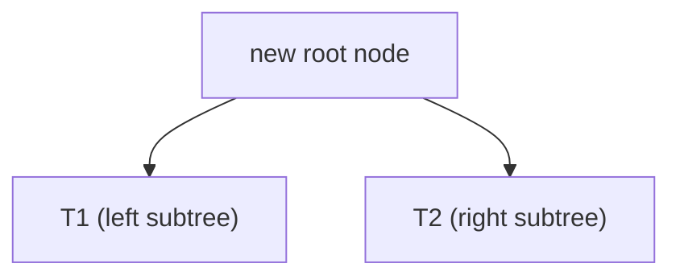

# CSE 311: Rooted Binary Tree Definition

A **rooted binary tree** is an [[CSE311/Part I - Mathematical Foundations/Data Structures/Inductive Data Types|inductive data type]] defined recursively, following the basis-plus-recursive-step pattern of a [[CSE311/Part I - Mathematical Foundations/Sets and Relations/Recursive Definition of Sets|recursive set definition]].

**Basis:** $(\cdot)$ — a single node — is a rooted binary tree.

**Recursive Step:** If $T_1$ and $T_2$ are rooted binary trees, then the following is also a rooted binary tree:

$$\begin{array}{c} \cdot \\ / \quad \backslash \\ T_1 \quad T_2 \end{array}$$

In words: a new tree is formed by attaching two existing trees $T_1$ and $T_2$ as the left and right subtrees of a fresh root node. Because every tree traces back to single-node basis elements through finitely many recursive steps, the structure is always finite and well-defined.

## Related

- [[CSE311/Part I - Mathematical Foundations/Data Structures/Rooted Binary Trees Functions|Rooted Binary Trees Functions]]
- [[CSE311/Part I - Mathematical Foundations/Data Structures/Inductive Data Types|Inductive Data Types]]
- [[CSE311/Part I - Mathematical Foundations/Sets and Relations/Recursive Definition of Sets|Recursive Definition of Sets]]
- [[CSE311/Part II - Formal Reasoning/Proof Techniques/Structural Induction|Structural Induction]]

## Industry Standard Terms

| CSE 311 Term | Industry-Standard Equivalent |
| --- | --- |
| Rooted binary tree | Binary tree |
| Basis (single node) | Leaf node / base case |
| Recursive step | Internal node with two children |
