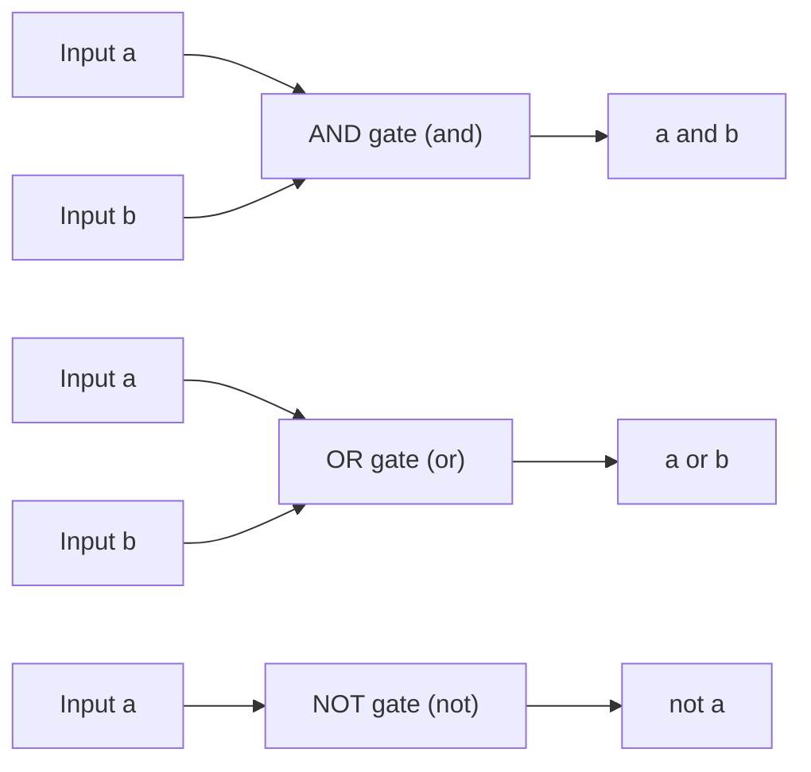

# CSE 311: Digital Circuits

## Application

In **digital circuits**, the logical truth values of [[CSE311/Part I - Mathematical Foundations/Logic/Boolean Algebra|Boolean algebra]] map directly onto binary electrical signals:

- $\text{T} = 1$ (high voltage)
- $\text{F} = 0$ (low voltage)
- **Gates**: physical components that take one or more input signals and produce an output signal. Each gate implements one logical operator, so a circuit built from gates computes a propositional formula in hardware.

## Gates

Each gate corresponds to a logical connective:

- **AND gate** ($\land$): outputs $1$ only when *all* inputs are $1$ — the hardware form of conjunction.
- **OR gate** ($\lor$): outputs $1$ when *at least one* input is $1$ — the hardware form of disjunction.
- **NOT gate** ($\neg$): a single-input gate (an **inverter**) that flips its input: $1 \to 0$ and $0 \to 1$.

Because any proposition can be written in [[CSE311/Part I - Mathematical Foundations/Logic/Normal Form|CNF or DNF]], any logical function can be built physically from just AND, OR, and NOT gates.

## Related

- [[CSE311/Part I - Mathematical Foundations/Logic/Boolean Algebra|Boolean Algebra]]
- [[CSE311/Part I - Mathematical Foundations/Logic/Truth Tables|Truth Tables]]
- [[CSE311/Part I - Mathematical Foundations/Logic/Normal Form|Normal Form]]

## Industry Standard Terms

| CSE 311 Term | Industry-Standard Equivalent |
| --- | --- |
| Gate | Logic gate |
| NOT gate | Inverter |
| Circuit | Combinational logic circuit |
