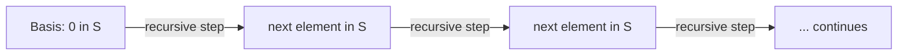

# CSE 311: Recursive Definition of Sets

A **recursive definition of a set** specifies its members by starting from a base case and applying a rule repeatedly. Standard format:

- **Basis Step**: explicitly state which element(s) are in the set (e.g., $0 \in S$).
- **Recursive Step**: if $x \in S$, then (do something to $x$) $\in S$.

Every element can be traced back to the basis through a finite number of recursive steps, which guarantees the set is well-defined — nothing is in the set unless it can be built this way.

This basis-plus-recursive-step pattern is the same one used to define [[CSE311/Part I - Mathematical Foundations/Data Structures/Inductive Data Types|inductive data types]] such as the [[CSE311/Part I - Mathematical Foundations/Data Structures/List of Integers|List of Integers]], the [[CSE311/Part I - Mathematical Foundations/Data Structures/Rooted Binary Tree Definition|rooted binary tree]], and the [[CSE311/Part I - Mathematical Foundations/Sets and Relations/Set of Strings|set of strings]] $\Sigma^*$. Because the set is built in finite steps, properties about all its elements are proved by [[CSE311/Part II - Formal Reasoning/Proof Techniques/Structural Induction|structural induction]].

## Related

- [[CSE311/Part I - Mathematical Foundations/Sets and Relations/What is a Set|What is a Set]]
- [[CSE311/Part I - Mathematical Foundations/Data Structures/List of Integers|List of Integers]]
- [[CSE311/Part I - Mathematical Foundations/Sets and Relations/Set of Strings|Set of Strings]]
- [[CSE311/Part II - Formal Reasoning/Proof Techniques/Structural Induction|Structural Induction]]

## Industry Standard Terms

| CSE 311 Term | Industry-Standard Equivalent |
| --- | --- |
| Recursive set definition | Inductive definition |
| Basis step | Base case |
| Recursive step | Inductive / generative rule |
