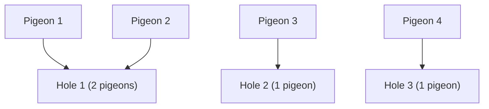

# CSE 312: Pigeonhole Principle

The **Pigeonhole Principle** is a counting argument about guaranteed collisions when distributing objects into containers. In its basic form, if $n$ objects are placed into $k$ boxes and $n > k$, then at least one box must contain two or more objects — there are simply not enough boxes to give every object its own.

## Strong Pigeonhole Principle

The **strong (generalized) form** sharpens this guarantee. If $n$ objects are placed into $k$ boxes, then at least one box contains at least $\lceil n/k \rceil$ objects.

### Formal Definition

$$\text{At least one box has} \geq \left\lceil \frac{n}{k} \right\rceil \text{ objects}$$

### Simplified Explanation

If the objects were spread as evenly as possible, every box would hold the average $n/k$. Since a box cannot hold a fractional object, some box must round up to $\lceil n/k \rceil$. The principle tells you about any guaranteed collisions or overlaps when distributing objects across a limited number of containers.

With 4 pigeons and 3 holes, at least one hole must contain $\lceil 4/3 \rceil = 2$ pigeons.

## Example

If you have to grow 10 crops, and you have 3 seasons to grow them in, then:
- **Pigeons:** The 10 crops
- **Pigeonholes:** The 3 seasons
- **Mapping:** Which crop you grow in which season.

Applying the strong pigeonhole principle, there is at least one season where you will grow at least $\lceil 10/3 \rceil = 4$ crops.

## Practical Tips

When applying the principle, clearly state:
1. What are the pigeons?
2. What are the pigeonholes?
3. How do you map from pigeons to pigeonholes?

Look for a set you're trying to divide into groups, where collisions would help you somehow.

## Related

- [[Product Rule]]
- [[Complementary Counting]]

## Industry Standard Terms

- **Pigeonhole Principle** → "Dirichlet's box principle" / "Dirichlet drawer principle." The strong form is the "generalized pigeonhole principle."
