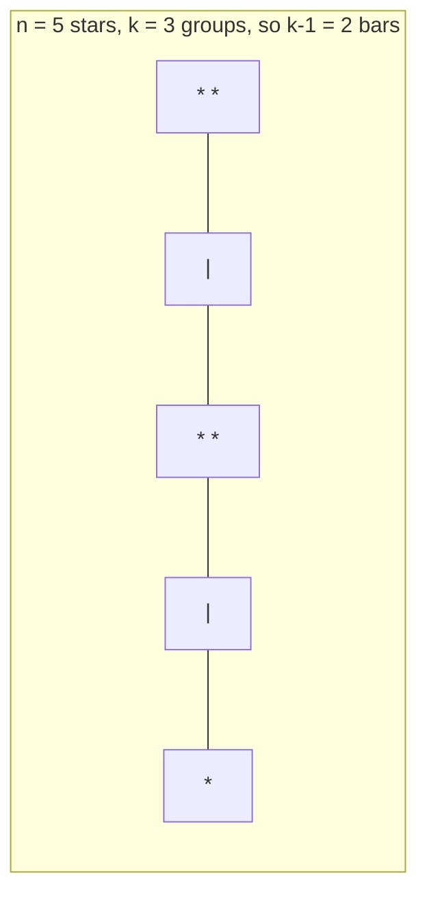

# CSE 312: Stars and Bars

**Stars and Bars** counts the number of ways to distribute $n$ identical objects among $k$ distinct groups, where order within a group does not matter and every element of a group is indistinguishable.

### Formal Definition

$$\binom{n+k-1}{k-1} = \frac{(n+1)(n+2)\cdots(n+k-1)}{(k-1)!}$$

### Simplified Explanation

Picture the $n$ objects as a row of stars. To split them into $k$ groups you only need $k-1$ dividers ("bars") placed between stars. Each distinct placement of the bars produces a distinct distribution, so the count is simply the number of ways to choose where the bars go among the $n + k - 1$ total symbols. This is why the technique reduces a distribution problem to a single [[Number of Subsets Formula|combination]].

In the arrangement above, the two bars split five stars into groups of sizes $2, 2, 1$.

## Example

Suppose you want to buy 12 seeds from Pierre's General Store, and there are 5 types of seeds (parsnip, cauliflower, potato, kale, garlic).
- We are picking $n = 12$ objects from $k = 5$ groups.
- The seeds of each type are indistinguishable, so only the count taken from each type matters — this is exactly a stars-and-bars distribution.
- The number of possible selections is $\binom{12+5-1}{5-1} = \binom{16}{4}$.

## Related

- [[Product Rule]]
- [[Number of Subsets Formula]]
- [[Overcounting]]
- [[Distribution]]

## Industry Standard Terms

- **Stars and Bars** → "Combinations with Repetition" / "Multiset Coefficient" / "Compositions of an Integer"
