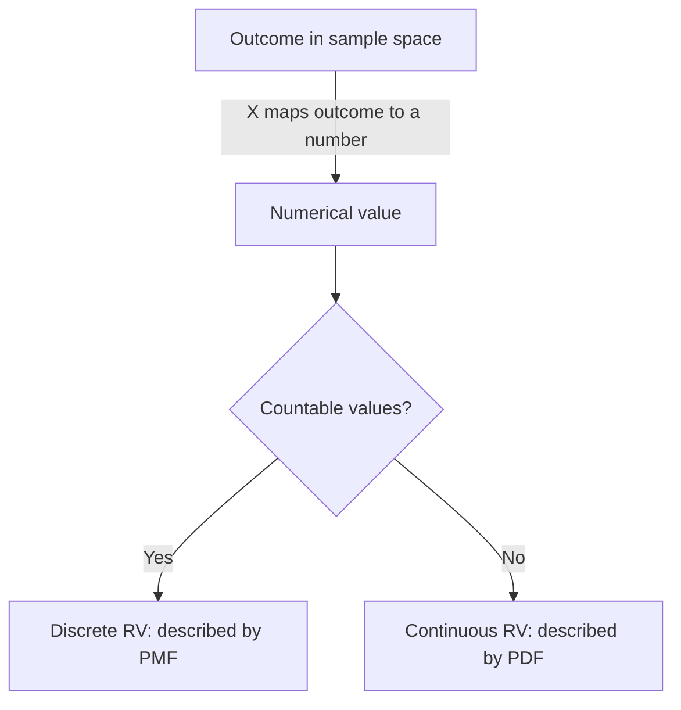

# CSE 312: Random Variables

#Definition A **random variable** is a way to summarize the outcome of an event as a numerical value. Formally, it is a function that maps each outcome in the [[Sample Space and Events|sample space]] to a real number, so that probabilities can be computed over numbers rather than raw outcomes.

$$P(X)$$

Every random variable has a **[[Support]]** — the set of values it can actually take with non-zero probability — and a **[[Range]]**, denoted $\Omega_X$.

## Discrete vs. Continuous

Random variables come in two kinds, distinguished by the kind of set their values come from:

- A **[[Discrete Random Variables|discrete random variable]]** takes values from a countable set and is described by a **[[Probability Mass Function]]**.
- A **[[Continuous Random Variable]]** takes values from an uncountable range and is described by a probability density function.

## Related
- [[Support]]
- [[Range]]
- [[Discrete Random Variables]]
- [[Continuous Random Variable]]
- [[Probability Mass Function]]

## Industry Standard Terms

- **Random Variable** → standard statistics term, often abbreviated "RV." Sometimes called a "stochastic variable" or "aleatory variable."
