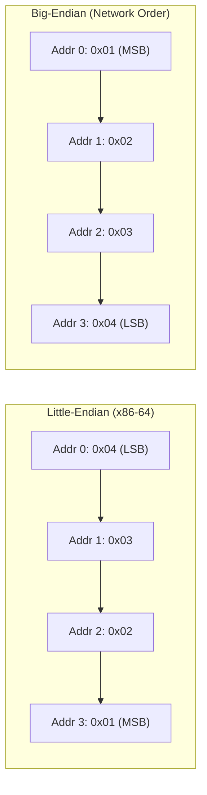

# CSE333: Pointers

**Pointers** are variables that store memory addresses. They point to locations within the process's **virtual address space**.

## Definition and Dereferencing

- **Address-of operator (`&`)**: `&foo` produces the virtual address of `foo`.
- **Dereference operator (`*`)**: Accesses the memory referred to by a pointer.

```c
int x = 351;
int* p;    // p is a pointer to an int
p = &x;    // p now contains the address of x
*p = 333;  // changes the value of x to 333
```

## Pointer Arithmetic

Pointers are **typed**, which tells the compiler the size of the data being pointed to.

- **Arithmetic Scaling**: Pointer arithmetic (e.g., `p + 1`) is automatically scaled by `sizeof(*p)`. So if `p` is an `int*` on a 64-bit system, `p + 1` advances the address by 4 bytes (the size of `int`), not 1 byte.
- **Generic Pointers (`void*`)**: A placeholder pointer with no associated type. Arithmetic is **not** allowed on `void*` because its element size is unknown.
- **Valid Operations**:
  - Add or subtract an integer and a pointer.
  - Subtract two pointers (only within the same stack frame or `malloc` block).
  - Compare pointers (`<`, `==`, etc.), including comparisons against `NULL`.

## Function Pointers

A function name is essentially the address of the function's code. **Function pointers** allow storing and passing these addresses, enabling callbacks and generic algorithms like `map()`.

- **Syntax**: `returnType (*name)(type1, ..., typeN)`

```c
int negate(int num) { return -num; }
int (*op)(int n) = negate;
int result = op(5); // calls negate(5)
```

## Endianness

**Endianness** determines the order in which multi-byte data is stored in memory.

- **Big-endian**: Most significant byte has the **lowest** address (i.e., stored "big-end first"). Used in network byte order.
- **Little-endian**: Least significant byte has the **lowest** address. Standard on x86-64.

For example, the 4-byte integer `0x01020304` is stored as `04 03 02 01` in memory on a little-endian machine.



## Related

- [[CSE333/C Fundamentals/Arrays|Arrays]]
- [[CSE333/Memory Management/Stack|Stack]]
- [[CSE333/Memory Management/Heap Management|Heap Management]]
- [[CSE333/C Fundamentals/Introduction to C|Introduction to C]]
- [[CSE351/Memory Fundamentals/Pointers|CSE351: Pointers]]

## Industry Standard Terms

- **Pointer** — Called a "raw pointer" in C++ contexts to distinguish from smart pointers
- **`void*`** — Known as a "generic pointer" or "opaque pointer"; widely used in C APIs for type-erasure (e.g., `pthread_create` arguments)
- **Function pointer** — The basis for vtables, callbacks, and the C equivalent of first-class functions
