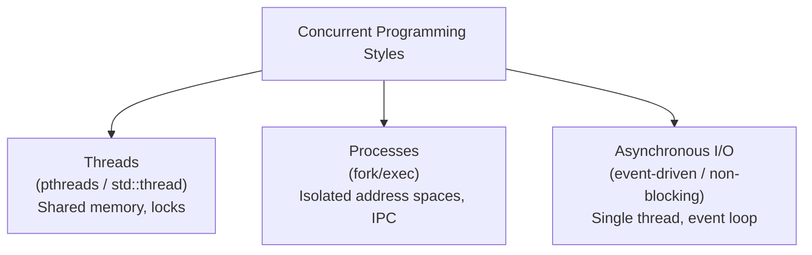

# CSE333: Concurrency Intro

**Concurrency** refers to a program that executes multiple tasks simultaneously (or interleaved). It is essential for high-performance applications, especially those that are I/O bound.

## Motivation: I/O Latency

I/O operations are orders of magnitude slower than CPU operations (Jeff Dean's "Numbers Everyone Should Know"):

| Operation | Latency |
| :--- | :--- |
| L1 cache reference | 0.5 ns |
| Main memory reference | 100 ns |
| Read 1 MB from network | ~10,000,000 ns (10 ms) |
| Read 1 MB from disk | ~30,000,000 ns (30 ms) |

In a **sequential** implementation, the CPU sits idle (**blocked**) while waiting for I/O to complete. Concurrency allows the CPU to work on other tasks (like processing another network request) while waiting for I/O.

## Concurrency vs. Parallelism

- **Concurrency**: Multiple tasks are in progress at the same time (interleaved on one or more CPUs). Logical simultaneity.
- **Parallelism**: Multiple tasks are executing at the exact same physical instant (requires multiple CPUs or cores). Physical simultaneity.

All parallel programs are concurrent, but not all concurrent programs are parallel.

## Concurrent Programming Styles

1. **Threads**: Multiple threads of control within a single process, sharing the same address space.
    - **POSIX pthreads**: Low-level C API (`<pthread.h>`). See [[CSE333/Concurrency/Threads|Threads]].
    - **C++11 `std::thread`**: Modern, type-safe C++ API (`<thread>`). See [[CSE333/Concurrency/C++ Concurrency|C++ Concurrency]].
2. **Processes**: Forking multiple processes with isolated address spaces. See [[CSE333/Process Management/Process Management|Process Management]].
3. **Asynchronous I/O**: Also known as **non-blocking I/O** or **event-driven programming**.

### Event-Driven Programming

The program is structured as an **event loop**.

- The program registers interest in data (e.g., a socket becoming readable) with the OS via `select()`, `poll()`, or `epoll()`.
- The OS delivers an **event** when data is ready.
- The program "dispatches" the event to the appropriate handler.
- **Advantages**: Avoids locks and race conditions; simpler for GUI programs and high-connection-count servers (e.g., nginx uses this model).
- **Disadvantages**: Can lead to complex, "inverted" code structure ("callback hell"). Tasks do not have their own stacks and must bundle their state into "continuations."

## Related

- [[CSE333/Concurrency/Threads|Threads]]
- [[CSE333/Concurrency/C++ Concurrency|C++ Concurrency]]
- [[CSE333/Process Management/Process Management|Process Management]]
- [[CSE333/Networking/Networking Intro|Networking Intro]]
- [[CSE333/File IO and POSIX/POSIX IO|POSIX IO (Non-blocking I/O)]]
- [[CSE451/Concurrency/Synchronization/Mechanics/Synchronization|CSE451: Concurrency]]

## Industry Standard Terms

- **Concurrency** — Logical overlap of execution; does not require multiple physical processors
- **Parallelism** — Physical simultaneous execution on multiple cores; a subset of concurrency
- **Event loop** — The control structure at the core of event-driven programs; also the basis of Node.js, Python `asyncio`, and browser JavaScript
- **`epoll`** — Linux's high-performance event notification API; allows a single thread to monitor thousands of file descriptors; equivalent to `kqueue` on macOS and IOCP on Windows
