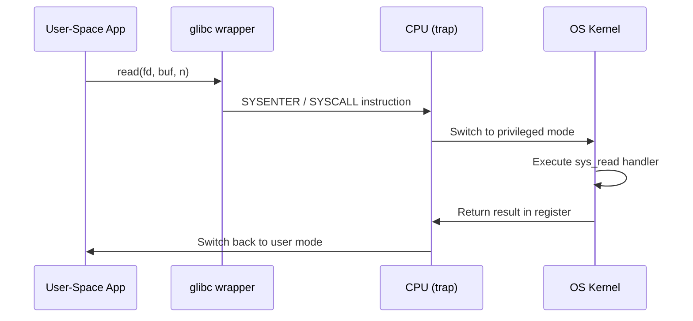

# CSE333: System Calls

**System Calls** are the interface between an application and the Operating System kernel. Every time a program reads a file, opens a network connection, or spawns a process, it is invoking a system call.

## OS Responsibilities

The OS is the "layer below" that:

- Directly interacts with hardware (disk controllers, NICs, GPU).
- Manages hardware resources (CPU time, physical memory, disk I/O).
- Provides abstractions (files, processes, network stacks, virtual memory).
- Protects the system from untrusted user-level code by enforcing privilege boundaries.

## Privilege Levels

- **Unprivileged Mode (User Mode)**: Application code runs here. Direct access to hardware is restricted; attempts to execute privileged instructions cause a fault.
- **Privileged Mode (Kernel Mode)**: The OS kernel runs here. Has full control over hardware and all memory.

## System Call Execution



1. Application code invokes a system call (typically via a `glibc` wrapper function).
2. A **trap** (using instructions like `SYSCALL` on x86-64) transitions the CPU to privileged mode and jumps to the kernel's system call handler.
3. The kernel executes the appropriate handler (e.g., `sys_read`).
4. The CPU transitions back to user mode and returns results to the application.

## strace

**`strace`** is a Linux utility that intercepts and shows the sequence of system calls a process makes in real time. It is an invaluable tool for debugging I/O and process issues.

```bash
strace ./my_program        # trace all syscalls
strace -e read,write ./my_program  # trace only read/write
```

## Related

- [[CSE333/File IO and POSIX/Standard C Streams|Standard C Streams]]
- [[CSE333/File IO and POSIX/POSIX IO|POSIX IO]]
- [[CSE333/Process Management/Process Management|Process Management]]
- [[CSE451/Virtualization/Mechanisms/Traps/System Call|CSE451: System Calls]]

## Industry Standard Terms

- **System call** — Also called "syscall"; the fundamental mechanism for user-space code to request kernel services
- **Trap / `SYSCALL` instruction** — The CPU instruction that transitions from user mode to kernel mode; on x86-64, the `SYSCALL` instruction is used (replacing the older `INT 0x80`)
- **`strace`** — The standard Linux tool for syscall tracing; `dtruss` on macOS and `Procmon` on Windows serve similar purposes
- **`glibc` wrapper** — A thin C library function that marshals arguments into the calling convention expected by the kernel and issues the trap instruction
