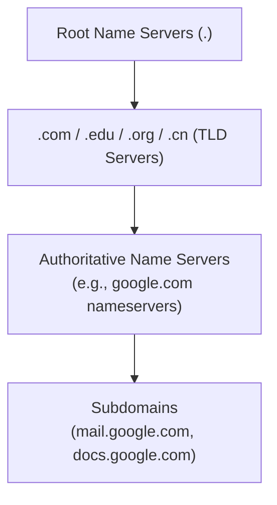

# CSE333: DNS

The **Domain Name System (DNS)** is a distributed, hierarchical database that translates human-readable domain names (e.g., `www.google.com`) into machine-routable IP addresses.

## DNS Hierarchy

DNS is organized into a tree structure where each node delegates authority to the next level:



1. **Root Name Servers**: Represented by a dot (`.`); there are 13 root server clusters worldwide.
2. **Top-Level Domains (TLD)**: `.com`, `.edu`, `.org`, `.cn`, etc.
3. **Authoritative Name Servers**: Manage specific domains (e.g., `google.com`). These hold the actual IP address records.
4. **Subdomains**: `mail.google.com`, `docs.google.com` — delegated from the authoritative server.

## IP Network Addresses

- **IPv4**: A 4-byte (32-bit) address, written in "dotted-decimal" notation (e.g., `128.95.4.1`). The IPv4 address space (~4 billion addresses) is exhausted.
- **IPv6**: A 16-byte (128-bit) address, written as 8 groups of 4 hex digits separated by colons (e.g., `2d01:db8:f188::1f33`). `::` can replace consecutive all-zero groups.

## Resolving DNS Names in C

The POSIX way to resolve names is `getaddrinfo()`, declared in `<netdb.h>`.

### getaddrinfo()

```c
int getaddrinfo(const char* hostname,
               const char* service,
               const struct addrinfo* hints,
               struct addrinfo** res);
```

- **hostname**: Domain name or IP address string.
- **service**: Port number (e.g., `"80"`) or service name (e.g., `"www"`).
- **hints**: A `struct addrinfo` that specifies constraints (e.g., `AF_INET6` for IPv6, `SOCK_STREAM` for TCP).
- **res**: A pointer to a pointer that will hold the resulting **linked list** of `addrinfo` structures — there may be multiple results (e.g., both an IPv4 and IPv6 address).

You must call **`freeaddrinfo(res)`** to free the linked list allocated by `getaddrinfo()`.

### addrinfo Structure

```c
struct addrinfo {
    int              ai_flags;     // AI_PASSIVE, AI_CANONNAME, etc.
    int              ai_family;    // AF_INET (IPv4), AF_INET6 (IPv6), AF_UNSPEC (either)
    int              ai_socktype;  // SOCK_STREAM (TCP), SOCK_DGRAM (UDP)
    int              ai_protocol;  // IPPROTO_TCP, IPPROTO_UDP
    size_t           ai_addrlen;   // Length of ai_addr
    struct sockaddr* ai_addr;      // Binary address (ready to pass to connect/bind)
    char*            ai_canonname; // Canonical hostname
    struct addrinfo* ai_next;      // Next result in linked list
};
```

## Address Conversion

- **`inet_pton`**: Converts human-readable strings ("presentation") to network byte-ordered binary addresses.
- **`inet_ntop`**: Converts binary addresses to human-readable strings.

## Related

- [[CSE333/Networking/Networking Intro|Networking Intro]]
- [[CSE333/Networking/TCP Sockets|TCP Sockets]]
- [[CSE333/Networking/HTTP|HTTP]]
- [[CSE461/Application/Domain Name System (DNS)|CSE461: DNS]]

## Industry Standard Terms

- **DNS** — Domain Name System; often called the "phone book of the internet"; implemented using UDP port 53 (or TCP for large responses)
- **Authoritative name server** — The server with the definitive DNS records for a domain; contrasted with a **recursive resolver** that caches and proxies queries on behalf of clients
- **`getaddrinfo()`** — The modern, protocol-independent POSIX function for name resolution; replaces the older `gethostbyname()` which was IPv4-only and not thread-safe
- **TTL (Time-To-Live)** — A field in DNS records that tells resolvers how long to cache the result before querying again
