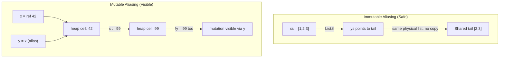

# CSE341: Mutation and Aliasing

While OCaml emphasizes immutability, it provides explicit support for mutable state via **[[CSE341/Definitions/Part2/Reference|References]]**. Understanding the distinction between identity and value is crucial when dealing with mutation.

## References

A reference is a first-class value that points to a mutable cell on the heap.

### The Reference Recipe

| Operation | Syntax | Type Checking | Evaluation |
| :--- | :--- | :--- | :--- |
| **Creation** | `ref e` | If `e: t`, then `ref e: t ref` | Eval `e` to `v`, allocate fresh cell with `v`. |
| **Retrieval** | `!e` | If `e: t ref`, then `!e: t` | Eval `e` to ref cell, return its contents. |
| **Assignment** | `e1 := e2` | If `e1: t ref` and `e2: t`, then `e1 := e2: unit` | Eval `e1` to ref cell, `e2` to `v`. Update cell with `v`. |

```ocaml
let x = ref 42
let _ = x := !x + 1
let y = !x (* 43 *)
```

## Aliasing

**[[CSE341/Definitions/Part2/Aliasing|Aliasing]]** occurs when multiple variables point to the same reference cell.

- **Immutability and Aliasing**: When data is immutable, aliasing is invisible. The compiler can freely share data (e.g., `List.tl` is constant time because it just returns a pointer to the rest of the existing list).
- **Mutability and Aliasing**: When data is mutable, aliasing becomes "visible" because a change through one alias is observable through another.

### Case Study: List Append

```ocaml
let rec append (xs, ys) =
  if xs = [] then ys
  else List.hd xs :: append (List.tl xs, ys)
```

In OCaml, `append` creates a new list structure for `xs` but the last tail of the new list points to the **exact same physical list** as `ys`. This is safe because OCaml lists are immutable.

## Equality: Physical vs. Structural

OCaml distinguishes between "looking the same" and "being the same thing."

1. **Structural Equality (`=`)**: Checks if two values have the same shape and contents. It is recursive.
   - `[1; 2] = [1; 2]` is `true`.
2. **Physical Equality (`==`)**: Checks if two values point to the same memory location (aliases).
   - `[1; 2] == [1; 2]` is `false` (they are different allocations).
   - `let x = [1];; x == x` is `true`.

### Warning on `==`

**Do NOT use `==` for immutable data.** The language definition makes very few guarantees about `==` for immutable values to allow compiler optimizations (like interning constants or aggressive sharing). Use it only when identity is part of your program's logic (e.g., checking if two references are the same cell).

## Callback Idiom

Mutation is often used in callback libraries to maintain a registry of functions.

```ocaml
let callbacks : (int -> unit) list ref = ref []

let on_key_event f =
  callbacks := f :: !callbacks

let do_key_event i =
  List.iter (fun f -> f i) !callbacks
```

Clients can use closures to "remember" private state between calls:

```ocaml
let count = ref 0
let _ = on_key_event (fun _ -> count := !count + 1)
```



## Related

- [[CSE341/Functions/First Class Functions and Closures|First Class Functions and Closures]]
- [[CSE341/Thunks and Streams/Delayed Evaluation|Delayed Evaluation]]
- [[CSE341/Object Features/Mutation and Objects|Mutation and Objects]]

## Industry Standard Terms

| Course Term | Industry/Standard Term |
| :--- | :--- |
| Reference (`ref`) | Mutable Cell / Mutable Variable / Pointer |
| Structural Equality (`=`) | Value Equality / Deep Equality |
| Physical Equality (`==`) | Reference Equality / Pointer Equality / Identity Comparison |
| Callback Idiom | Observer Pattern / Event Listener |
| Aliasing | Aliasing / Shared Mutable State |
