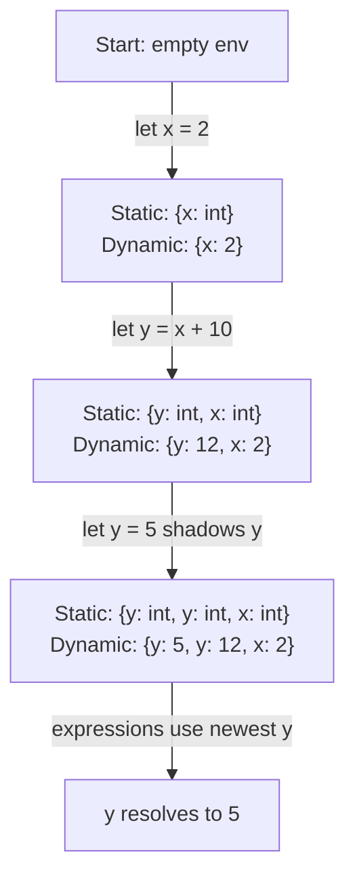

# CSE341: Variable Bindings

An OCaml program is fundamentally a sequence of bindings. These bindings map names to values and are evaluated sequentially from top to bottom.

## Let Bindings

The syntax for a variable binding is: `let x = e`

### Semantics

When OCaml encounters a `let` binding, it processes it in two distinct phases:

1. **Type Checking (Static Semantics):**
   - The expression `e` is type-checked in the current **[[CSE341/Definitions/Part0/Static Environment|Static Environment]]**.
   - If `e` has type `t`, the binding `x : t` is added to the static environment for subsequent expressions.
   - Note: Type checking ensures that `x` will always be bound to a value of type `t`. There is no "else" case for variable lookup failing at runtime because the static check guarantees its existence.

2. **Evaluation (Dynamic Semantics):**
   - The expression `e` is evaluated in the current **[[CSE341/Definitions/Part0/Dynamic Environment|Dynamic Environment]]** to produce a value `v`.
   - The binding `x ↦ v` is added to the dynamic environment for subsequent expressions.

```ocaml
(* Static Environment: empty *)
(* Dynamic Environment: empty *)

let x = 2
(* Static Environment: { x : int } *)
(* Dynamic Environment: { x : 2 } *)

let y = x + 10
(* Static Environment: { y: int; x : int } *)
(* Dynamic Environment: { y: 12; x: 2 } *)
```

### Shadowing and Immutability

In functional programming, bindings are **immutable**. However, you can bind the same name again in a subsequent expression. This does not mutate the original variable; instead, it **shadows** it. The old binding still exists in the scope it was created for, but the new binding takes precedence in the current scope.

```ocaml
let y = 5
(*
Static  : { y: int; y: int; x: int }
Dynamic : { y: 5; y: 12; x: 2 }
*)
```



## Related

- [[CSE341/OCaml Fundamentals/Functions|Functions]]
- [[CSE341/Syntax and Semantics/Syntax and Semantics|Syntax and Semantics]]
- [[CSE341/Data Structures/Options and Let Expressions|Options and Let Expressions]]

## Industry Standard Terms

| Course Term | Industry/Standard Term |
| :--- | :--- |
| Let Binding | Variable Declaration / Variable Definition |
| Shadowing | Variable Shadowing / Name Hiding |
| Dynamic Environment | Runtime Environment / Symbol Table (runtime) |
| Static Environment | Type Environment / Symbol Table (compile-time) |
