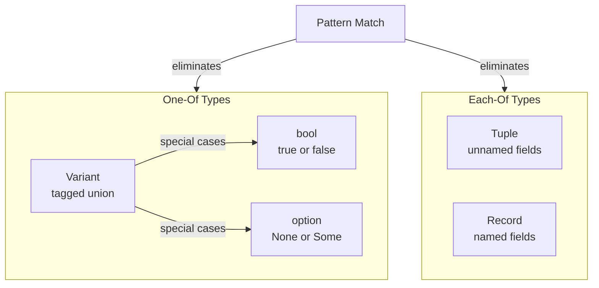

# CSE341: Records and Variants

Languages generally provide three building blocks for types: "Each-Of", "One-Of", and "Self-Reference". In OCaml, **[[CSE341/Definitions/Part1/Record|Records]]** and **[[CSE341/Definitions/Part1/Variant|Variants]]** are the primary ways users define these types.

## Records

A **[[CSE341/Definitions/Part1/Record|Record]]** is an "Each-Of" type, similar to a tuple but with named fields.

### Definition and Construction

You must define a record type before using it.

- **Syntax**: `type t = {f1 : t1; ...; fn : tn}`
- **Building**: `{f1 = e1; ...; fn = en}`

```ocaml
type car = { make : string; model : string; year : int }
let my_car = { make = "Honda"; model = "Civic"; year = 2006 }
```

### Elimination

Fields are accessed using dot notation: `e.f`.

```ocaml
let m = my_car.make (* "Honda" *)
```

---

## Variants

A **[[CSE341/Definitions/Part1/Variant|Variant]]** (or "One-Of" type) allows a value to be one of several different cases.

### Definition

- **Syntax**: `type t = C1 [of t1] | C2 [of t2] | ...`
- **Constructors**: $C_i$ are constructors. They must be capitalized.

```ocaml
type shape =
  | Circle of float
  | Rectangle of float * float
  | Point
```

### Pattern Matching

To use a variant, you use a `match` expression. This is the **elimination rule** for variants.

- **Syntax**:
  ```ocaml
  match e with
  | P1 -> e1
  | P2 -> e2
  ```
- **Semantics**: Evaluates $e$ to a value $v$. It then finds the first pattern $P_i$ that matches $v$, binds any internal data to local variables, and evaluates the corresponding expression $e_i$.

```ocaml
let area s =
  match s with
  | Circle r -> 3.14 *. r *. r
  | Rectangle (l, w) -> l *. w
  | Point -> 0.0
```

---

## The Power of Pattern Matching

**[[CSE341/Definitions/Part1/Pattern Matching|Pattern Matching]]** is superior to using helper functions (like `is_circle` or `get_radius`) for several reasons:

1. **Exhaustiveness**: The compiler warns if you forget a case.
2. **Redundancy**: The compiler warns if a case is unreachable.
3. **Data Extraction**: It combines checking the "tag" (constructor) and extracting the data into a single, atomic operation.
4. **Safety**: You cannot accidentally extract "radius" from a "Rectangle."

### Syntactic Sugar: Booleans and Options

- **Booleans**: Can be viewed as a variant `type bool = true | false`. `if e1 then e2 else e3` is **[[CSE341/Definitions/Part1/Syntactic Sugar|Syntactic Sugar]]** for a match on `true` and `false`.
- **Options**: Are also variants: `type 'a option = None | Some of 'a`.



## Related

- [[CSE341/Data Structures/Options and Let Expressions|Options and Let Expressions]]
- [[CSE341/Pattern Matching/Nested Patterns and Tail Recursion|Nested Patterns and Tail Recursion]]

## Industry Standard Terms

| Course Term | Industry/Standard Term |
| :--- | :--- |
| Record (Each-Of) | Struct / Named Tuple / Product Type |
| Variant (One-Of) | Sum Type / Tagged Union / Discriminated Union |
| Constructor | Data Constructor / Variant Tag |
| Pattern Matching | Structural Matching / Destructuring |
| Exhaustiveness Check | Exhaustive Match / Coverage Check |
