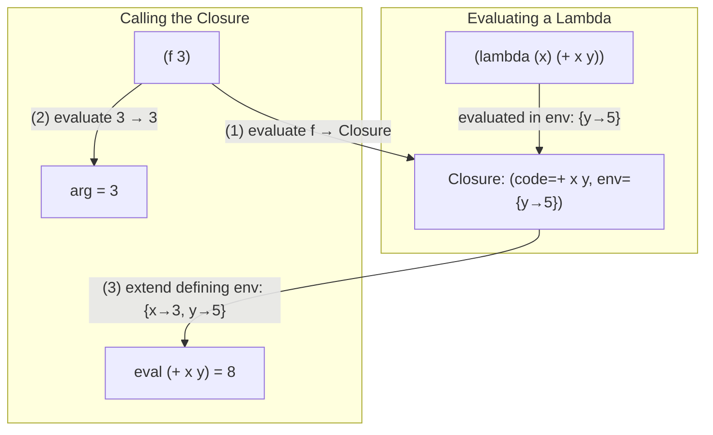

# CSE341: First-Class Functions in Trefoil

Trefoil supports **[[CSE341/Definitions/Part5/First-Class Function|First-Class Functions]]**, which means functions can be treated as values. This is achieved by adding `lambda` expressions and **[[CSE341/Definitions/Part5/Closure|Closures]]** to the language.

## Lambdas and Closures

A `lambda` expression defines an anonymous function. When a `lambda` is evaluated, it creates a **[[CSE341/Definitions/Part5/Closure|Closure]]**.

### Formal Definition

A **Closure** is a pair consisting of:

1. The function's code (parameter names and body expression).
2. The **[[CSE341/Definitions/Part5/Static Environment|Lexical Environment]]** that was active when the closure was created.

### Simplified Explanation

A closure is a function with a "backpack" full of all the variables that were around when the function was born. Even if the function is called in a completely different part of the program, it still has access to the variables in its backpack. The backpack is the defining environment, frozen at the moment the `lambda` was evaluated.

---

## Interpreter Implementation

To support first-class functions, the interpreter's `value` type must be expanded to include closures, and function calls must be generalized.

### Updated AST and Values

```ocaml
type value =
  | Int of int
  | Bool of bool
  | Closure of string * expr * env (* arg name, body, defining env *)

and expr =
  | Val of value
  | Var of string
  | Lambda of string * expr (* arg name, body *)
  | FnCall of expr * expr   (* fn expression, arg expression *)
```

### Function Call Logic (The "How")

In a language with first-class functions, a function call `(f e)` proceeds as follows:

1. **Evaluate `f`**: The expression `f` is evaluated to a value. This value must be a `Closure`.
2. **Evaluate `e`**: The argument expression `e` is evaluated to a value `v_arg`.
3. **Execute Body**:
   - Take the environment stored in the closure (`defining_env`).
   - Bind the parameter name to `v_arg` in that environment.
   - Bind the function name (if recursive) back to the closure itself to allow recursion.
   - Evaluate the closure's body in this extended environment.

### Why Lexical Scope?

Closures implement **[[CSE341/Definitions/Part4/Lexical Scope|Lexical Scope]]**, meaning variable resolution depends on where the function was defined, not where it is called. This makes code more predictable and modular, as functions don't unexpectedly interact with variables in the caller's scope.



---

## Higher-Order Functions

With first-class functions, we can implement higher-order functions like `map` and `filter`.

### Walkthrough: map

```racket
(define (map f xs)
  (if (empty? xs)
      nil
      (cons (f (car xs)) (map f (cdr xs)))))
```

Here, `f` is a variable bound to a closure. The expression `(f (car xs))` is a function call where the function position is a variable — this is only possible because functions are first-class values.

---

## Related

- [[CSE341/Trefoil Advanced/Structs and Pattern Matching|Structs and Pattern Matching]]
- [[CSE341/Definitions/Part5/Closure|Closure]]
- [[CSE341/Definitions/Part5/First-Class Function|First-Class Function]]
- [[CSE341/Functions/First Class Functions and Closures|First Class Functions and Closures (OCaml)]]
- [[CSE341/Trefoil Basics/Trefoil Functions and Scoping|Trefoil Functions and Scoping]]

## Industry Standard Terms

| Course Term | Industry/Standard Term |
| :--- | :--- |
| First-Class Function | First-Class Function / Lambda |
| Closure | Closure / Lambda Capture / Anonymous Function with Captured Environment |
| Lambda Expression | Lambda / Anonymous Function / Arrow Function |
| Function Call (generalized) | Dynamic Dispatch / Higher-Order Call |
| `map` / `filter` (higher-order) | Functional Combinators / Higher-Order Functions |
