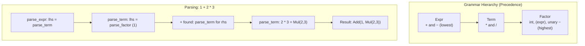

# CSE341: Parsing

Parsing is the process of converting a flat string of source code into a structured **[[CSE341/Definitions/Part3/Abstract Syntax Tree (AST)|Abstract Syntax Tree (AST)]]**. This typically involves two phases: Lexing and Parsing.

## Phase 1: Lexing (Tokenization)

The **Lexer** reads the raw characters and groups them into meaningful units called **Tokens**. This simplifies the parser's job by removing whitespace and identifying high-level constructs like numbers, keywords, and operators.

### Example Tokens

For the expression `(1 + 2) * 3`, the tokens might be:

`LPAREN`, `INT 1`, `PLUS`, `INT 2`, `RPAREN`, `TIMES`, `INT 3`

---

## Phase 2: Recursive Descent Parsing

A **[[CSE341/Definitions/Part5/Recursive Descent Parser|Recursive Descent Parser]]** uses a set of mutually recursive functions to process the token stream according to a context-free grammar.

### Grammar Design

Grammars must be designed to handle operator precedence and associativity correctly. A common pattern is:

- **Expr**: Handles addition and subtraction (lowest precedence).
- **Term**: Handles multiplication and division.
- **Factor**: Handles base cases like integers, parenthesized expressions, and unary negation (highest precedence).

### Recursive Descent Logic (The "How")

Each function in the parser corresponds to a grammar rule. It attempts to match its part of the grammar and returns the AST node it created along with the remaining tokens. The structure of these functions directly mirrors the grammar rules, which is why the technique is called "recursive descent" — the call graph descends through the grammar.

```ocaml
(* expr ::= term (("+" | "-") term)* *)
let rec parse_expr toks =
  let lhs, toks1 = parse_term toks in
  parse_expr_tail lhs toks1

and parse_expr_tail lhs toks =
  match toks with
  | PLUS :: rest ->
      let rhs, rest2 = parse_term rest in
      parse_expr_tail (Add (lhs, rhs)) rest2
  | _ -> (lhs, toks)
```

### Why Use Tail Recursion in Parsing?

The `parse_expr_tail` pattern effectively handles left-associative operators (like `+` and `-`) without needing left-recursion in the grammar (which would cause infinite loops in a recursive descent parser). By accumulating the left-hand side as an argument and recurring on the tail, the parser constructs left-associative AST nodes in a single left-to-right pass.



---

## Abstract Syntax Trees (AST)

The final output of the parser is an **[[CSE341/Definitions/Part3/Abstract Syntax Tree (AST)|AST]]**. The AST represents the logical structure of the program, independent of surface syntax (like whether parentheses were used).

### Formal Representation

```ocaml
type expr =
  | Int of int
  | Add of expr * expr
  | Mul of expr * expr
  | Neg of expr
```

### Simplified Explanation

The lexer sees words; the parser sees sentences. The AST is the "diagram" of those sentences that the interpreter can actually understand and execute. Importantly, the AST discards all surface syntax (like parentheses) and encodes only the semantic structure — what operations are performed and in what order.

---

## Related

- [[CSE341/Definitions/Part5/Recursive Descent Parser|Recursive Descent Parser]]
- [[CSE341/Trefoil Advanced/Type Checking|Type Checking]]
- [[CSE341/Implementation/Implementing Languages|Implementing Programming Languages]]

## Industry Standard Terms

| Course Term | Industry/Standard Term |
| :--- | :--- |
| Lexing / Tokenization | Lexical Analysis / Scanning |
| Token | Token / Lexeme |
| Recursive Descent Parser | Recursive Descent Parser / LL(1) Parser |
| Grammar Rule | Production Rule / BNF Rule |
| Abstract Syntax Tree (AST) | Abstract Syntax Tree (AST) |
| Left-Associativity | Left-Associativity / Left-to-Right Evaluation |
