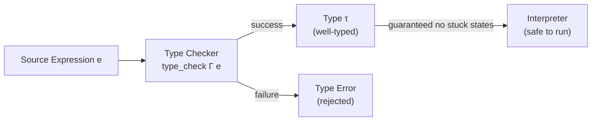

# CSE341: Type Checking

**[[CSE341/Definitions/Part5/Type Checking|Type Checking]]** is a static analysis phase that occurs before a program is executed. It ensures that operations are performed on compatible types, preventing "stuck" states or undefined behavior during runtime.

## Static vs. Dynamic Environments

Type checking relies on a **[[CSE341/Definitions/Part5/Static Environment|Static Environment]]** ($\Gamma$), which maps variables to their types. This is distinct from the **[[CSE341/Definitions/Part5/Dynamic Environment|Dynamic Environment]]** ($E$), which maps variables to values.

| Aspect | Static Environment | Dynamic Environment |
| :--- | :--- | :--- |
| **Phase** | Compile-time / Type-check time | Runtime / Interpretation time |
| **Content** | Types (e.g., `Int`, `Bool`) | Values (e.g., `5`, `true`) |
| **Purpose** | Predict behavior and safety | Execute the program |

---

## Type Rules

Type checking is defined by a set of formal rules. We use the notation $\Gamma \vdash e : \tau$ to mean "in environment $\Gamma$, expression $e$ has type $\tau$."

### Rule for Addition

### Formal Definition

$$\frac{\Gamma \vdash e_1 : \text{Int} \quad \Gamma \vdash e_2 : \text{Int}}{\Gamma \vdash e_1 + e_2 : \text{Int}}$$

### Simplified Explanation

If both sides of a `+` are integers, then the whole expression is an integer. If either side is not an integer, the type checker rejects the program before it ever runs.

### Rule for If-Expressions

### Formal Definition

$$\frac{\Gamma \vdash e_1 : \text{Bool} \quad \Gamma \vdash e_2 : \tau \quad \Gamma \vdash e_3 : \tau}{\Gamma \vdash \text{if } e_1 \text{ then } e_2 \text{ else } e_3 : \tau}$$

### Simplified Explanation

The condition must be a boolean. Crucially, the "then" branch and the "else" branch must have the **exact same type**. This is because the type checker must know the type of the `if` expression without knowing which branch will be taken at runtime.

---

## Implementation in OCaml

A type checker is typically implemented as a recursive function that mirrors the structure of the AST.

```ocaml
type typ = TInt | TBool

let rec type_check (env : static_env) (e : expr) : typ =
  match e with
  | Val (Int _) -> TInt
  | Add (l, r) ->
      if type_check env l = TInt && type_check env r = TInt then TInt
      else failwith "Type error in addition"
  | If (p, t, e_branch) ->
      if type_check env p <> TBool then failwith "Condition must be bool"
      else
        let t1 = type_check env t in
        let t2 = type_check env e_branch in
        if t1 = t2 then t1
        else failwith "Branches must have same type"
  | Var x -> StrMap.find x env
```

### Soundness

A type system is **sound** if a program that passes the type checker is guaranteed not to have certain classes of runtime errors (e.g., trying to add a boolean to an integer). Soundness is often summarized as: "Well-typed programs do not go wrong."



---

## Related

- [[CSE341/Definitions/Part5/Type Checking|Type Checking]]
- [[CSE341/Definitions/Part5/Static Environment|Static Environment]]
- [[CSE341/Definitions/Part5/Dynamic Environment|Dynamic Environment]]
- [[CSE341/Type Systems/Type Inference|Type Inference (OCaml)]]

## Industry Standard Terms

| Course Term | Industry/Standard Term |
| :--- | :--- |
| Type Checking | Static Type Checking / Type Analysis |
| Static Environment ($\Gamma$) | Type Environment / Type Context |
| Type Rule | Typing Judgment / Inference Rule |
| $\Gamma \vdash e : \tau$ | Typing Judgment ("$e$ has type $\tau$ under $\Gamma$") |
| Soundness | Type Soundness / Progress and Preservation |
| "Well-typed programs do not go wrong" | Soundness Theorem (Milner, 1978) |
