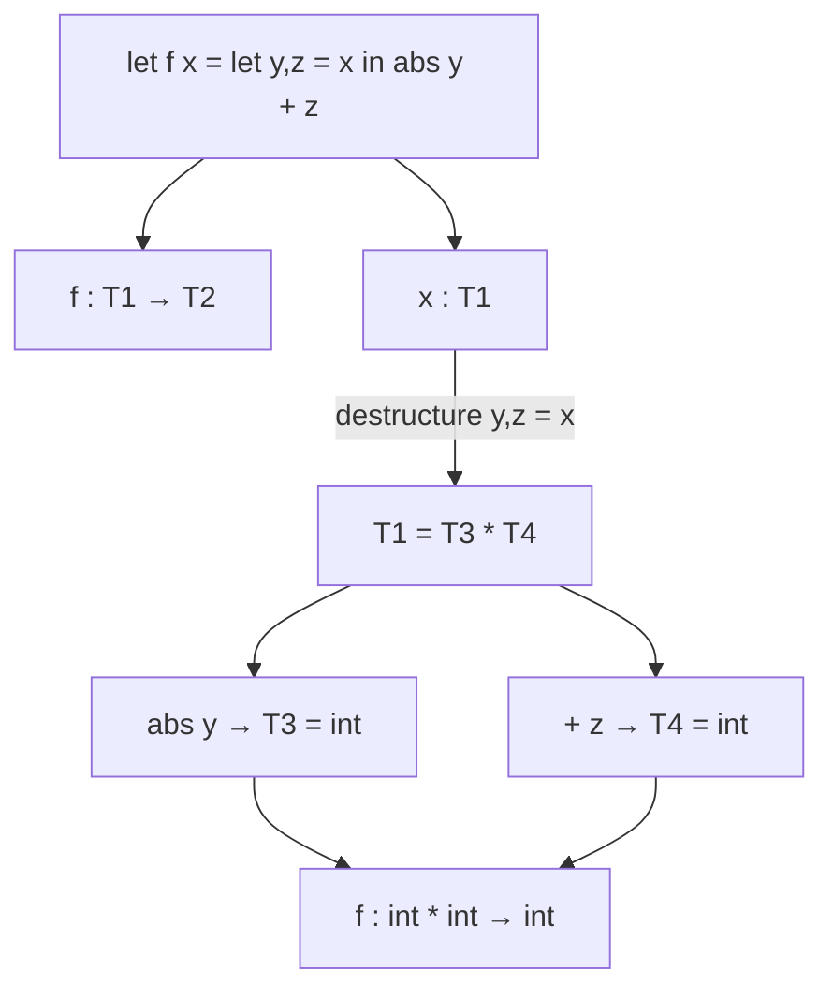

# CSE341: Type Inference

OCaml is a **statically typed** language, meaning every binding has exactly one type determined before the program runs. However, it is also **implicitly typed**, meaning the programmer rarely needs to explicitly write down types. This is made possible through **[[CSE341/Definitions/Part3/Type Inference|Type Inference]]**.

## The Type Inference Algorithm

The type inference problem is to assign every binding and expression a type such that the program type-checks. OCaml's algorithm follows a systematic process of collecting and solving constraints.

### Key Steps

1. **Determine types in order**: Bindings are analyzed sequentially. You cannot use a binding before it is defined.
2. **Collect Constraints**: For each `let` binding, the definition is analyzed to build a set of facts (constraints).
   - `x > 0` implies `x : int`.
   - `if true then y else z` implies `y` and `z` must have the same type.
3. **Solve Constraints**: If all constraints can be satisfied, types are assigned. If no solution exists, a type error is reported.
4. **Generalize**: Any unconstrained types are replaced with type variables (e.g., `'a`).

### Concrete Example: Constraint Solving

Consider the function:

```ocaml
let f x =
  let y, z = x in
  abs y + z
```

The algorithm performs the following inference:

- `f : T1 -> T2`
- `x : T1`
- Since `let y, z = x`, `T1` must be a pair: `T1 = T3 * T4`.
- `y : T3`, `z : T4`.
- `abs y` implies `T3 = int`.
- `+ z` implies `z` must be `int` (since `+` takes `int * int`), so `T4 = int`.
- The result of `+` is `int`, so the return type `T2 = int`.
- **Final Result**: `f : int * int -> int`.



## Polymorphism vs. Inference

Polymorphism and type inference are orthogonal concepts:

- **Polymorphism**: The ability for a function to operate on multiple types (e.g., `'a list -> int`).
- **Inference**: The ability to determine types without being told.

A function like `length` is polymorphic because it is **under-constrained**:

```ocaml
let rec length xs =
  match xs with
  | [] -> 0
  | x :: xs' -> 1 + length xs'
```

Constraints:

- `xs : T1 list`
- Result is `int`.
- `x` is never used in a way that constrains its type.
- **Result**: `val length : 'a list -> int`.

## The [[CSE341/Definitions/Part3/Value Restriction|Value Restriction]]

A major challenge in type inference is the combination of polymorphism and **mutation**. Without restrictions, the following broken code would type-check:

```ocaml
let r = ref None (* val r : 'a option ref *)
let _ = r := Some "hi" (* Instantiate 'a with string *)
let i = (Option.get (!r)) / 3 (* Instantiate 'a with int -> CRASH *)
```

### The Fix

To ensure soundness, OCaml enforces the **[[CSE341/Definitions/Part3/Value Restriction|Value Restriction]]**: A variable-binding can only have a polymorphic type if the expression being bound is a **value** (like a constant or a function) or a variable.

- `ref None` is a function call, not a value.
- Instead of a polymorphic type, OCaml assigns a **weak type variable** (e.g., `'_weak1`).
- This weak type variable can be instantiated exactly once.

### Workaround

If the value restriction prevents a legitimate polymorphic use (e.g., with partial application), you can use **eta-expansion**:

```ocaml
(* Restricted: val pairWithOne : '_weak1 list -> ('_weak1 * int) list *)
let pairWithOne = List.map (fun x -> (x,1))

(* Polymorphic: val pairWithOne : 'a list -> ('a * int) list *)
let pairWithOne xs = List.map (fun x -> (x,1)) xs
```

### Comparison: Type Inference in Other Contexts

| Context | Inference Difficulty | Notes |
| :--- | :--- | :--- |
| **Without Polymorphism** | Easier | Every function must have a concrete type |
| **With Polymorphism (ML)** | Moderate | Hindley-Milner algorithm handles most cases |
| **With Subtyping** | Significantly harder | Constraints become inequalities, not equalities |

## Related

- [[CSE341/Definitions/Part3/Type Inference|Definition: Type Inference]]
- [[CSE341/Definitions/Part3/Value Restriction|Definition: Value Restriction]]
- [[CSE341/Trefoil Advanced/Type Checking|Type Checking in Trefoil]]

## Industry Standard Terms

| Course Term | Industry/Standard Term |
| :--- | :--- |
| Type Inference | Hindley-Milner Type Inference / Algorithm W |
| Type Variable (`'a`) | Type Parameter / Generic Type Variable |
| Value Restriction | Value Restriction / Monomorphism Restriction (Haskell) |
| Weak Type Variable (`'_weak1`) | Monomorphic Type Variable / Constrained Polymorphism |
| Eta Expansion | Eta Expansion / Function Eta-Conversion |
