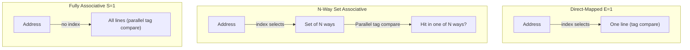

# CSE351: Cache Associativity

**Cache associativity** determines where in the cache a given memory block can be placed. It is the key design parameter governing the trade-off between conflict misses, hardware complexity, and access speed.

## Direct-Mapped Cache

A **direct-mapped cache** uses a strict 1-to-1 mapping: each memory address maps to exactly one specific cache line.

- **Mechanism:** The set index bits of the address select the single line that must hold this block. Only that one line's tag is compared to check for a hit.
- **Pros:** Simple and fast hardware — only one comparator needed per lookup.
- **Cons:** Prone to **conflict misses**. If two frequently accessed addresses share the same set index (they are separated by a multiple of the cache size), they will continuously evict each other, even if all other cache lines are empty. This "thrashing" can cause the effective hit rate to collapse.

## Fully Associative Cache

In a **fully associative cache**, a memory block can be placed in any cache line — there is only one set containing all lines.

- **Mechanism:** The cache must compare the tag against every line simultaneously using parallel comparators.
- **Pros:** Eliminates conflict misses entirely; provides maximum placement flexibility.
- **Cons:** Requires a comparator for every cache line — hardware area and power scale with the number of lines. Practical only for small caches such as [[Translation Lookaside Buffer (TLB 351)|TLBs]].

## N-Way Set Associative Cache

An **N-way set associative cache** is the practical middle ground: each address maps to one specific **set**, which contains $N$ cache lines (called **ways**).

- **Mechanism:** The set index selects one set; all $N$ tag comparisons within that set happen in parallel. A hit is declared if any way's tag matches and its valid bit is set.
- **Pros:** Reduces conflict misses substantially compared to direct-mapped without requiring comparators for the entire cache.
- **Trade-off:** As $N$ increases, hardware complexity and lookup latency increase slightly, but conflict misses decrease. Most modern L1 caches are 4–8 way set associative.

---

---

## Related

- [[Cache Organization|Cache Organization]]
- [[Cache Locality|Locality]]
- [[Translation Lookaside Buffer (TLB 351)|TLB (fully associative example)]]
- [[Program Optimizations via Cache|Program Optimizations via Cache]]

---

## Industry Standard Terms

| Course Term | Industry / Standard Term |
|:---|:---|
| Direct-mapped cache | Direct-mapped; 1-way set associative |
| Fully associative cache | Fully associative; content-addressable memory (CAM) |
| N-way set associative | N-way set associative; $N$-way associativity |
| Conflict miss (from direct-mapped) | Conflict miss; mapping collision; cache thrashing |
| Parallel comparators | Tag comparators; CAM lookup hardware |
