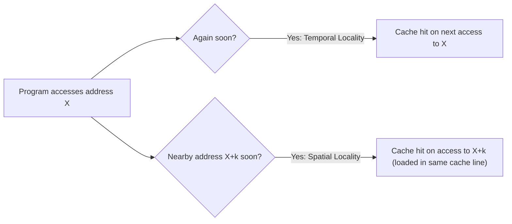

# CSE351: Cache Locality

**Locality of reference** is the tendency of programs to access a small, concentrated subset of their address space during any short time window. This principle is the fundamental reason why small, fast caches are effective at hiding the latency of large, slow main memory.

---

## Types of Locality

### [[Temporal Locality|Temporal Locality]]

**Temporal locality** exists when a recently referenced memory location is likely to be referenced again in the near future. This occurs most visibly in loops, where the loop body instructions and loop variables are accessed on every iteration.

### [[Spatial Locality|Spatial Locality]]

**Spatial locality** exists when locations near a recently referenced location are likely to be referenced soon. This occurs with sequential instruction execution and with data structures like [[CSE351/Data Structures/Arrays|arrays]], where adjacent elements are accessed one after another.

---

## Why Locality Enables Effective Caching

A cache works by keeping recently accessed data close to the CPU. Locality guarantees that:
- **Temporal locality** → data will be needed again before it is evicted → cache hits on future accesses.
- **Spatial locality** → nearby data (loaded as part of the same **cache line**) will be needed soon → cache hits on neighboring elements.

Without locality, a cache would be hit at essentially random rates and would provide little benefit.

---

---

## Related

- [[Temporal Locality|Temporal Locality]]
- [[Spatial Locality|Spatial Locality]]
- [[Cache Organization|Cache Organization]]
- [[Cache Associativity|Cache Associativity]]
- [[CSE351/Data Structures/Arrays|Arrays (spatial locality example)]]
- [[Program Optimizations via Cache|Program Optimizations via Cache]]

---

## Industry Standard Terms

| Course Term | Industry / Standard Term |
|:---|:---|
| Locality of reference | Principle of locality; memory locality |
| Temporal locality | Temporal reuse; time locality |
| Spatial locality | Spatial reuse; stride locality |
| Cache line (block loaded on miss) | Cache line; cache block |
