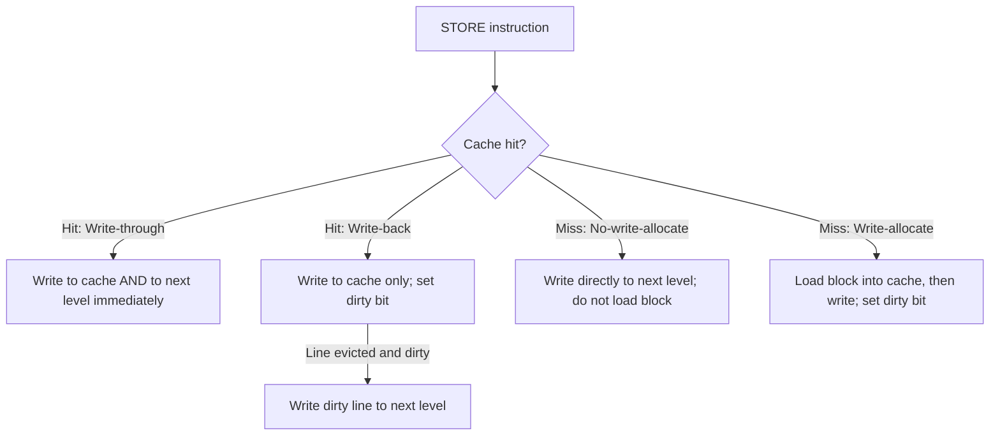

# CSE351: Handling Writes

Write operations require additional policy decisions that read operations do not: when a write hits the cache, must the underlying memory be updated immediately? And when a write misses, should the block be loaded first?

## Write-Hit Policies

A **write-hit** occurs when the address being written is already present in the cache.

- **Write-through:** Immediately propagate the write to the next memory level (another cache tier or main memory) on every write operation.
    - **Bus impact:** High. Every `STORE` instruction generates a bus transaction. This can saturate memory bandwidth in write-heavy workloads.
    - **Advantage:** Memory is always consistent with the cache — simplifies cache coherence in multi-core systems.

- **Write-back:** Defer writing to the next level until the cache line is evicted. Each line has a **dirty bit** that is set when the line is written; on eviction, only dirty lines generate a write-back to memory.
    - **Bus impact:** Low. Bus transactions only occur when a dirty line is evicted to make room. Significantly more efficient for repeated writes to the same block (multiple writes coalesce into one eviction write).
    - **Advantage:** Fewer memory transactions overall; much better for write-heavy workloads.

## Write-Miss Policies

A **write-miss** occurs when the block being written is not currently in the cache.

- **No-write-allocate** (write-around): Write directly to the next memory level without loading the block into the cache. Used when future accesses to the same block are unlikely.
- **Write-allocate** (fetch-on-write): Load the block into the cache first, then apply the write. Used when the same block is likely to be written or read again soon — exploits [[Temporal Locality|temporal locality]].

## Common Policy Combinations

Hardware designers pair write-hit and write-miss policies to match typical workloads:

| Combination | Typical Use |
|:---|:---|
| **Write-back + write-allocate** | Most common for L1/L2 caches; minimizes total memory traffic |
| **Write-through + no-write-allocate** | L2 cache in multi-core systems; ensures other cores can observe updates via the shared L3 without explicit invalidation |

---

---

## Related

- [[Cache Organization|Cache Organization]]
- [[Cache Associativity|Cache Associativity]]
- [[Program Optimizations via Cache|Program Optimizations via Cache]]
- [[Temporal Locality|Temporal Locality]]

---

## Industry Standard Terms

| Course Term | Industry / Standard Term |
|:---|:---|
| Write-through | Write-through; immediate update policy |
| Write-back | Write-back; deferred update; copy-back |
| Dirty bit | Modified bit; dirty bit (standard hardware term) |
| No-write-allocate | Write-around; no-fetch-on-write |
| Write-allocate | Fetch-on-write; write-allocate |
| Eviction of dirty line | Writeback; cache flush |
