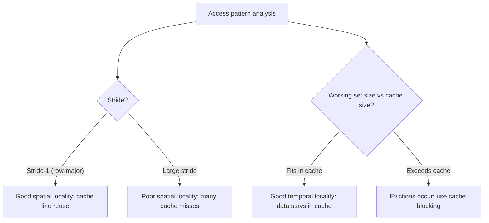

# CSE351: Program Optimizations via Cache

Cache performance is determined by the **miss rate** — the fraction of accesses that fail to find data in the cache. Because a cache miss to main memory is 100× slower than a hit, even small reductions in miss rate produce large performance gains.

## Strategies

Cache performance can be improved by:
- Adjusting memory access patterns to reduce the miss rate (requires knowledge of cache parameters).
- Choosing cache-friendly data structures and algorithms.
- Applying loop transformations that improve locality.

## Cache Images

A **cache image** is an aligned chunk of memory exactly the same size as the cache ($C$ bytes). Any $C$-byte region aligned to $C$ bytes is guaranteed to fit entirely in the cache at once.

Key insight: two addresses with the **same offset within their respective cache images** map to the **same set** in the cache. This means:
- Contiguous blocks in memory map to contiguous cache sets.
- If $B = C/K$ is the number of blocks the cache can hold, an aligned $C$-byte chunk all fits simultaneously.

Cache images help predict which cache set a given address will occupy, which is useful for diagnosing **conflict misses** — situations where two frequently accessed addresses share a set despite the overall cache being mostly empty.

## Optimization Guidelines

| Goal | Technique |
|:---|:---|
| [[CSE351/Cache/Temporal Locality|Temporal locality]] | Keep the working set small; reuse data before eviction |
| [[CSE351/Cache/Spatial Locality|Spatial locality]] | Access memory in small strides; prefer [[CSE351/Data Structures/Arrays|arrays]] over linked lists |
| Nested loops | Focus optimizations on the **innermost loop body** — this is where most accesses occur |
| 2D arrays | Use **cache blocking (tiling)** so sub-matrices fit in the cache |

## Data Structure Choices

| Layout | Cache Behavior |
|:---|:---|
| Array | Contiguous in memory; excellent [[CSE351/Cache/Spatial Locality|spatial locality]] — neighboring elements load in the same cache line |
| Linked list | Non-contiguous; pointer-chasing causes frequent cache misses since nodes can be anywhere in memory |

Cache-friendly data structure choices exploit the fact that loading one element also loads its neighbors into the cache at no extra cost.

Note: Optimal cache performance is platform-specific, since it depends on cache size, block size, and associativity — parameters that vary across processor generations.

---

---

## Related

- [[Cache Locality|Locality]]
- [[Cache Organization|Cache Organization]]
- [[Temporal Locality|Temporal Locality]]
- [[Spatial Locality|Spatial Locality]]
- [[CSE351/Data Structures/Arrays|Arrays]]

---

## Industry Standard Terms

| Course Term | Industry / Standard Term |
|:---|:---|
| Cache image | Aligned cache-sized region; cache-colored block |
| Cache blocking / tiling | Loop tiling; cache blocking; register blocking |
| Stride-1 access | Unit-stride access; row-major traversal |
| Working set | Working set size; resident set |
| Miss rate reduction | Cache-friendly programming; memory access optimization |
