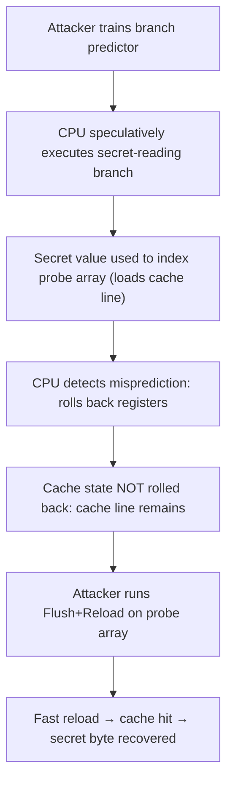

# CSE351: Side Channel Attacks

**Side channel attacks** exploit physical side effects of a system's implementation — such as timing or memory access patterns — to infer secret information without breaking the underlying cryptography directly. The CPU's cache is a particularly powerful side channel because its behavior is observable through timing.

## Timing Attacks

Consider a password checker that returns early on the first mismatched character:

```c
int check_password(char* input, char* real) {
    for (int i = 0; input[i] != 0 && real[i] != 0; i++) {
        if (input[i] != real[i]) return 0;
    }
    return 1;
}
```

An attacker can recover the password one character at a time by measuring how long each guess takes: a **longer execution time** means more characters matched before the early return, leaking information about the correct password character by character. The fix is a constant-time comparison that always iterates through all characters.

## Cache Timing

By measuring how long a memory access takes, an attacker can determine whether a given address is in the cache:
- **Fast access (~4 cycles):** Cache hit — someone recently loaded this address.
- **Slow access (~200 cycles):** Cache miss — this address was not recently loaded.

### Flush + Reload

A three-step cache timing technique that exploits shared memory (e.g., shared libraries):

1. **Flush:** Evict the target address from all cache levels using the `clflush` instruction.
2. **Wait:** Let the victim program execute — if it accesses the monitored address, it will be loaded into the shared cache.
3. **Reload:** Access the target address and measure the time. A fast access (cache hit) confirms the victim accessed it; a slow access (cache miss) confirms it did not.

This technique can recover what data a victim program accessed, even across process boundaries, because cache lines are shared physical hardware.

## Spectre and Meltdown

### Speculative Execution and Branch Prediction

Modern CPUs **pipeline** instructions — they begin work on future instructions before the current one completes. At a conditional branch, the CPU uses **branch prediction**: it observes past program behavior and guesses which path to take. If correct, time is saved; if wrong, the CPU **rolls back** and executes the correct path.

Rollback restores architectural state (registers, memory) — but it does **not** restore the cache state. Speculatively executed memory accesses leave traces in the cache even after rollback.

### Spectre Attack

Spectre combines cache timing with speculative execution to read memory the attacker should not be able to access:

1. **Train** the branch predictor over many iterations to expect a particular branch to be taken.
2. Cause the predictor to speculatively execute that branch using an out-of-bounds index — the speculative execution reads a secret memory location and uses its value to index into an accessible array, loading a specific cache line.
3. Even after the CPU detects the misprediction and rolls back, the **loaded cache line remains** — the rollback undoes the register writes but not the cache state.
4. Use **Flush + Reload** to determine which cache line was loaded, recovering the secret byte.

### Mitigations

| Approach | Cost |
|:---|:---|
| Virtual memory isolation | Already in use; limits inter-process access (but Spectre operates within a process) |
| Disabling speculative execution for sensitive code paths | ~30% performance penalty |
| Flushing branch predictor state on context switch | Moderate overhead; prevents cross-process branch predictor training |

Most performance-costly mitigations are not universally deployed because a real-world Spectre attack already requires the attacker to have code running on the victim's machine, making the threat model relatively narrow.

---



---

## Related

- [[Program Optimizations via Cache|Program Optimizations via Cache]]
- [[Cache Organization|Cache Organization]]
- [[Buffer Overflow|Buffer Overflow]]

---

## Industry Standard Terms

| Course Term | Industry / Standard Term |
|:---|:---|
| Side channel attack | Side-channel attack; covert channel |
| Timing attack | Timing side-channel; timing oracle |
| Flush + Reload | Flush+Reload attack; Prime+Probe (related technique) |
| Branch prediction | Branch predictor; dynamic branch prediction |
| Speculative execution | Out-of-order execution; speculative execution |
| Spectre | Spectre vulnerability (CVE-2017-5753, CVE-2017-5715) |
| Meltdown | Meltdown vulnerability (CVE-2017-5754) |
| Branch predictor flushing on context switch | Retpoline; IBRS; indirect branch speculation mitigation |
