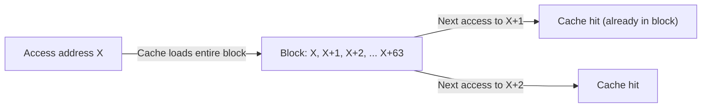

# CSE351: Spatial Locality

**Spatial locality** is the tendency for a program to access memory locations that are near recently accessed locations. It is one of the two primary forms of [[CSE351/Cache/Cache Locality|locality of reference]], alongside [[CSE351/Cache/Temporal Locality|temporal locality]].

## Principle

When a program accesses a specific memory address, there is a high probability that it will access nearby addresses in the near future. The closer in memory two locations are, the more likely they are to be accessed close together in time.

## In Cache Systems

Caches exploit spatial locality by loading an entire **cache block** (also called a cache line) into the cache whenever a single byte is requested. A typical cache line is 64 bytes. This way, subsequent accesses to neighboring data — data already in the loaded block — result in cache hits without any additional memory traffic.

The relationship between cache block size and spatial locality is a design trade-off: larger blocks capture more spatial locality but waste bandwidth if nearby data is never accessed (see **Compulsory miss** in [[CSE351/Cache/Cache Organization|Cache Organization]]).

## Examples

- **Arrays:** Accessing elements of an array sequentially (`A[0], A[1], A[2]...`) is the canonical example of perfect spatial locality. Because array elements are contiguous in memory, loading `A[0]` also loads the neighboring elements into the cache.
- **Sequential instruction execution:** The CPU fetches instructions one after another from consecutive addresses. The instruction cache takes advantage of this by loading a full block of instructions on every miss.
- **Disk I/O:** Hard disks read data in sectors (512–4096 bytes). Loading a full sector on every access exploits the spatial locality of files, whose bytes are typically stored consecutively.

## Importance and Optimizations

Understanding spatial locality drives several software optimizations:

- **Stride-1 access:** Iterating through a multidimensional array in the order that matches its memory layout (row-major order in C) achieves stride-1 access — every access lands in the same or the next cache line. See [[CSE351/Cache/Program Optimizations via Cache|Program Optimizations via Cache]].
- **Cache blocking (tiling):** Restructuring algorithms (e.g., matrix multiplication) to operate on sub-blocks that fit in the cache maximizes both spatial and temporal reuse.

---

---

## Related

- [[CSE351/Cache/Cache Locality|Cache Locality]]
- [[CSE351/Cache/Temporal Locality|Temporal Locality]]
- [[CSE351/Cache/Cache Organization|Cache Organization (block size)]]
- [[CSE351/Cache/Program Optimizations via Cache|Program Optimizations via Cache]]
- [[CSE351/Data Structures/Arrays|Arrays (stride-1 access)]]
- [[CSE344/Database Design/Disk Storage|Disk Storage (Database context)]]

---

## Industry Standard Terms

| Course Term | Industry / Standard Term |
|:---|:---|
| Spatial locality | Spatial reuse; stride locality |
| Cache block / cache line | Cache line (typically 64 bytes on modern x86-64) |
| Stride-1 access | Unit-stride access; row-major traversal |
| Cache blocking / tiling | Loop tiling; cache-oblivious algorithms; register blocking |
