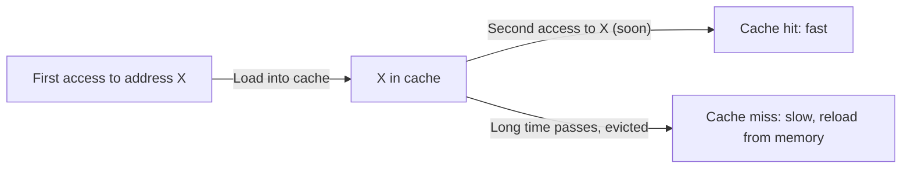

# CSE351: Temporal Locality

**Temporal locality** is the tendency for a program to access the same memory location multiple times within a short period of time. It is one of the two primary forms of [[Cache Locality|locality of reference]], alongside [[Spatial Locality|spatial locality]].

## Principle

If a memory location is referenced once, there is a high probability that it will be referenced again in the near future. The more recently a location was accessed, the more likely it is to be accessed again soon.

## In Cache Systems

Caches exploit temporal locality by **keeping recently accessed data in the cache** after it is first loaded. When the same address is requested again soon after the initial access, it results in a **cache hit** — the data is served directly from the fast cache without going to slower main memory or disk.

The **replacement policy** (e.g., Least Recently Used) is designed to keep temporally local data in the cache. See [[Cache Organization|Cache Organization]] for details on miss types and replacement policies.

## Examples

- **Loops:** In a `for` or `while` loop, the same instructions are fetched on every iteration, and loop variables (counters, accumulators) are read and written repeatedly. The instruction cache hits on every iteration after the first, and frequently accessed variables may remain in registers or L1 data cache.
- **Database buffering:** When a database loads a page into its buffer pool, it expects that subsequent queries are likely to access data from that same page again, making the buffer act as a software-managed temporal cache.
- **Function calls:** The instructions of a frequently called function stay in the instruction cache after the first call, so subsequent calls execute faster.

---

---

## Related

- [[Cache Locality|Cache Locality]]
- [[Spatial Locality|Spatial Locality]]
- [[Cache Organization|Cache Organization (LRU replacement)]]
- [[Program Optimizations via Cache|Program Optimizations via Cache]]
- [[Disk Storage|Disk Storage (Database context)]]

---

## Industry Standard Terms

| Course Term | Industry / Standard Term |
|:---|:---|
| Temporal locality | Temporal reuse; time locality |
| Cache hit on re-access | Cache hit; temporal locality exploitation |
| LRU replacement policy | Least Recently Used (LRU); approximated by pseudo-LRU in hardware |
| Working set | The set of pages / cache lines actively used during a phase of computation |
