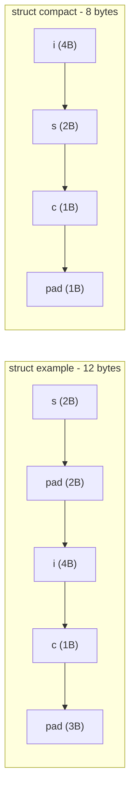

# CSE351: Structs

A **struct** (structure) in C is a user-defined data type that groups related variables of different types into a single named unit stored contiguously in memory.

## Definition and Declaration

```c
struct struct_tag {
    type_1 field_1;
    /* ... */
    type_N field_N;
};

struct struct_tag my_struct_var; // Instance declaration
```

### Typedef Pattern

Using `typedef` creates an alias that removes the need to repeat the `struct` keyword:

```c
typedef struct {
    int x;
    int y;
} Point;

Point pt1; // No need to write 'struct Point'
```

## Field Access

| Syntax | Used When | Meaning |
|:---|:---|:---|
| `pt.x` | Instance | Access field `x` of instance `pt` |
| `ptr->y` | Pointer | Access field `y` through pointer `ptr` |
| `(*ptr).y` | Pointer | Equivalent to `ptr->y` |

---

## Struct Alignment and Padding

To allow the CPU to load fields efficiently, compilers follow **alignment rules**. An object of size $K$ bytes is **aligned** if its address is a multiple of $K$. Misaligned accesses require multiple bus cycles and are forbidden on some architectures.

### Formal Definition

The **alignment requirement** of a type of size $K$ bytes is $K$ bytes. A field of alignment $K$ must be placed at the next address that is a multiple of $K$.

### Simplified Explanation

The compiler inserts invisible "padding" bytes between fields to satisfy alignment. Think of it as adding spacers so that each field starts on its "natural" boundary.

### Layout Rules

1. **Field ordering:** Fields are placed in the order they are declared; the compiler does not reorder them.
2. **Internal padding:** Unused bytes are inserted before a field so its start address meets its alignment requirement.
3. **External padding:** Unused bytes are appended at the end so the total struct size is a multiple of the largest field alignment ($K_{max}$). This ensures correctness when the struct is used in an array.

### Example: Alignment and Fragmentation

```c
struct example {
    short s;  // 2 bytes, offset 0
    int i;    // 4 bytes, needs 4-byte alignment → offset 4 (2B internal padding)
    char c;   // 1 byte, offset 8
};            // K_max = 4. Current size = 9, padded to multiple of 4 → 12 bytes total
```

**Memory layout:**
```
Offset 0: s (2 bytes)
Offset 2: [padding 2 bytes]
Offset 4: i (4 bytes)
Offset 8: c (1 byte)
Offset 9: [padding 3 bytes]
```

**Internal Fragmentation:** Wasted space between fields — e.g., the 2 bytes between `short s` and `int i`.

**External Fragmentation:** Wasted space at the end of the struct — e.g., the 3 bytes after `char c`.

### Minimizing Padding: Field Ordering

Declaring fields in **decreasing order of size** eliminates most internal padding:

```c
struct compact {
    int i;    // 4 bytes, offset 0
    short s;  // 2 bytes, offset 4
    char c;   // 1 byte, offset 6
};            // 1 byte external padding → 8 bytes total (vs. 12 above)
```

---



---

## Related

- [[CSE351/Data Structures/Arrays|Arrays]]
- [[CSE351/Memory Fundamentals/Pointers|Pointers]]
- [[CSE351/Memory Management/Memory Allocation|Memory Allocation (alignment requirements)]]
- [[CSE333/Data Structures/Struct|Struct (CSE333)]]
- [[CSE484/Memory Exploits/Memory Layout|Memory Layout (CSE484)]]

---

## Industry Standard Terms

| Course Term | Industry / Standard Term |
|:---|:---|
| Struct | Structure; record; composite type |
| Internal padding | Alignment padding; inter-field padding |
| External padding | Tail padding; struct end padding |
| $K_{max}$ alignment rule | Maximum member alignment; struct alignment requirement |
| `typedef struct` | Type alias; named struct type |
| Field ordering for size | Struct packing optimization; dense packing |
| `__attribute__((packed))` | Pragma pack; disables padding (non-portable) |
