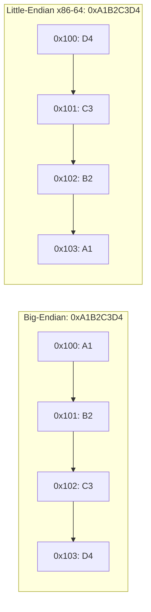

# CSE351: Words and Memory

In systems programming, **memory** is a hardware component that acts as local data storage for the CPU during instruction execution. Data is moved and manipulated in fixed-length chunks called **words**.

## Word Size

**Word size** is the number of bits the CPU processes as a single unit during instruction execution.
- On a 64-bit system, the word size is **8 bytes** (64 bits).
- The word size determines the width of pointers and the maximum addressable memory (a 64-bit word can address $2^{64}$ unique bytes, though current x86-64 implementations use only 48 bits of the virtual address).

## Memory Addresses

Each byte in memory is assigned a unique **memory address**, typically represented in [[Binary and Hexadecimal|hexadecimal]].
- On 64-bit systems, addresses are 8 bytes wide.
- The **address space** is the set of all possible addresses the CPU can generate; for a process this is the virtual address space managed by [[CSE351/Memory Management/Virtual Memory|Virtual Memory]].

---

## Endianness (Byte Ordering)

**Endianness** refers to the order in which the individual bytes of a multi-byte data type (such as an `int` or `long`) are stored in consecutive memory addresses.

### MSB and LSB

- **Most Significant Bit (MSB):** The left-most bit in a word — the bit with the highest positional value.
- **Least Significant Bit (LSB):** The right-most bit in a word — the bit with the lowest positional value.
- **Most Significant Byte:** The byte that contains the MSB.
- **Least Significant Byte:** The byte that contains the LSB.

### Byte Ordering Models

For multi-byte data, consecutive bytes of the value are stored in consecutive memory addresses. The two conventions differ in which end goes first.

| Model | Description |
|:---|:---|
| **Big-Endian** | The **most significant byte** is stored first (at the lowest address). Matches "natural" reading order. Used in network protocols (Internet byte order). |
| **Little-Endian** | The **least significant byte** is stored first (at the lowest address). **x86-64** uses little-endian. |

### Example: Storing `0xA1B2C3D4` at Address `0x100`

- **MSB Byte:** `A1`
- **LSB Byte:** `D4`

| Address | Big-Endian | Little-Endian |
|:---:|:---:|:---:|
| `0x100` | `A1` | `D4` |
| `0x101` | `B2` | `C3` |
| `0x102` | `C3` | `B2` |
| `0x103` | `D4` | `A1` |

Little-endian means that when you look at a raw memory dump, the bytes of a multi-byte integer appear reversed relative to how you would write the number in hex. This matters for [[Buffer Overflow|Buffer Overflow]] exploits, where the attacker must account for byte ordering when crafting a return address.

---

---

## Related

- [[CSE351/Memory Fundamentals/Pointers|Pointers (including Pointer Arithmetic)]]
- [[Binary and Hexadecimal|Binary and Hexadecimal]]
- [[x86-64 Registers|x86-64 Registers]]
- [[Buffer Overflow|Buffer Overflow]]
- [[CSE351/Memory Management/Virtual Memory|Virtual Memory]]

---

## Industry Standard Terms

| Course Term | Industry / Standard Term |
|:---|:---|
| Word size | Natural word size; machine word |
| Big-endian | Network byte order (IETF standard); big-endian (ARM, PowerPC) |
| Little-endian | Host byte order on x86/x86-64; little-endian |
| Memory address | Virtual address (in process context); physical address (hardware) |
| Address space | Virtual address space (VAS) |
