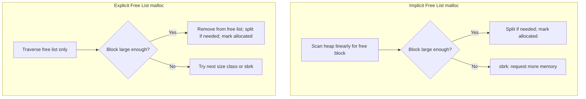

# CSE351: Explicit Allocation Implementation

## Memory Notation

In diagrams we represent memory as a sequence of **words**. On x86-64:
- 1 word = 64 bits = 8 bytes
- All allocations are aligned and sized to multiples of words.

## Core Implementation Questions

Any explicit allocator must answer:
1. How do we know how much memory to free given only a pointer?
2. How do we track which blocks are free?
3. How do we choose which free block to use?
4. What do we do with leftover space when a block is larger than requested?
5. How do we reclaim space from freed adjacent blocks?

---

## Knowing How Much to Free: Headers

Store the block's size (and allocation status) in a **header** — the word immediately before the payload. This costs one extra word per block.

If the block size is always a multiple of $2^n$, then the lowest $n$ bits of the size are always zero. The allocator exploits this by packing the `is_allocated` flag into the lowest bit of the header:

```c
h = size | a;       // encode: set low bit if allocated
a = h & 1;          // decode: extract allocated flag
size = h & ~1;      // decode: mask out the low bit to get size
```

This bit-packing technique is fundamental to keeping per-block metadata overhead to a single word.

---

## Tracking Free Blocks

### Implicit Free List

Traverse the entire heap block by block using pointer arithmetic until a free block is found.
- **Pros:** No extra memory for pointers — only the header is needed.
- **Cons:** Finding a free block is O(n) in the **total number of blocks** (both allocated and free).

### Explicit Free List

Maintain a doubly-linked list of **only** the free blocks. Since free blocks are not storing payload, their payload area can hold the `next` and `prev` pointers.

**Free Block Structure:**
1. **Header:** (4 or 8 bytes) stores `size | a`.
2. **Next pointer:** (8 bytes) stores address of the next free block in the list.
3. **Prev pointer:** (8 bytes) stores address of the previous free block in the list.
4. **Old payload / padding:** Remainder of the block's interior.
5. **Footer:** (4 or 8 bytes) copy of the header, used for backward coalescing.

- **Pros:** Finding a free block is faster — only free blocks are visited.
- **Cons:** Requires more space (pointers add to minimum free block size). Minimum free block is 4 words (header + next + prev + footer).

### Implicit Free List: Implementation Steps

1. **Initialization:** Set up a large chunk of memory with a "prologue" block (always allocated, size 0) and an "epilogue" block (always allocated, size 0) to simplify boundary conditions during coalescing — these sentinels eliminate edge-case checks.
2. **Allocation (`malloc`):**
    - Round up the requested size to satisfy alignment and include the header.
    - Search the heap from the start (First-Fit) or last position (Next-Fit).
    - If a large enough free block is found: **split** it if the remainder meets the minimum block size. Mark as allocated.
    - If no block fits: request more memory from the OS (`sbrk`).
3. **Deallocation (`free`):**
    - Clear the "allocated" bit in the header.
    - **Coalesce** with adjacent free blocks immediately (Eager) or defer (Lazy/Deferred coalescing).

### Explicit Free List: Implementation Steps

1. **Initialization:** Same as implicit, but also initialize an empty doubly-linked list of free blocks.
2. **Allocation (`malloc`):**
    - Search **only** the free list (faster than implicit).
    - If a block is found: remove it from the free list. **Split** if necessary.
    - Insert the remaining free fragment back into the free list.
3. **Deallocation (`free`):**
    - Mark the block as free.
    - Check neighbors (using footers or "prev-allocated" flags).
    - If neighbors are free, remove them from the free list and merge.
    - **Insert** the (merged) block into the free list according to the insertion policy (LIFO or Address-Ordered).

---

## Implicit Free List: Operations

### Finding a Free Block

- **First fit:** Start from the beginning and return the first block that fits. O(n). Can create many small fragments near the heap start.
- **Next fit:** Like first fit, but start from where the previous search ended. Faster on average; tends to have worse fragmentation.
- **Best fit:** Scan all free blocks and return the one with the fewest bytes left over. Better utilization; worst throughput.

### Allocating (Splitting)

When the chosen free block is larger than needed, **split** it to avoid internal fragmentation:

```c
void split(ptr b, int bytes) {
    int newsize = ((bytes + 15) >> 4) << 4;  // round up to multiple of 16
    int oldsize = *b & ~1;                   // mask out allocated bit
    *b = newsize | 1;                        // mark new block as allocated
    if (newsize < oldsize) {
        *(b + newsize) = oldsize - newsize;  // set header of remainder (free)
    }
}
```

### Freeing (Coalescing)

Simply clearing the allocated bit leads to **false fragmentation** — adjacent free blocks that cannot individually satisfy a request. Fix by coalescing immediately on free.

**Coalescing with the next block** (forward coalescing):

```c
void free_block(ptr p) {
    ptr b = p - WORD;           // move to block header
    *b &= ~1;                   // clear allocated bit
    ptr next = b + (*b & ~1);   // find next block's header
    if ((*next & 1) == 0)       // if next block is free
        *b += *next;            // merge: add its size to this block
}
```

**Coalescing with the previous block** (backward coalescing) requires a **footer** (boundary tag) at the end of each block. When freeing, check the footer of the block immediately before the current one; if it is free, merge.

---

## Explicit Free Lists: Operations

### Freeing — Insertion Policy

When a block is freed, it must be inserted into the free list. Two common policies:

- **LIFO (insert at head):** Constant-time insertion. Research suggests slightly worse fragmentation than address-ordered.
- **Address-ordered:** Insert so the free list stays sorted by memory address. Better fragmentation; linear-time insertion.

### Coalescing

Neighboring free blocks are already in the free list. When merging:
1. Remove both neighbors from the free list.
2. Merge them into a single larger free block.
3. Insert the merged block into the free list (respecting the insertion policy).

### Block Size Requirements

| Block Type | Required Fields | Minimum Size |
|:---|:---|:---|
| Allocated | Header + payload | 2 words |
| Free | Header + next pointer + prev pointer + footer | 4 words |

---

## When You Don't Need a Footer

A footer is only needed for **backward coalescing** — checking whether the preceding block is free. If each header stores an extra flag indicating whether the **preceding** block is allocated, the allocator can omit footers from allocated blocks (free blocks still need footers so their preceding neighbors can find them). This optimization saves one word per allocated block.

---

## Garbage Collection

**Garbage collection** is automatic reclamation of heap memory — the programmer only allocates, and the runtime frees unreachable blocks.

The allocator identifies unreachable blocks by modeling memory as a **directed graph**:
- Each allocated heap block is a node.
- Each pointer stored in that block is a directed edge.
- **Root nodes** are non-heap locations that contain pointers into the heap (registers, stack, global variables).
- A node is **reachable** if there is a path from any root to it. Unreachable nodes are garbage.

### Mark and Sweep

Two-phase algorithm:

**Mark phase:** Starting from each root node, follow all pointers recursively and mark each reachable heap block.

**Sweep phase:** Scan the entire heap; any block not marked is unreachable — free it.

---



---

## Related

- [[Memory Allocation|Memory Allocation]]
- [[Segregated List Allocators|Segregated List Allocators]]
- [[CSE351/Memory Management/Virtual Memory|Virtual Memory]]
- [[CSE333/Data Structures/LinkedList|Linked Lists (CSE333)]]
- [[CSE333/Memory Management/Malloc and Free|malloc (CSE333)]]

---

## Industry Standard Terms

| Course Term | Industry / Standard Term |
|:---|:---|
| Prologue / epilogue blocks | Sentinel blocks; boundary sentinels |
| Header (size \| alloc bit) | Block header; Knuth boundary tag header |
| Footer (copy of header) | Boundary tag; block footer |
| Implicit free list | Implicit list allocator |
| Explicit free list | Explicit free list; segregated free list (when organized by size) |
| LIFO insertion | Last-in-first-out insertion; head insertion |
| Address-ordered insertion | Address-ordered free list; sorted free list |
| Mark and Sweep | Mark-and-sweep garbage collection; tracing GC |
| Root nodes (for GC) | GC roots; root set |
