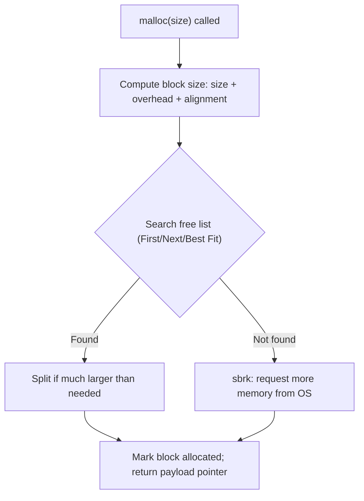

# CSE351: Memory Allocation

## Ways to Store Program Data

| Type | Size Known At | Lifetime |
|:---|:---|:---|
| **Static / global** | Compile time | Entire program; a portion is read-only (string literals) |
| **Stack-allocated** | Compile time (mostly) | Deallocated automatically when the function returns |
| **Dynamic (heap)** | Runtime | Controlled entirely by the programmer |

## Dynamic Memory Allocation

Programmers use **dynamic memory allocators** to acquire heap memory at runtime — for data whose size or lifetime is only known when the program runs. The heap segment grows as needed; when it runs out, the allocator requests more from the OS via `sbrk` (Unix).

Two kinds of allocators:
- **Implicit** (garbage-collected): the programmer only allocates; the runtime frees (e.g., `new` in Java).
- **Explicit**: the programmer both allocates and frees (e.g., `malloc` / `free` in C).

## malloc / free API

```c
#include <stdlib.h>

void* malloc(size_t size);  // allocate `size` uninitialized bytes
void  free(void* p);        // release block previously returned by malloc
```

- `malloc` returns a pointer to the start of the block, or `NULL` on failure or if `size == 0`. Blocks are typically aligned to 8 or 16 bytes.
- `free` must receive the exact pointer originally returned by `malloc`. Calling `free` on an already-freed block is undefined behavior (can introduce vulnerabilities). `free(NULL)` is a no-op.

### Best Practices

```c
int* ptr = (int*) malloc(n * sizeof(int));  // sizeof makes code portable across architectures
free(ptr);
ptr = NULL;  // set to NULL after freeing to prevent accidental double-free
```

### Allocator Interface Constraints

Applications must:
- Never access memory outside a currently allocated block.
- Only call `free` with a pointer previously returned by `malloc`.

Allocators must:
- Respond immediately to every `malloc` call (no background GC pauses).
- Only allocate blocks from currently free memory.
- Align blocks to satisfy all alignment requirements.
- Never move allocated blocks (no compaction).

### Common Bug: Pointer Drift

```c
int* p = (int*) malloc(N * sizeof(int));
for (int i = 0; i < N; i++) {
    *p = i;
    p++;         // p no longer points to the original block start
}
free(p);         // ERROR: freeing wrong address — undefined behavior
```

---

## Heap Fragmentation

Poor memory utilization caused by **fragmentation** — parts of the heap not storing useful payload.

### Internal Fragmentation

Wasted space **inside** allocated blocks: $\text{Internal} = \text{BlockSize} - \text{Payload}$.

### Formal Definition

$$\text{BlockSize} = \left\lceil \frac{P + M}{A} \right\rceil \times A$$

Where $P$ = requested payload, $M$ = metadata overhead (header, footer), $A$ = alignment requirement.

$$\text{Internal Fragmentation} = \text{BlockSize} - P$$

### Simplified Explanation

The allocator must round up every block to a multiple of the alignment size and include its own bookkeeping overhead. Bytes used for padding and metadata are "wasted" from the application's perspective.

**Example (16-byte alignment, 8-byte header):**
- Request 20 bytes.
- $P = 20,\ M = 8 \Rightarrow P + M = 28$
- Round 28 up to next multiple of 16 $\Rightarrow \text{BlockSize} = 32$
- $\text{Internal} = 32 - 20 = 12$ bytes wasted.

### External Fragmentation

Unused space **between** allocated blocks. Occurs when allocation and free patterns leave holes such that the aggregate free memory is sufficient for a request, but no single contiguous free block is large enough.

---

## Allocation Strategies

| Strategy | Behavior | Trade-off |
|:---|:---|:---|
| **First Fit** | Search from the beginning; return the first block large enough | Fast; tends to fragment the start of the heap |
| **Next Fit** | Search from where the last search ended; wrap around | More even distribution; worse fragmentation than best fit |
| **Best Fit** | Search the entire heap; return the block with the fewest bytes left over | Better utilization; slower (O(n) per allocation) |

---

## Block Allocation Process

1. Compute required block size: payload + metadata + alignment padding.
2. Search for a free block using the chosen strategy.
3. **Split** the block if it is significantly larger than needed (the remainder must be at least the minimum block size).
4. Mark the block as allocated and return the payload address.

---

## Alignment Requirements

1. The payload address must be a multiple of the alignment size.
2. The total block size must be a multiple of the alignment size.

### Minimum Block Size

The minimum block size must accommodate both the allocated block format and the free block format (which needs extra fields for free list pointers).

Example with 16-byte alignment:
- Headers only: 16 bytes minimum (header + payload must be ≥ 16 bytes total)
- With boundary tags (header + footer): 32 bytes minimum

---

## Coalescing

**Coalescing** combines neighboring free blocks into a single larger block to prevent **false fragmentation** — a situation where many small adjacent free blocks cannot individually satisfy a larger request, even though their combined size is sufficient.

| Case | Previous Block | Next Block | Action |
|:---|:---|:---|:---|
| 1 | Allocated | Allocated | No coalescing possible |
| 2 | Allocated | Free | Forward coalescing |
| 3 | Free | Allocated | Backward coalescing |
| 4 | Free | Free | Bidirectional coalescing |

---

## Boundary Tags (Headers + Footers)

**Problem:** With only a header, there is no efficient way to find the preceding block for backward coalescing — you would have to scan the entire heap from the beginning.

**Solution:** Add a **footer** (a copy of the header) at the end of every block. This enables O(1) backward traversal and bidirectional coalescing.

---

## Free List Structures

### Implicit Free List

Traverse the entire heap using pointer arithmetic to find free blocks. Saves memory (no extra pointers), but finding a free block is O(n) in the total number of all blocks.

### Explicit Free List

A doubly-linked list threading **only** the free blocks together. Pointers are stored in the payload area (since free blocks are not storing user data). Faster search — only free blocks are visited — but requires more minimum block size to hold the pointers.

For full implementation details — header format, splitting code, coalescing code, insertion policies — see [[CSE351/Memory Management/Explicit Allocation Implementation|Explicit Allocation Implementation]].

### Segregated Free Lists

Multiple free lists, one per size class, for better throughput and utilization. See [[CSE351/Memory Management/Segregated List Allocators|Segregated List Allocators]].

---



---

## Related

- [[CSE351/Memory Management/Explicit Allocation Implementation|Explicit Allocation Implementation]]
- [[CSE351/Memory Management/Segregated List Allocators|Segregated List Allocators]]
- [[CSE351/Memory Management/Virtual Memory|Virtual Memory (351)]]
- [[CSE351/Data Structures/Structs|Structs (including Alignment)]]
- [[CSE333/Memory Management/Malloc and Free|Malloc and Free (CSE333)]]
- [[CSE333/Memory Management/Heap Management|Heap Management (CSE333)]]
- [[CSE451/Virtualization/Memory/Memory management|OS Memory Management (CSE451)]]
- [[CSE484/Memory Exploits/Memory Layout|Memory Layout (CSE484)]]

---

## Industry Standard Terms

| Course Term | Industry / Standard Term |
|:---|:---|
| Dynamic memory allocator | Memory allocator; heap allocator; `malloc` implementation |
| Implicit allocator (GC) | Garbage-collected allocator; managed memory |
| Explicit allocator (`malloc`/`free`) | Unmanaged memory; manual memory management |
| `sbrk` | `sbrk(2)` system call; `brk(2)`; `mmap(2)` (modern allocators use `mmap`) |
| Internal fragmentation | Internal fragmentation; alignment waste |
| External fragmentation | External fragmentation; heap fragmentation |
| Coalescing | Block coalescing; free block merging |
| Boundary tag / footer | Boundary tag; Knuth boundary tags (named after their inventor) |
| Implicit free list | Implicit list allocator |
| Explicit free list | Explicit free list; doubly-linked free list |
