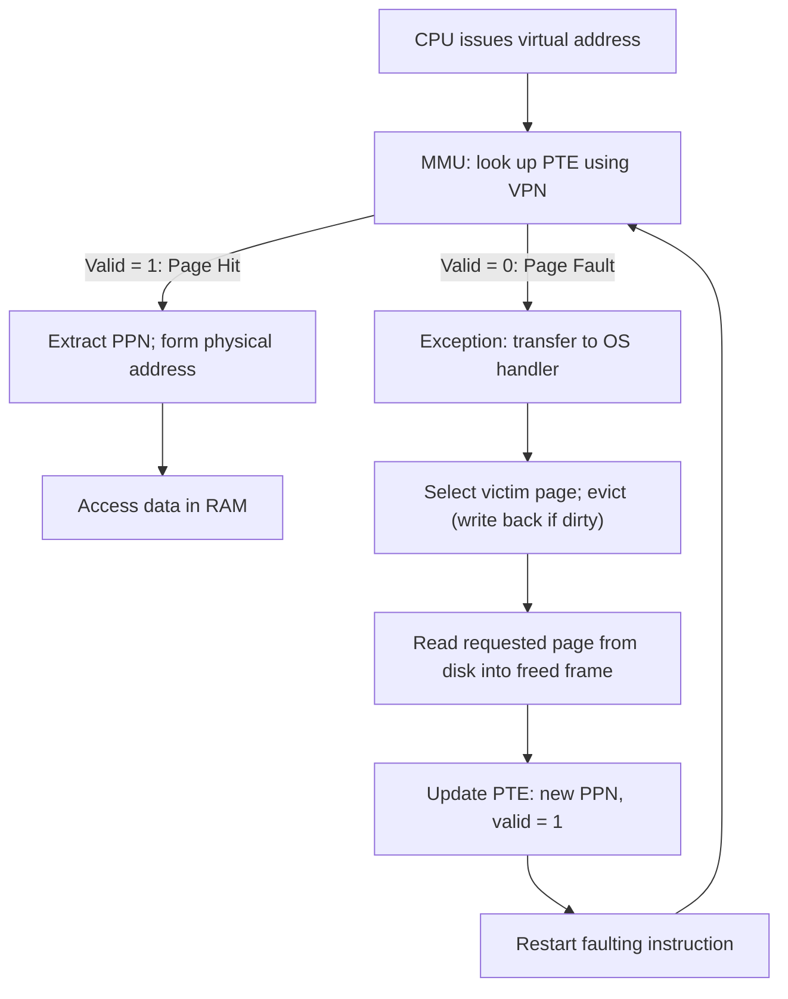

# CSE351: Page Faults

A **page fault** occurs when a requested virtual page is not currently in physical memory (the valid bit in its PTE is 0). When the OS evicts a page from RAM to disk, it marks the page's PTE as invalid and records the disk location. On the next access to that virtual page, the invalid PTE triggers a page fault exception, and the OS handler brings the page back from disk.

Note: a single instruction can trigger **multiple page faults** — for example, if both the instruction fetch and its data operand reference pages that are not in memory.

---

## Page Fault Handling Steps

1. CPU sends a virtual address to the MMU.
2. MMU looks up the PTE using the VPN.
3. Valid bit = 0 → MMU raises a **page fault exception**, transferring control to the OS.
4. OS handler:
   a. Identifies a **victim page** in physical memory to evict (using a replacement policy such as LRU).
   b. If the victim is dirty, writes it back to its disk location.
   c. Reads the requested page from disk into the freed physical frame.
   d. Updates the PTE: sets the new PPN and sets valid = 1.
5. OS restarts the faulting instruction from the beginning.
6. On the retry, the access is a guaranteed page hit (the PTE is now valid).

---

## Page Hit vs. Page Fault

### Page Hit

```
CPU → MMU → Memory (PTE lookup) → MMU → Memory (data fetch) → CPU
```
Memory accesses: **2** (one for the PTE, one for the data).

### Page Fault

```
CPU → MMU → Memory (PTE) → MMU → OS Handler → Disk I/O → Memory update → restart
```
After the OS restarts the instruction: **2 more accesses** (PTE again, then data).

Plus the massive disk I/O penalty — see the latency table below.

---

## Why Page Faults Are Expensive

| Level | Approximate Access Time |
|:---|:---|
| Register | ~1 cycle |
| Memory (RAM) | ~100 cycles |
| Disk (SSD) | ~100,000 cycles |
| Disk (HDD) | ~10,000,000 cycles |

This 100,000× to 10,000,000× cost is why:
- The [[CSE351/Memory Management/Translation Lookaside Buffer (TLB 351)|TLB]] minimizes the number of page table memory accesses.
- Write-back policy limits the number of disk writes on eviction.
- Page size is large (4 KiB) — amortizing the disk I/O cost over many bytes.

---

## Address Translation Components

| Component | Purpose |
|:---|:---|
| CPU | Issues virtual addresses for every instruction and data access |
| MMU | Performs address translation using the current page table |
| PTBR | Page Table Base Register — points to the current process's page table in RAM |

---



---

## Related

- [[CSE351/Memory Management/Page Tables|Page Tables]]
- [[CSE351/Memory Management/Virtual Memory|Virtual Memory]]
- [[CSE351/Memory Management/Translation Lookaside Buffer (TLB 351)|TLB]]
- [[CSE351/System Programming/Exceptions|Exceptions]]
- [[CSE351/System Programming/Context Switching|Context Switching]]
- [[CSE451/Virtualization/Memory/Page Fault|Page Fault (CSE451)]]
- [[CSE451/Virtualization/Memory/How does the OS handle page faults|How the OS Handles Page Faults (CSE451)]]
- [[CSE451/Virtualization/Memory/Page Replacement/Page replacement|Page Replacement (CSE451)]]

---

## Industry Standard Terms

| Course Term | Industry / Standard Term |
|:---|:---|
| Page fault | Page fault; demand paging miss |
| Valid bit = 0 | Page not present; non-resident page |
| OS handler for page fault | Page fault handler; OS page fault routine |
| Victim page | Evicted page; page frame to reclaim |
| Write-back dirty page | Page writeback; dirty page flush |
| Restart faulting instruction | Resume-after-fault; instruction restart |
| PTBR | Page Table Base Register; CR3 (x86-64) |
