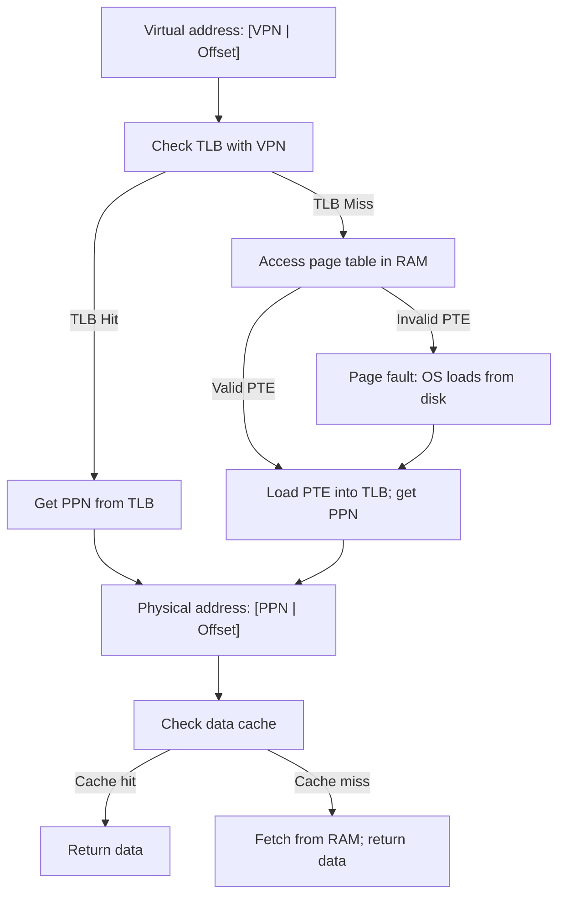

# CSE351: Translation Lookaside Buffer (TLB)

The **TLB** is a small, fast hardware cache inside the MMU that stores recently used [[Page Tables|page table entries (PTEs)]] to accelerate address translation.

---

## Purpose

Without a TLB, every memory access requires **two memory operations**: one to look up the PTE in the page table (in RAM), and one to fetch the actual data. The TLB eliminates the PTE lookup on hits, reducing most accesses to a **single memory operation**. Given that memory accesses are already slow (~100 cycles), doubling that cost on every access would be prohibitive.

---

## TLB Structure

- **Cached data:** Page table entries (PPN + management bits)
- **Index:** TLB Index (TLBI) extracted from the VPN
- **Tag:** TLB Tag (TLBT) for hit detection
- **Organization:** Set-associative cache (typically fully associative due to the TLB's small size — usually 16–512 entries)

---

## VPN Field Breakdown

The VPN is subdivided to navigate the TLB, just as a memory address is subdivided to navigate a data cache:

```
VPN: [ TLBT (TLB Tag) ][ TLBI (TLB Index) ]
```

---

## TLB Entry Components

| Component | Description |
|:---|:---|
| Valid bit | Is this TLB entry currently valid? |
| TLB Tag (TLBT) | Identifies which VPN this entry corresponds to |
| PTE Data | Management bits (R/W/X, dirty) + PPN |

---

## TLB Operation

### TLB Hit

- VPN found in TLB (tag match + valid bit = 1).
- PPN retrieved directly without accessing the page table in RAM.
- **Fastest path** — address translation completes in ~1 cycle.

### TLB Miss

- VPN not found in TLB (tag mismatch or valid = 0).
- Fetch the PTE from the page table in RAM (one extra memory access).
- Load the new PTE into the TLB, evicting an old entry if necessary.
- Subsequent accesses to the same page will be TLB hits.

---

## TLB Size Calculation Example

**System:**
- 12-bit virtual addresses, 8-bit physical addresses
- 16-byte pages ($p = 4$)
- 5 management bits per PTE
- 4-way set associative, 16 entries total

**Calculations:**
- VPN width: $12 - 4 = 8$ bits
- PPN width: $8 - 4 = 4$ bits
- TLB sets: $16 / 4 = 4$
- TLBI width: $\log_2(4) = 2$ bits
- TLBT width: $8 - 2 = 6$ bits
- TLB entry size: $1 \text{ (valid)} + 6 \text{ (tag)} + 5 \text{ (mgmt)} + 4 \text{ (PPN)} = \mathbf{16}$ bits

---

## Complete Translation Flow

### Stage 1: Virtual to Physical

1. Check TLB with the VPN.
   - **TLB Hit:** Get PPN directly → proceed to Stage 2.
   - **TLB Miss:** Access the page table in RAM.
     - **Page hit:** Load PTE into TLB; proceed to Stage 2.
     - **[[Page Faults|Page fault]]:** OS loads page from disk, updates page table and TLB; restart.

### Stage 2: Cache Access

2. Use the physical address to check the data cache.
   - **Cache hit:** Return data immediately.
   - **Cache miss:** Fetch from main memory.

---

## Performance Paths

| Path | TLB | Page Table | Cache | Total Memory Ops |
|:---|:---|:---|:---|:---|
| Best case | Hit | — | Hit | 1 |
| TLB miss | Miss | Hit | Hit | 2 |
| Cache miss | Hit | — | Miss | 2 |
| Both miss | Miss | Hit | Miss | 3 |
| Page fault | Miss | Fault | — | Many (+ disk I/O) |

---



---

## Related

- [[Page Tables|Page Tables]]
- [[Page Faults|Page Faults]]
- [[CSE351/Memory Management/Virtual Memory|Virtual Memory]]
- [[Cache Associativity|Cache Associativity (fully associative TLB)]]
- [[CSE451/Virtualization/Memory/Address Translation/Translation Lookaside Buffer (TLB)|TLB (CSE451)]]
- [[CSE451/Virtualization/Memory/Address Translation/TLB/Translation Lookaside Buffer (TLB) How It Works|How the TLB Works (CSE451)]]
- [[CSE484/Memory Exploits/Memory Layout|Memory Layout (CSE484)]]

---

## Industry Standard Terms

| Course Term | Industry / Standard Term |
|:---|:---|
| TLB | Translation Lookaside Buffer (universal term) |
| TLBI (TLB index) | TLB set index; TLB row |
| TLBT (TLB tag) | TLB tag |
| TLB hit | TLB hit; address translation cache hit |
| TLB miss | TLB miss; page walk required |
| TLB entry | TLB entry; translation entry |
| Page table walk on TLB miss | Hardware page table walker (x86-64); software-managed TLB (MIPS) |
| TLB flush on context switch | TLB shootdown; TLB invalidation; ASID (Address Space Identifier) to avoid full flush |
