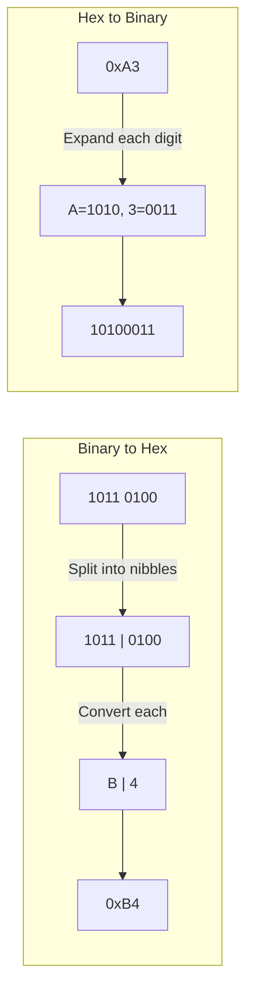

# CSE351: Binary and Hexadecimal

Numbers can be represented in any **base** (radix). Digital computers work natively in **binary** (base-2), while **hexadecimal** (base-16) serves as a compact human-readable shorthand.

---

## Conversion to Decimal

### Formal Definition

$$\sum_{i=0}^{n} d_i \times b^i$$

where $d_i$ is the digit at position $i$ (counting from the least significant digit at position 0), and $b$ is the base.

### Simplified Explanation

Multiply each digit by its base raised to its position index, then sum all the products. Position 0 is the rightmost digit.

---

## Converting from Decimal to Binary

To convert a **decimal** (base-10) number to **binary** (base-2), use the subtraction method:

1. **Find the largest power of 2** that is less than or equal to your target number.
2. **Place a `1`** in the corresponding bit position.
3. **Subtract** that power of 2 from your target.
4. **Repeat** until the remainder is 0.
5. **Place a `0`** in any skipped positions.

### Example: Converting 114 to Binary

- $64$ ($2^6$) fits: Result `1xxxxxx`, Remainder: $114 - 64 = 50$
- $32$ ($2^5$) fits: Result `11xxxxx`, Remainder: $50 - 32 = 18$
- $16$ ($2^4$) fits: Result `111xxxx`, Remainder: $18 - 16 = 2$
- $8$ ($2^3$) > 2: Result `1110xxx`
- $4$ ($2^2$) > 2: Result `11100xx`
- $2$ ($2^1$) fits: Result `111001x`, Remainder: $2 - 2 = 0$
- $1$ ($2^0$): Result `1110010`

**Result:** $114_{10} = 1110010_2$

---

## Hexadecimal Representation

**Hexadecimal** is a **base-16** number system using digits 0–9 and letters A–F for values 10–15. It is the standard notation for memory addresses and machine-level values in x86-64 because each hex digit maps to exactly 4 binary bits.

| Decimal | Hex |
|---------|-----|
| 0–9 | `0x0`–`0x9` |
| 10 | `0xA` |
| 11 | `0xB` |
| 12 | `0xC` |
| 13 | `0xD` |
| 14 | `0xE` |
| 15 | `0xF` |

Each hex digit corresponds to exactly 4 binary bits (a **nibble**). A full byte (8 bits) is represented by exactly two hex digits, making conversion between binary and hex mechanical: split the binary string into 4-bit groups and convert each group independently.

**Example:** `0b10110100` → `0xB4` (nibbles: `1011` = `B`, `0100` = `4`)

---

---

## Related

- [[CSE351/Number Representation/Unsigned Integers|Unsigned Integers]]
- [[CSE351/Number Representation/Two's Complement|Two's Complement]]
- [[CSE351/Number Representation/Bitwise Operations|Bitwise Operations]]
- [[CSE351/Memory Fundamentals/Words and Memory|Words and Memory (Endianness)]]

---

## Industry Standard Terms

| Course Term | Industry / Standard Term |
|:---|:---|
| Binary (base-2) | Base-2 numeral system; used universally in digital logic |
| Hexadecimal (base-16) | Hex; standard for memory addresses, color codes, machine code |
| Nibble (4 bits) | Semi-octet; half-byte |
| `0x` prefix | C/C++ hex literal notation; also used in Python, Rust, etc. |
