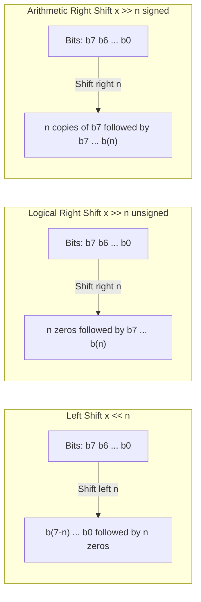

# CSE351: Bit Shifting

**Shift operators** (`<<`, `>>`) move bits left or right by a specified number of positions. Bits that "fall off" the end are discarded.

---

## Types of Shifts

### Left Shift (`<<`)

Shifts bits left, filling vacated positions on the right with **zeros**.

```
00011001 << 2
Result: 01100100
```

### Logical Right Shift (`>>` on unsigned)

Shifts bits right, filling vacated positions on the left with **zeros**. Used for [[CSE351/Number Representation/Unsigned Integers|unsigned]] values.

```
10010001 >> 2  (unsigned)
Result: 00100100
```

### Arithmetic Right Shift (`>>` on signed)

Shifts bits right, filling vacated positions with copies of the **sign bit (MSB)**. Preserves the number's sign, which is required for signed division by powers of 2.

```
10010001 >> 2  (signed, -111)
Result: 11100100  (MSB was 1, fills with 1s)
```

---

## Shifting as Arithmetic

Shifts are fast multiplication and division by powers of 2, because multiplying by $2^n$ in binary is exactly equivalent to appending $n$ zeros on the right.

### Formal Definition

| Operation | Equivalent | Example |
|-----------|------------|---------|
| `x << n` | $x \times 2^n$ | `5 << 2` = 20 |
| `x >> n` | $x \div 2^n$ (floor) | `20 >> 2` = 5 |

### Simplified Explanation

Left-shifting by $n$ is like appending $n$ zeros in binary — the same digit pattern now represents a value $2^n$ times larger. Right-shifting strips off the last $n$ bits (rounding down toward negative infinity for arithmetic shifts).

### Example

```c
char x = 5;      // 0b00000101
char y = x << 2; // 0b00010100 = 20
```

---

## Undefined Behavior Warning

Shifting by a **negative amount** or by an amount **>= the bit width** is undefined behavior in C. For example, shifting a 32-bit `int` by 32 positions is not guaranteed to produce 0.

---



---

## Related

- [[CSE351/Number Representation/Bitwise Operations|Bitwise Operations]]
- [[CSE351/Number Representation/Two's Complement|Two's Complement]]
- [[CSE351/Number Representation/Unsigned Integers|Unsigned Integers]]
- [[CSE351/Number Representation/Overflow|Overflow]]
- [[CSE351/x86-64 Assembly/x86-64 Registers|x86-64 Registers]]

---

## Industry Standard Terms

| Course Term | Industry / Standard Term |
|:---|:---|
| Left shift (`<<`) | Logical left shift; arithmetic left shift (identical for both) |
| Logical right shift | Unsigned right shift (Java `>>>`) |
| Arithmetic right shift | Signed right shift (Java/C `>>` on signed types) |
| Shift as multiplication/division | Strength reduction optimization |
