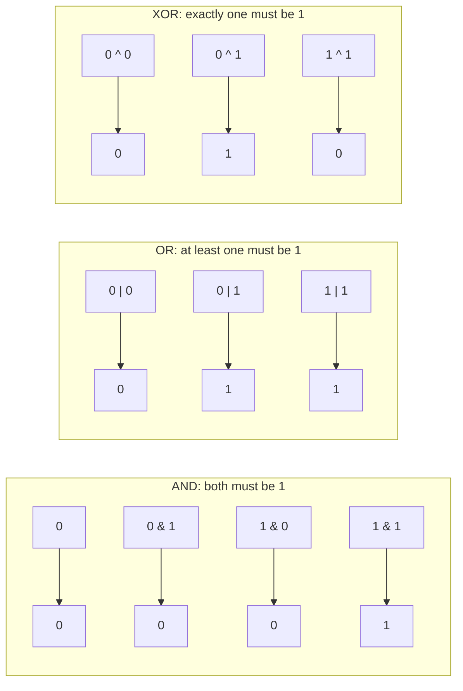

# CSE351: Bitwise Operations

**Bitwise operators** manipulate individual bits of integral data types (`char`, `int`, `long`). Each bit in the result is computed independently from the corresponding bits of the inputs.

---

## Bitwise Operators

### AND (`&`)

Sets result bit to `1` only if **both** input bits are `1`.

**Use case:** **Masking** — isolating or testing specific bits by ANDing with a mask that has `1`s only in the positions of interest.

```c
  01010101  (85)
& 00110011  (51)
----------
  00010001  (17)
```

### OR (`|`)

Sets result bit to `1` if **at least one** input bit is `1`.

**Use case:** **Setting** specific bits by ORing with a mask that has `1`s in the target positions.

```c
  01010101  (85)
| 00110011  (51)
----------
  01110111  (119)
```

### XOR (`^`) — Exclusive OR

Sets result bit to `1` if the two input bits are **different**.

**Use case:** **Toggling** or flipping specific bits. Also used in cryptographic operations and parity checks.

```c
  01010101  (85)
^ 00110011  (51)
----------
  01100110  (102)
```

### NOT (`~`) — Complement

Inverts **all** bits. Used in [[Two's Complement|Two's Complement]] negation: `-x == ~x + 1`.

```c
~ 01010101  (85)
----------
  10101010  (-86 in two's complement)
```

---

## Logical vs. Bitwise Operators

These two families look similar but behave very differently:

| Bitwise | Logical | Key Difference |
|---------|---------|----------------|
| `&` | `&&` | Bitwise operates bit-by-bit; logical treats the whole value as true (non-zero) or false (zero) |
| `\|` | `\|\|` | Same distinction |
| `~` | `!` | Bitwise inverts all bits; logical returns exactly `0` or `1` |

### Logical Operators

- **`&&`**: Returns `1` if both operands are non-zero; short-circuits on the first `0`.
- **`||`**: Returns `1` if at least one operand is non-zero; short-circuits on the first non-zero.
- **`!`**: Returns `1` if operand is `0`, else returns `0`.

```c
int result = (5 && 0);  // result is 0 (false)
int result = (5 || 0);  // result is 1 (true)
int result = !0;        // result is 1 (true)
```

---

## Common Bit Manipulation Patterns

| Goal | Expression | Explanation |
|:-----|:-----------|:------------|
| Test bit $k$ | `x & (1 << k)` | Non-zero if bit $k$ is set |
| Set bit $k$ | `x \| (1 << k)` | Forces bit $k$ to 1 |
| Clear bit $k$ | `x & ~(1 << k)` | Forces bit $k$ to 0 |
| Toggle bit $k$ | `x ^ (1 << k)` | Flips bit $k$ |

---



---

## Related

- [[Binary and Hexadecimal|Binary and Hexadecimal]]
- [[Two's Complement|Two's Complement]]
- [[Bit Shifting|Bit Shifting]]
- [[Condition Codes|Condition Codes]]

---

## Industry Standard Terms

| Course Term | Industry / Standard Term |
|:---|:---|
| Bitwise AND (`&`) | Bit masking; AND gate in digital logic |
| Bitwise OR (`\|`) | Bit setting; OR gate |
| Bitwise XOR (`^`) | Bit toggling; XOR gate; used in parity and checksums |
| Bitwise NOT (`~`) | Bitwise complement; one's complement; NOT gate |
| Mask | Bitmask; used in flags, network subnet masks, permissions |
