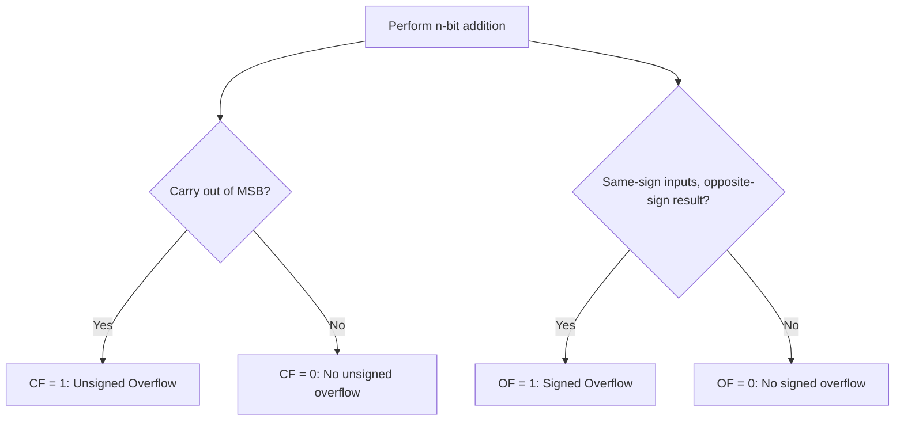

# CSE351: Overflow

Arithmetic on fixed-width binary numbers uses **modular arithmetic**. When a result exceeds the representable range, the extra bits are dropped and values "wrap around."

Subtraction is performed by adding the negative. For signed integers, the negative is computed using [[CSE351/Number Representation/Two's Complement|Two's Complement]]: `-x == ~x + 1`.

---

## Modular Arithmetic and Fixed-Width Registers

Every arithmetic result is implicitly taken modulo $2^n$ (for $n$-bit registers). The hardware discards any carry or borrow out of the most significant bit. This produces correct answers when no overflow occurs, and well-defined (but wrong) wrap-around answers when it does.

---

## 4-bit Examples

| Operation | HW Result | Unsigned Interpretation | Signed Interpretation |
|-----------|-----------|-------------------------|-----------------------|
| `0011 + 0010` | `0101` | 3 + 2 = 5 | 3 + 2 = 5 |
| `0100 + 1101` | `10001` | 4 + 13 = **17 → 1** | 4 + (−3) = 1 |
| `0101 + 0100` | `1001` | 5 + 4 = 9 | 5 + 4 = **−7** |
| `1011 + 1100` | `10111` | 11 + 12 = **23 → 7** | (−5) + (−4) = **7** |

---

## Unsigned Overflow

Occurs when the true result falls outside $[0, 2^n - 1]$.

### Formal Definition

Unsigned overflow occurs when the carry-out from the MSB position is 1. The stored result equals $(a + b) \bmod 2^n$.

### Simplified Explanation

Think of a 4-bit counter that rolls over from 15 back to 0 — just like a car odometer wrapping around. The carry bit that "fell off" is lost.

**Detection:** Carry-out from the MSB.

**Example:** `4 + 13 = 17`, but 17 > 15 (max for 4-bit unsigned). Result wraps to `17 mod 16 = 1`.

The [[CSE351/x86-64 Assembly/Condition Codes|Carry Flag (CF)]] is set when unsigned overflow occurs.

---

## Signed Overflow

Occurs when the true result falls outside $[-2^{n-1}, 2^{n-1} - 1]$.

### Formal Definition

Signed overflow occurs if and only if the carry into the MSB differs from the carry out of the MSB. Equivalently, the [[CSE351/x86-64 Assembly/Condition Codes|Overflow Flag (OF)]] is set.

### Simplified Explanation

If you add two positive numbers and get a negative result, or two negatives and get a positive result, the sign bit has been corrupted — that is signed overflow.

**Detection Rule:** Signed overflow occurs when adding two numbers with the **same sign** produces a result with the **opposite sign**.

### Positive + Positive → Negative

`5 + 4` should be `9`, but the 4-bit result `1001` = `−7`. **Overflow!**

### Negative + Negative → Positive

`(−5) + (−4)` should be `−9`, but the 4-bit result `0111` = `7`. **Overflow!**

**Note:** Adding numbers with **different** signs can never cause signed overflow — the magnitude can only decrease.

---

---

## Related

- [[CSE351/Number Representation/Two's Complement|Two's Complement]]
- [[CSE351/Number Representation/Unsigned Integers|Unsigned Integers]]
- [[CSE351/Number Representation/Bit Shifting|Bit Shifting]]
- [[CSE351/x86-64 Assembly/Condition Codes|Condition Codes (CF, OF)]]

---

## Industry Standard Terms

| Course Term | Industry / Standard Term |
|:---|:---|
| Modular arithmetic on fixed-width integers | Integer wrapping / modular reduction mod $2^n$ |
| Carry-out from MSB | Carry flag (CF) in the status register |
| Signed overflow (same-sign → opposite-sign) | Overflow flag (OF) in the status register |
| Unsigned overflow | Unsigned wrap-around |
