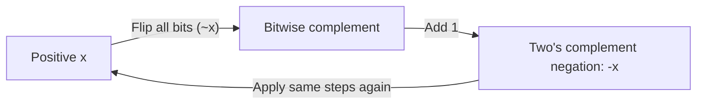

# CSE351: Two's Complement

**Two's Complement** is the standard representation for **signed integers** in all modern computers, allowing both positive and negative numbers using the same addition hardware as unsigned arithmetic.

---

## Representation

The **most significant bit (MSB)** carries a **negative** weight instead of a positive one. For $n$ bits, the MSB weight is $-2^{n-1}$.

### Formal Definition

For an $n$-bit string $b_{n-1} b_{n-2} \ldots b_1 b_0$, the Two's Complement value is:

$$-b_{n-1} \cdot 2^{n-1} + \sum_{i=0}^{n-2} b_i \cdot 2^i$$

### Simplified Explanation

Treat all bits normally except the leftmost one — instead of adding $2^{n-1}$, you subtract $2^{n-1}$. If the MSB is 0 the number is non-negative (identical to unsigned); if it is 1 the number is negative.

### 8-bit Example

Value of `0b10001110`:
- MSB is `1`: value $-2^7 = -128$
- Other set bits: $2^3 + 2^2 + 2^1 = 8 + 4 + 2 = 14$
- **Total:** $-128 + 14 = -114$

---

## Range

### Formal Definition

For $n$ bits: $[-2^{n-1},\ 2^{n-1} - 1]$

### Simplified Explanation

There is one more negative value than positive because zero takes the slot that would otherwise be "negative zero." The most negative value has only the MSB set (`100...0`); the most positive has every bit except the MSB set (`011...1`).

| Bits | Range |
|------|-------|
| 8 | −128 to 127 |
| 16 | −32,768 to 32,767 |
| 32 | ~−2.1 billion to ~2.1 billion |

---

## Advantages

- **Unique Zero:** All zeros = 0 (no "negative zero" problem like sign-magnitude)
- **Balanced Range:** Roughly equal positive and negative values
- **Consistent Positives:** Positive numbers match their unsigned representation
- **Simple Negation:** Flip all bits and add one (`-x == ~x + 1`)
- **Hardware Reuse:** The same adder circuit works for both signed and unsigned arithmetic

---

## Negation: Flip and Add One

**Formula:** `-x == ~x + 1`

This works because `x + (~x) = 0xFF...F = -1` (all ones in two's complement), so `~x = -x - 1`, and therefore `~x + 1 = -x`.

### Example: −114 to 114

1. Start: `0b10001110` (−114)
2. Flip bits: `0b01110001`
3. Add one: `0b01110010`
4. Verify: $64 + 32 + 16 + 2 = 114$ ✓

### Example: 50 to −50

1. Start: `0b00110010` (50)
2. Flip bits: `0b11001101`
3. Add one: `0b11001110`
4. Verify: $-128 + 64 + 8 + 4 + 2 = -50$ ✓

---

---

## Related

- [[Unsigned Integers|Unsigned Integers]]
- [[Binary and Hexadecimal|Binary and Hexadecimal]]
- [[Overflow|Overflow]]
- [[Bitwise Operations|Bitwise Operations]]
- [[Extension Instructions|Extension Instructions (sign extension)]]

---

## Industry Standard Terms

| Course Term | Industry / Standard Term |
|:---|:---|
| Two's Complement | Two's complement (universal in CPUs); `int8_t`, `int32_t` in C stdint.h |
| Flip and add one | Two's complement negation; bitwise NOT + increment |
| MSB with negative weight | Sign bit |
| Signed overflow | Signed integer overflow; Overflow Flag (OF) in x86 |
