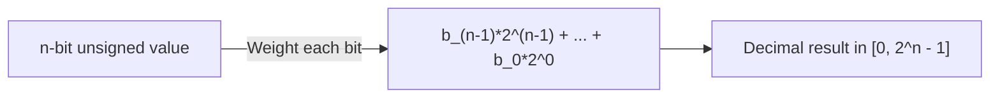

# CSE351: Unsigned Integers

**Unsigned integers** represent **non-negative numbers** (0 and positive). The bit pattern is interpreted as a standard binary numeral stored in a fixed-width register — no sign information is encoded.

---

## Data Types and Ranges

On a typical 64-bit machine:

| Type | Size | Range |
|------|------|-------|
| `unsigned char` | 1 byte (8 bits) | 0 to 255 |
| `unsigned short` | 2 bytes (16 bits) | 0 to 65,535 |
| `unsigned int` | 4 bytes (32 bits) | 0 to ~4.3 billion |
| `unsigned long` | 8 bytes (64 bits) | 0 to ~18 quintillion |

### Formal Definition

For $n$ bits, the unsigned range is $[0,\ 2^n - 1]$ and the value of a bit string $b_{n-1} \ldots b_1 b_0$ is:

$$\sum_{i=0}^{n-1} b_i \times 2^i$$

### Simplified Explanation

Every bit position contributes a non-negative power of 2. The leftmost bit position $n-1$ contributes $2^{n-1}$, not a negative weight (unlike [[Two's Complement|Two's Complement]]). All values are therefore zero or positive.

---

## Binary Arithmetic

Addition and subtraction work like decimal arithmetic, but **carry** and **borrow** happen at value **2** instead of 10. This is why adding 1 to the binary representation of the maximum value wraps around to 0 — see [[Overflow|Overflow]].

### Example: Binary Addition (8-bit)

Adding `170 + 73 = 243`:
- `170` = `10101010`
- `73`  = `01001001`

```
  10101010
+ 01001001
----------
  11110011  (243)
```

---



---

## Related

- [[Two's Complement|Two's Complement]]
- [[Binary and Hexadecimal|Binary and Hexadecimal]]
- [[Overflow|Overflow]]
- [[Bit Shifting|Bit Shifting]]

---

## Industry Standard Terms

| Course Term | Industry / Standard Term |
|:---|:---|
| Unsigned integer | Unsigned integer; `uint8_t`, `uint32_t`, etc. in C stdint.h |
| $n$-bit range $[0, 2^n-1]$ | Unsigned saturation point; modular range |
| Carry-out from MSB | Unsigned overflow; Carry Flag (CF) |
