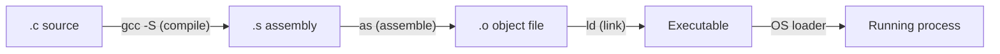

# CSE351: CALL Process (Building an Executable)

**CALL** = **C**ompiling → **A**ssembling → **L**inking → **L**oading

These four phases transform human-readable C source code into a running process, each producing an artifact used by the next phase.

---

## Overview

| Phase | Input | Output |
|:---|:---|:---|
| Compiling | `.c` source | `.s` assembly |
| Assembling | `.s` assembly | `.o` object file |
| Linking | `.o` files + libraries | executable |
| Loading | executable | running process |

---

## Compiling

### Steps

1. **Preprocessor:** Handle `#include` directives (text substitution), `#define` macros, and conditional compilation (`#ifdef`).
2. **Compiler:** Translate preprocessed C to x86-64 assembly, applying optimizations.

### Optimization Flags

The compiler can trade off execution speed vs. compilation speed vs. debuggability:

| Flag | Purpose |
|:---|:---|
| `-O0` | No optimization — fastest compilation, easiest debugging |
| `-O1`, `-O2`, `-O3` | Progressive performance optimization |
| `-Os` | Optimize for binary size |
| `-Og` | Debug-friendly optimization — some speed improvement but debugger still works well |

```bash
gcc -S source.c         # Stop after compiling (produce .s)
gcc -O2 -S source.c     # Compile with optimization level 2
```

---

## Assembling

Converts assembly text (`.s`) into machine code bytes (`.o`).

### Object File Contents

An object file (`.o`) is not yet a complete executable — it contains three key sections:

- **Object code:** Machine instructions, but with some addresses left as placeholders.
- **Symbol table:** Globally visible labels defined in this file (e.g., function names).
- **Relocation table:** A list of every reference to an external symbol — "I used `printf` at offset X; please fill in the real address."

### Why "Incomplete"?

At assembly time, the final memory addresses of external functions and global variables are not yet known. The assembler leaves these as zeros in the object code, and the relocation table records where the linker must patch them in.

---

## Linking

Stitches together all object files and static library archives into a final executable with all addresses resolved.

### Process

1. Combine all `.text`, `.data`, and `.rodata` sections from each `.o` file.
2. Match every relocation table entry (from Step 1) against the symbol tables of all input files.
3. Assign final virtual addresses to every symbol.
4. Patch the object code: replace placeholder zeros with actual addresses.

### Symbol Resolution

- **Relocation table entry:** "At this byte offset, insert the address of symbol X."
- **Symbol table entry:** "Symbol X is defined at address Y."
- **Linker action:** Writes address Y at the specified byte offset.

### Even Single Files Need Linking

A single-file C program still requires linking against:
- The C standard library (`libc`) for `printf`, `malloc`, `strlen`, etc.
- System call interface wrappers.
- The C runtime startup code (`_start`) that calls `main` and handles return values.

---

## Loading

The OS converts the on-disk executable into a running process in memory.

### OS Tasks

1. Create a new process and allocate virtual address space.
2. Map the executable's code and data segments from disk into the address space.
3. Initialize the stack and set up the initial stack frame for `main`'s arguments (`argc`, `argv`).
4. Set initial register values (including `%rip` pointing to the entry point, typically `_start`).
5. Create the process control block (PCB) and schedule the process.

```
┌─────────────────┐
│     Stack       │ ← Initialized by OS (argc, argv on stack)
├─────────────────┤
│      Heap       │ ← Empty initially
├─────────────────┤
│ Static/Global   │ ← Mapped from executable
├─────────────────┤
│   Literals      │ ← Mapped from executable (.rodata)
├─────────────────┤
│     Code        │ ← Mapped from executable (.text)
└─────────────────┘
```

---

## Disassembling

The reverse process — converting machine code bytes back to assembly text — is called **disassembly**. Tools like `objdump -d` produce output in this format:

```
0000000000401126 <main>:
  401126: 48 83 ec 08    sub    $0x8,%rsp
  40112a: bf 10 20 40 00 mov    $0x402010,%edi
```

| Column | Meaning |
|:---|:---|
| Left | Virtual memory addresses |
| Middle | Machine code bytes (hex) |
| Right | Disassembled assembly instruction |

---



---

## Related

- [[CSE351/Procedures and Stack/Memory Layout|Memory Layout]]
- [[x86-64 Instruction Format|Instruction Format]]
- [[Processes|Processes]]
- [[CSE451/Virtualization/Memory/Virtual Memory|Virtual Memory (CSE451)]]
- [[CSE333/Build Systems/Makefiles|Makefiles (CSE333)]]

---

## Industry Standard Terms

| Course Term | Industry / Standard Term |
|:---|:---|
| CALL process | Compilation pipeline; build pipeline |
| Object file (`.o`) | Relocatable object file; ELF relocatable (on Linux) |
| Symbol table | Symbol table; export table (in DLLs) |
| Relocation table | Relocation entries; fixup table |
| Linker | Static linker; `ld`; `lld` (LLVM linker) |
| Loader | Dynamic linker/loader; OS program loader; `execve` system call |
| Disassembly | Disassembly; reverse engineering; `objdump -d` |
