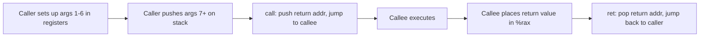

# CSE351: x86-64 Calling Conventions

**Calling conventions** are the established rules that govern how control and data are passed between procedures. They enable separately compiled modules — including libraries written in different languages — to interoperate correctly. x86-64 Linux follows the **System V AMD64 ABI**.

---

## Terminology

- **Caller:** The procedure that initiates the call.
- **Callee:** The procedure being called.

---

## Return Address

Because a procedure can be called from many different sites in the program, execution must return to the correct location after each call. The `call` instruction automatically pushes the address of the **next instruction** (the instruction immediately after `call`) onto the stack as the return address. The `ret` instruction pops this address back into `%rip`.

---

## Procedure Call (`call`)

```assembly
call label
```

**Steps:**
1. Push the return address (address of the instruction following `call`) onto the stack.
2. Update `%rip` to the address of `label`.

---

## Procedure Return (`ret`)

```assembly
ret
```

**Steps:**
1. Pop the return address from the top of the stack.
2. Update `%rip` to the popped address.

**Critical:** `%rsp` must point exactly to the return address before `ret` executes. Any mismatch causes execution to jump to the wrong location — a common source of bugs in hand-written assembly and the target of [[Buffer Overflow|buffer overflow]] attacks.

---

## Argument Passing

### First 6 Arguments (Registers)

Arguments are passed in dedicated registers in a fixed order. Using registers avoids the cost of memory writes for the common case of six or fewer arguments.

| Argument | Register | Mnemonic |
|:---|:---|:---|
| 1st | `%rdi` | **D**iane's |
| 2nd | `%rsi` | **S**ilk |
| 3rd | `%rdx` | **D**ress |
| 4th | `%rcx` | **C**ost |
| 5th | `%r8` | **$8** |
| 6th | `%r9` | **9** |

**Memory aid:** "Diane's Silk Dress Cost $8.9"

### Arguments 7 and Beyond (Stack)

Additional arguments are pushed onto the stack in **reverse order** so that argument 7 is at the lowest address (closest to `%rsp` at the call site), immediately above the return address.

---

## Return Value

- **Location:** `%rax` register.
- **Size limit:** 8 bytes (a single 64-bit value or pointer).
- **Large values:** Return a pointer to the data in `%rax`; the data itself lives in the caller's stack or a caller-allocated buffer.

---

## Example

```c
func(a, b, c, d, e, f, g, h);
```

```assembly
movq h, (%rsp)          # 8th argument (pushed first, at lowest address)
movq g, 8(%rsp)         # 7th argument
movq a, %rdi            # 1st argument
movq b, %rsi            # 2nd argument
movq c, %rdx            # 3rd argument
movq d, %rcx            # 4th argument
movq e, %r8             # 5th argument
movq f, %r9             # 6th argument
call func
```

---



---

## Related

- [[Stack Frames|Stack Frames]]
- [[Register Saving Conventions|Register Saving Conventions]]
- [[x86-64 Registers|x86-64 Registers]]
- [[Buffer Overflow|Buffer Overflow]]

---

## Industry Standard Terms

| Course Term | Industry / Standard Term |
|:---|:---|
| Calling conventions | ABI (Application Binary Interface); System V AMD64 ABI (Linux/macOS); Microsoft x64 ABI (Windows) |
| Return address | Return address; link register (in RISC architectures) |
| Argument registers (`%rdi`–`%r9`) | Parameter registers; argument-passing registers |
| Return value in `%rax` | Return value register; accumulator |
| Arguments 7+ on stack | Stack-passed arguments; memory arguments |
