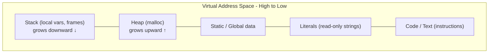

# CSE351: Memory Layout

A running process's address space is divided into named **segments**, each serving a distinct purpose. Understanding the layout is essential for reasoning about pointers, the stack, and memory vulnerabilities.

---

## Memory Segments (High to Low Addresses)

| Segment | Purpose | Growth |
|:---|:---|:---|
| **Stack** | Local variables, function call frames | Downward (toward lower addresses) |
| **Heap** | Dynamic allocation (`malloc` / `free`) | Upward (toward higher addresses) |
| **Static/Global** | Global variables, static data | Fixed |
| **Literals** | String literals, read-only constants | Fixed |
| **Code/Text** | Program instructions (machine code) | Fixed |

---

## The Stack

- **Location:** Highest usable virtual addresses in the process space.
- **Contents:** Local variables, procedure context (saved registers, return addresses).
- **Growth:** Downward — allocating space decrements the stack pointer `%rsp`.
- **Management:** Automatic — created on function call, released on function return.

### Why Downward Growth?

Stack downward growth is a historical convention from early systems. The key practical benefit is that the stack and heap start at opposite ends of the address space and grow toward each other, maximizing the total combined memory both can use before colliding.

---

## Address Ranges Example

```
0x7fff0b570788  (Stack)      ← Highest addresses
         ↕
0x12a8010       (Heap)
0x601038        (Static/Global)
0x400670        (Code)
0x400547        (Code)       ← Lowest addresses
```

**Memory addresses ordered:** Code < Static < Heap < Stack

---



---

## Related

- [[Stack Pointer|Stack Pointer]]
- [[Stack Frames|Stack Frames]]
- [[Memory Allocation|Memory Allocation]]
- [[CSE351/Memory Management/Virtual Memory|Virtual Memory]]
- [[CSE451/Virtualization/Memory/Virtual Memory|Virtual Memory (CSE451)]]
- [[CSE333/Memory Management/Stack|Stack (CSE333)]]
- [[CSE333/Memory Management/Heap Management|Heap Management (CSE333)]]

---

## Industry Standard Terms

| Course Term | Industry / Standard Term |
|:---|:---|
| Stack segment | Stack area; call stack; thread stack |
| Heap segment | Dynamic memory region; heap area |
| Static/Global segment | BSS segment (uninitialized globals), data segment (initialized globals) |
| Literals segment | Read-only data segment (`.rodata`) |
| Code/Text segment | Text segment; code segment; `.text` section |
