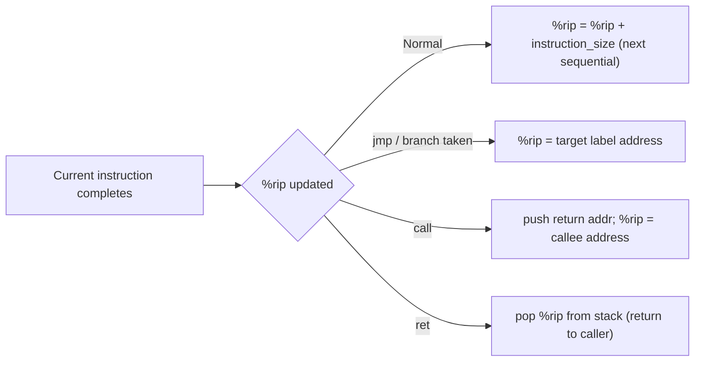

# CSE351: Program Counter (`%rip`)

The **program counter** is a special register that holds the address of the **next instruction** to be fetched and executed. On x86-64, this register is named `%rip` (register instruction pointer).

---

## Behavior

- **Normal execution:** After each instruction completes, `%rip` automatically advances to the address of the next sequential instruction.
- **Jump instructions:** `jmp` and conditional jumps can load any target address into `%rip`, breaking sequential flow.
- **`call` instruction:** Pushes the address of the instruction immediately following `call` (the return address) onto the stack, then loads the callee's address into `%rip`.
- **`ret` instruction:** Pops the saved return address from the stack and loads it back into `%rip`, resuming the caller.

---

## With Jump Instructions

```assembly
jmp label           # %rip = address of label (unconditional)
je label            # %rip = address of label only if ZF = 1
```

---

## With Call / Ret

```assembly
call func           # push %rip (return addr onto stack), then %rip = address of func
ret                 # pop top of stack into %rip (return to caller)
```

The value pushed by `call` is the address of the instruction **immediately after** the `call` instruction — not the address of `call` itself. This is why `%rip` already points to the next instruction when the callee starts executing.

---

## Indirect Jumps

```assembly
jmp *%rax           # %rip = value stored in %rax
jmp *(%rax)         # %rip = value at the memory address stored in %rax
```

Used for [[Switch Statements|switch statements]] with jump tables, where the target address is computed at runtime from a table lookup.

---



---

## Related

- [[x86-64 Registers|x86-64 Registers]]
- [[Jump Instructions|Jump Instructions]]
- [[Switch Statements|Switch Statements]]
- [[Calling Conventions|Calling Conventions]]
- [[Labels|Labels]]
- [[CSE451/Virtualization/Processes/CPUState/CPU State#Program Counter (PC)|Program Counter (CSE451)]]

---

## Industry Standard Terms

| Course Term | Industry / Standard Term |
|:---|:---|
| Program counter (`%rip`) | Instruction pointer (IP); program counter (PC); `%eip` in 32-bit x86 |
| `%rip` advances automatically | PC increment; instruction fetch and advance |
| `call` pushes return address | Link register save (RISC); return address push (x86) |
| `ret` pops into `%rip` | Return from subroutine; branch to link register |
| Indirect jump | Computed branch; register-indirect jump |
