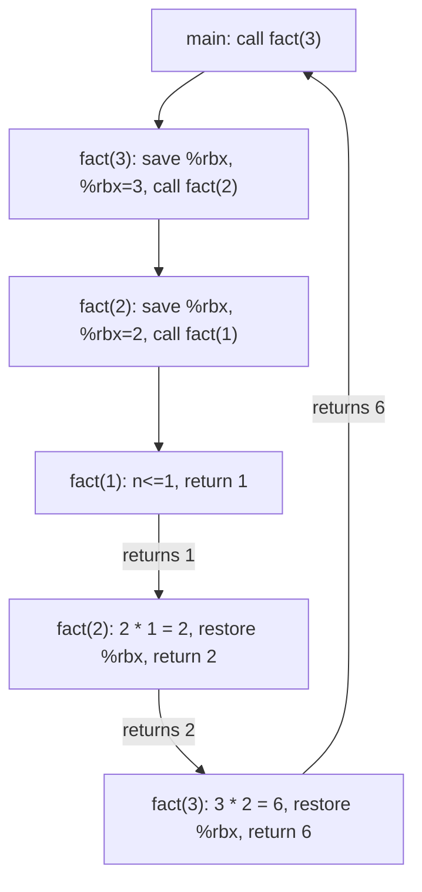

# CSE351: Recursion

Recursion works seamlessly with [[CSE351/Procedures and Stack/Stack Frames|stack frames]] and [[CSE351/Procedures and Stack/Calling Conventions|calling conventions]] — no special hardware support is needed. The same mechanism that handles ordinary function calls handles recursive calls, because each invocation gets its own private stack frame.

---

## How It Works

- Each recursive call creates a **new stack frame** on top of the existing ones.
- Each frame has its **own local variables** (including the parameter `n`), so there is no interference between invocations.
- [[CSE351/Procedures and Stack/Register Saving Conventions|Callee-saved registers]] ensure that values computed at one level are not destroyed when a deeper level runs.

---

## Dual Role Challenge

A recursive procedure is simultaneously a **caller** and a **callee**:
- As a callee: it receives parameters and must restore callee-saved registers before returning.
- As a caller: it sets up arguments for the next recursive call, which may overwrite caller-saved registers.

This means any value that must survive across a recursive call must be stored in a callee-saved register (e.g., `%rbx`) or on the stack — not in a caller-saved register like `%rdi`, which will be overwritten when passing the new argument.

---

## Factorial Example

### C Code

```c
int fact(int n) {
    if (n <= 1) return 1;
    return n * fact(n - 1);
}
```

### Assembly

```assembly
fact:
  mov    $0x1,%eax        # Default return value = 1
  cmp    $0x1,%rdi        # Compare n with 1
  ja     recursive        # Jump if n > 1 (unsigned above — handles negatives safely)
  retq                    # Base case: return 1

recursive:
  push   %rbx             # Save %rbx (callee-saved) — we need it across the recursive call
  mov    %rdi,%rbx        # Save n into %rbx (survives the recursive call)
  lea    -0x1(%rdi),%rdi  # Compute n-1, pass as 1st argument
  callq  fact             # Recursive call: fact(n-1)
  imul   %rbx,%rax        # n * fact(n-1): %rax holds fact(n-1), %rbx holds n
  pop    %rbx             # Restore %rbx for caller
  retq                    # Return result
```

The key insight: `n` is stored in `%rbx` (callee-saved) so it survives the `callq fact` instruction, which overwrites `%rdi` and `%rax`.

---

## Stack Frame Growth for `fact(3)`

```
┌─────────────────┐
│     main        │
├─────────────────┤
│ <ret to main>   │ ← fact(3) frame
│ <main's %rbx>   │   (%rbx saved; %rbx = 3)
├─────────────────┤
│   0x40113f      │ ← fact(2) frame
│       3         │   (%rbx = 3, saved from fact(3))
├─────────────────┤
│   0x40113f      │ ← fact(1) frame (base case — no push %rbx)
├─────────────────┤ ← %rsp
```

---

## Execution Trace

1. `fact(3)`: n=3 > 1 → save `%rbx`, store n=3, call `fact(2)`
2. `fact(2)`: n=2 > 1 → save `%rbx` (=3 from parent), store n=2, call `fact(1)`
3. `fact(1)`: n=1 ≤ 1 → base case; return 1 immediately (no `pushq %rbx`)
4. `fact(2)`: receives 1 in `%rax`; computes `2 × 1 = 2`; restores `%rbx`; returns 2
5. `fact(3)`: receives 2 in `%rax`; computes `3 × 2 = 6`; restores `%rbx`; returns 6

---

## Key Observations

- The base case frame is smaller because it returns before reaching `pushq %rbx`.
- All recursive calls return to the same `imul` instruction address (`0x40113f`) in each frame.
- Each frame's `n` is safely isolated in its own `%rbx` slot on the stack.

---



---

## Related

- [[CSE351/Procedures and Stack/Stack Frames|Stack Frames]]
- [[CSE351/Procedures and Stack/Stack Pointer|Stack Pointer]]
- [[CSE351/Procedures and Stack/Register Saving Conventions|Register Saving Conventions]]
- [[CSE351/Procedures and Stack/Calling Conventions|Calling Conventions]]

---

## Industry Standard Terms

| Course Term | Industry / Standard Term |
|:---|:---|
| Recursive call creating a new frame | Function call stack growth; stack depth |
| Callee-saved register used across recursive call | Register spill for live value; non-volatile register usage |
| Base case (no push) | Base case; termination condition |
| Execution trace unwinding | Stack unwinding; return sequence |
