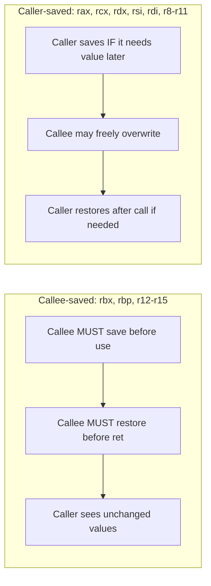

# CSE351: Register Saving Conventions

Register saving conventions define who is responsible for preserving register values across a function call. Because both the caller and callee may want to use the same registers, one side must save and restore them to avoid destroying the other's data.

---

## Two Types of Registers

### Callee-saved Registers

- **Responsibility:** The **callee** must save these before using them and restore them before returning.
- **Timing:** Saved in the function prologue (pushed onto the stack), restored in the epilogue (popped before `ret`).
- **Caller's view:** Values appear unchanged after the call returns — the caller can rely on them persisting across calls.

**Registers:** `%rbx`, `%rbp`, `%r12`–`%r15`

### Caller-saved Registers

- **Responsibility:** The **caller** must save these if it needs their values after the call.
- **Timing:** Saved before the `call` instruction, restored afterward.
- **Callee's view:** Free to overwrite without restriction — the caller has no expectation that they survive the call.

**Registers:** `%rax`, `%rcx`, `%rdx`, `%rsi`, `%rdi`, `%r8`–`%r11`

---

## Examples

### Callee-saved (`%rbx`)

```assembly
function:
    pushq %rbx          # Save old value (prologue)
    movq %rdi, %rbx     # Use %rbx for computation
    # ... function body ...
    popq %rbx           # Restore old value (epilogue)
    ret
```

### Caller-saved (`%rax`)

```assembly
# Caller code
movq %rax, %r10         # Save %rax into a callee-saved register
call some_function      # %rax may be overwritten
movq %r10, %rax         # Restore %rax afterward
```

---

## Stack Ordering (LIFO)

When saving multiple registers, the stack's LIFO nature requires restoring in **reverse push order**:

```assembly
# Save
pushq %rcx
pushq %rdx

# Restore (REVERSE order)
popq %rdx
popq %rcx
```

---

## Stack Frame Integration

Callee-saved registers are stored just below the return address in the stack frame, before local variables:

```
┌─────────────────┐
│  Return address │
├─────────────────┤
│ Callee-saved    │ ← Saved in prologue, restored in epilogue
├─────────────────┤
│ Local variables │
├─────────────────┤
│ Caller-saved    │ ← Saved before sub-calls if needed
├─────────────────┤
│ Arguments 7+    │ ← Built for sub-calls
└─────────────────┘
```

---

## Optimization

- Use **caller-saved** registers for temporaries that are not needed after a call.
- Use **callee-saved** registers for values that must survive across multiple calls within a function.
- Compilers perform **register allocation** automatically to minimize unnecessary saves and restores.

---



---

## Related

- [[CSE351/Procedures and Stack/Calling Conventions|Calling Conventions]]
- [[CSE351/Procedures and Stack/Stack Frames|Stack Frames]]
- [[CSE351/Procedures and Stack/Recursion|Recursion]]
- [[CSE351/x86-64 Assembly/x86-64 Registers|x86-64 Registers]]

---

## Industry Standard Terms

| Course Term | Industry / Standard Term |
|:---|:---|
| Callee-saved registers | Non-volatile registers; preserved registers; saved registers |
| Caller-saved registers | Volatile registers; scratch registers; clobbered registers |
| Register saving in prologue/epilogue | Callee save/restore; spill to stack |
| Register allocation | Compiler register assignment; live range analysis |
