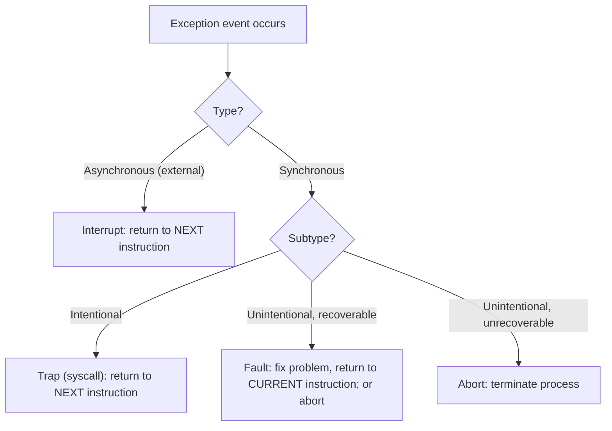

# CSE351: Exceptions

An **exception** is the transfer of execution control to the OS **kernel** in response to some event. Every exception causes the hardware to save the current processor state and jump to a predefined kernel **exception handler**.

---

## Exception Handling Process

1. **Event occurs** (interrupt arrives, trap instruction executed, fault detected, etc.)
2. **Control transfers to kernel** — the hardware saves context (registers, `%rip`, `%rflags`) and jumps to the handler.
3. **Handler executes** (kernel code runs with full privileges).
4. **Handler completes** with one of three outcomes.

---

## Handler Outcomes

| Outcome | When Used |
|:---|:---|
| Re-execute the current instruction | Recoverable faults (e.g., [[CSE351/Memory Management/Page Faults|page fault]]) — the handler fixes the problem, then restarts |
| Execute the next instruction | Successful traps and interrupts — normal completion |
| Abort the process | Unrecoverable errors — the process is killed |

---

## Types of Exceptions

### Asynchronous Exceptions (Interrupts)

- **Cause:** Events **external** to the processor — the CPU did not cause them.
- **Examples:** Timer interrupts (used for time-slicing), I/O completion signals, network packets arriving.
- **Handler:** Always returns to the **next** instruction — the interrupted instruction is completed normally.
- Interrupts are the mechanism by which the OS regains control from a running process.

### Synchronous Exceptions

Caused by executing a specific instruction — the instruction itself triggers the exception.

#### Traps

- **Nature:** **Intentional** transfer to the OS kernel.
- **Purpose:** Access privileged resources or services ([[CSE351/System Programming/System Calls|system calls]]).
- **Examples:** `open()`, `malloc()` (which calls `sbrk`), `read()`, `fork()`.
- **Handler:** Returns to the **next** instruction — the program continues normally.

#### Faults

- **Nature:** **Unintentional** but **possibly recoverable**.
- **Examples:** Division by zero, segmentation fault (illegal memory access), [[Page Faults|page fault]].
- **Handler:** Returns to the **current** instruction if the fault is fixed, or aborts the process if not.
- Page faults are the most common recoverable fault — the OS loads the missing page and restarts the instruction.

#### Aborts

- **Nature:** **Unintentional** and **unrecoverable**.
- **Examples:** Hardware malfunction (parity error, machine check).
- **Handler:** Always aborts the process — recovery is impossible.

---

## Example: File Operations

```c
int fd = open("file.txt", O_RDONLY);  // Trap exception (system call)
```

- **Type:** Trap — the program intentionally requests OS service.
- **Handler outcome:** Execute next instruction — `open()` returns the file descriptor.

---



---

## Related

- [[Processes|Processes]]
- [[Context Switching|Context Switching]]
- [[CSE351/System Programming/System Calls|System Calls]]
- [[Page Faults|Page Faults]]
- [[CSE451/Virtualization/Mechanisms/Exceptions/Exception|Exceptions (CSE451)]]
- [[CSE451/Virtualization/Mechanisms/Interrupts/Interrupts|Interrupts (CSE451)]]
- [[CSE451/Virtualization/Mechanisms/Traps/Traps|Traps (CSE451)]]

---

## Industry Standard Terms

| Course Term | Industry / Standard Term |
|:---|:---|
| Exception | Exception; processor exception; hardware exception |
| Interrupt (asynchronous) | Hardware interrupt; IRQ (Interrupt Request) |
| Trap (intentional) | Software interrupt; trap; syscall instruction |
| Fault (recoverable) | Hardware fault; processor fault |
| Abort (unrecoverable) | Machine check; non-maskable interrupt (NMI) |
| Exception handler | Interrupt Service Routine (ISR); exception handler; fault handler |
| Saving context on exception | Context save; exception entry; kernel mode transition |
