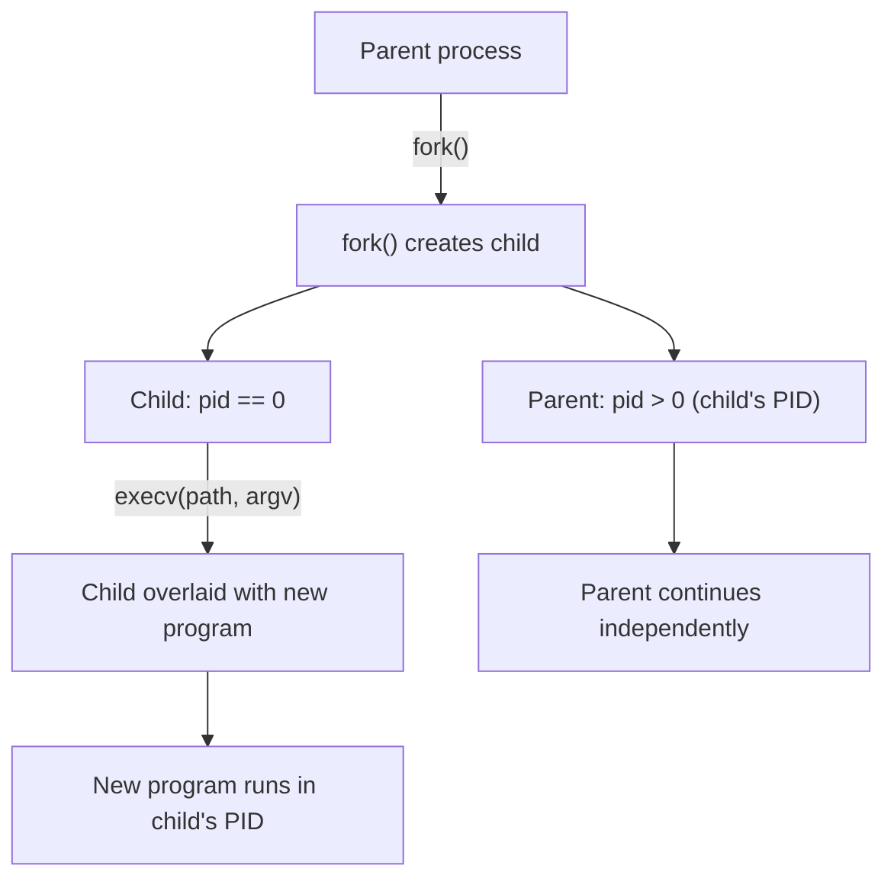

# CSE351: Fork-Exec Model

Linux uses the **fork-exec model** for process creation, deliberately splitting the operation into two independent steps. This design gives the programmer full control over the child's environment before the new program begins executing.

---

## Why Fork-Exec?

- **Flexibility:** A process can `fork` and then configure the child (redirect file descriptors, set environment variables, change user IDs) before calling `exec`.
- **Simplicity:** Each system call does exactly one thing — `fork` duplicates, `exec` replaces. Neither needs to accept complex arguments to handle the other's job.
- **Efficiency:** The OS can share memory pages between parent and child using copy-on-write until one side modifies them, making `fork` cheap even for large processes.

---

## Fork System Call

### `fork()` Behavior

- **Purpose:** Duplicates the calling process — creates a "child" process that is an identical copy of the "parent."
- The child inherits: open file descriptors, memory mappings, signal handlers, environment variables, and the current working directory.
- After `fork`, both parent and child **execute concurrently** from the same point in the code.

### Return Values

| Process | Return Value |
|:---|:---|
| Parent | Child's PID (positive integer) |
| Child | 0 |
| Error | −1 (no child created) |

The `if (pid > 0)` vs `if (pid == 0)` pattern is how the parent and child take different code paths after the fork.

### Example

```c
pid_t pid = fork();

if (pid > 0) {
    // Parent process
    printf("Parent: child PID is %d\n", pid);
} else if (pid == 0) {
    // Child process
    printf("Child: I am the child\n");
} else {
    perror("fork failed");
}
```

---

## Exec Family Functions

### Purpose

**Overlay** the current process with a fresh instance of the specified program. The PID stays the same, but code, data, heap, and stack are all replaced.

### Variants

| Function | Arguments | Environment | Searches PATH |
|:---|:---|:---|:---|
| `execv` | Vector (array) | Current | No |
| `execl` | List (varargs) | Current | No |
| `execve` | Vector | Specified | No |
| `execvp` | Vector | Current | Yes |

### What Exec Replaces

| Section | New State |
|:---|:---|
| Code | From the new executable |
| Data | From the new executable |
| Heap | Empty (reset) |
| Stack | `main`'s initial frame (argc, argv, envp) |
| Registers | Starting values per calling convention |

A successful `exec` call **never returns** — the calling code no longer exists. Any code after `exec` only runs if `exec` failed.

---

## Complete Example

```c
void fork_exec(char *path, char *argv[]) {
    pid_t pid = fork();

    if (pid != 0) {
        // Parent continues with its own work
        printf("Parent: created child %d\n", pid);
    } else {
        // Child overlays itself with the new program
        execv(path, argv);
        perror("execv failed");  // Only reached if exec failed
    }
}
```

---

## Key Insights

1. The child inherits **everything** from the parent at `fork` time.
2. `exec` **completely replaces** the process image — no state from before `exec` survives (except the PID and open file descriptors, unless explicitly closed).
3. Only the child's code path reaches `exec` — the parent continues past the `if` block.
4. Parent and child execute **concurrently** after `fork` — their relative ordering is non-deterministic.

---



---

## Related

- [[Processes|Processes]]
- [[Context Switching|Context Switching]]
- [[CSE351/System Programming/System Calls|System Calls]]
- [[Process Termination|Process Termination]]
- [[CSE451/Virtualization/Processes/Syscalls/Fork|Fork (CSE451)]]
- [[CSE451/Virtualization/Processes/Syscalls/Exec|Exec (CSE451)]]
- [[CSE451/Virtualization/Processes/Syscalls/exec vs fork|Fork vs Exec (CSE451)]]

---

## Industry Standard Terms

| Course Term | Industry / Standard Term |
|:---|:---|
| Fork-exec model | Fork-exec idiom; POSIX process creation model |
| `fork()` | POSIX `fork(2)` system call |
| `exec*()` | POSIX `exec(3)` family; `execve(2)` (the underlying syscall) |
| Copy-on-write after fork | COW fork; lazy page copy on write |
| Child inherits everything | Inherited file descriptors; inherited environment |
| `execv` never returns | Exec overlays the process image |
