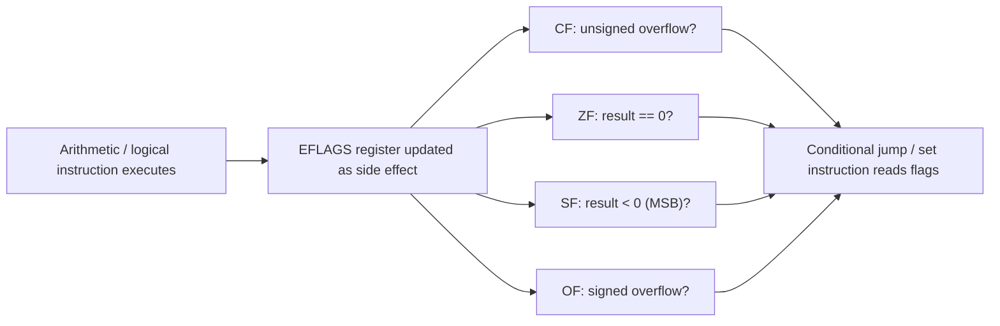

# CSE351: Condition Codes

**Condition codes** (also called flags) are single-bit status registers within the CPU that record information about the result of the most recently executed arithmetic or logical instruction. They are stored in the **`EFLAGS` register** and drive all conditional branching.

## The Four Main Flags

| Flag | Name | Description |
|:---:|:---|:---|
| **`CF`** | **Carry Flag** | Set if unsigned overflow occurred (carry out of the MSB). |
| **`ZF`** | **Zero Flag** | Set if the result was zero. |
| **`SF`** | **Sign Flag** | Set if the result was negative (MSB = 1). |
| **`OF`** | **Overflow Flag** | Set if signed overflow occurred. |

## How Condition Codes Are Set

### Implicit Setting (Side Effects)

Arithmetic and logical operations (`addq`, `subq`, `imulq`, `andq`, etc.) **automatically update** condition codes as a side effect. The programmer does not need a separate compare instruction if a preceding arithmetic instruction already set the relevant flag.

**Example:** If `%al = 0x80` (−128 in Two's Complement), then `addb %al, %al` produces `%al = 0x00` and sets:
- `CF = 1` (unsigned overflow: 0x80 + 0x80 = 0x100, which doesn't fit in 8 bits)
- `ZF = 1` (result is zero)
- `SF = 0` (result MSB is 0)
- `OF = 1` (signed overflow: −128 + −128 = −256, out of range for 8-bit signed)

### Explicit Setting (Dedicated Instructions)

Some instructions are designed specifically to set condition codes without storing a result anywhere:

- **`cmpq A, B`:** Computes `B − A` internally but **does not store the result**. Used to compare two values before a conditional jump.
- **`testq A, B`:** Computes `B & A` internally but **does not store the result**. Commonly used to test whether a value is zero (`testq %rax, %rax` sets `ZF = 1` if `%rax == 0`) or to test individual bits.

## Key Properties

- **Bitwise operations** (`and`, `or`, `xor`) always force `CF = 0` and `OF = 0` because they cannot produce a carry or signed overflow by definition.
- **`cmp` and `test`:** These instructions never modify their operands — only the flags are changed.
- The flags remain set until the next instruction that writes them, so a flag-setting instruction followed immediately by a jump is a common pattern.

---

---

## Related

- [[CSE351/x86-64 Assembly/Jump Instructions|Jump Instructions]]
- [[CSE351/Number Representation/Bitwise Operations|Bitwise Operations]]
- [[CSE351/Number Representation/Overflow|Overflow (CF, OF)]]
- [[CSE351/x86-64 Assembly/Conditionals|Conditionals]]
- [[CSE351/x86-64 Assembly/Loops|Loops]]

---

## Industry Standard Terms

| Course Term | Industry / Standard Term |
|:---|:---|
| Condition codes / flags | Status flags; processor status register (PSR); EFLAGS / RFLAGS |
| Carry Flag (CF) | Carry flag; unsigned overflow indicator |
| Zero Flag (ZF) | Zero flag |
| Sign Flag (SF) | Sign flag; negative flag (in ARM: N flag) |
| Overflow Flag (OF) | Overflow flag; signed overflow indicator |
| `cmpq` / `testq` | Compare instruction; test instruction; flag-setting without side effects |
