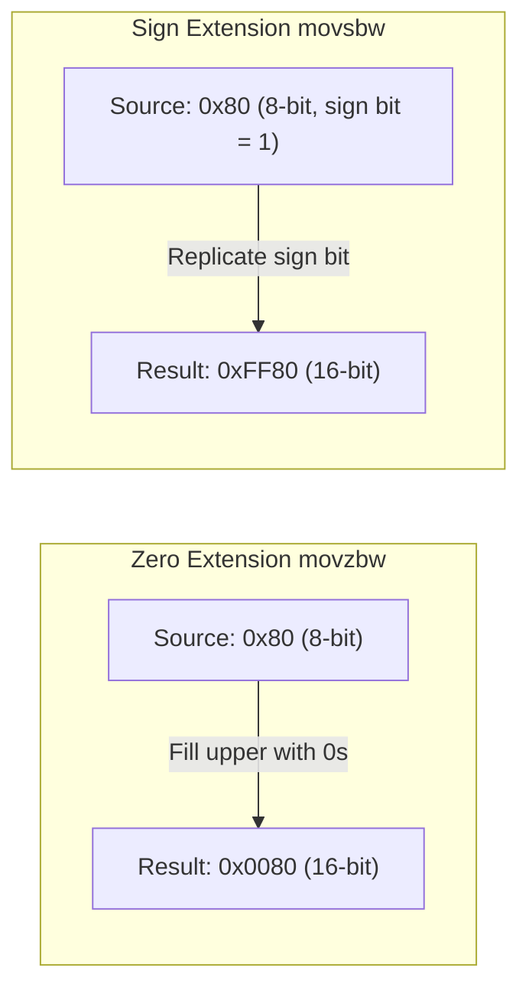

# CSE351: Extension Instructions (`movz` and `movs`)

Extension instructions handle **size mismatches** where the source is smaller than the destination. They copy a smaller value into a larger register, filling the extra upper bits according to the type of extension.

---

## Two Types

### Zero Extension (`movz`)

- Fills upper bits with **zeros**.
- Used for **unsigned** values — a small unsigned number padded with zeros is still numerically equal to the original.

### Sign Extension (`movs`)

- Fills upper bits with copies of the **sign bit (MSB)** of the source.
- Used for **signed** (Two's Complement) values — replicating the sign bit preserves the numeric value in the wider representation.

The underlying reason: in [[Two's Complement|Two's Complement]], a negative 8-bit value like `0x80` (−128) must be sign-extended to `0xFF80` in 16 bits, not zero-extended to `0x0080` (+128), to preserve its meaning.

---

## Instruction Format

`mov[z|s][source_size][dest_size]`

Two size specifiers are always present: the first describes the source width, the second the destination width.

---

## Examples

Starting with `%al = 0x80` (−128 as a signed byte, 128 as an unsigned byte):

```assembly
movzbw %al, %bx     # Zero-extend byte→word:  %bx = 0x0080  (+128)
movsbw %al, %bx     # Sign-extend byte→word:  %bx = 0xFF80  (-128)
movsbl %al, %ebx    # Sign-extend byte→long:  %ebx = 0xFFFFFF80  (-128)
```

---

## Important Note: 32-bit Destination Zeroes Upper Bits

When using a 32-bit destination register, the upper 32 bits of the 64-bit register are automatically zeroed — this is a general x86-64 property, not specific to `movz`/`movs`:

```assembly
movsbl %al, %ebx    # %ebx = 0xFFFFFF80
                    # %rbx = 0x00000000FFFFFF80  (upper 32 bits automatically zeroed)
```

---

## Quiz Example

**Question:** If `%rdi = 0xF8F7F6F5F4F3F2F1`, what is `%rdi` after `movswq %di, %rdi`?

**Solution:**
1. `%di` = `0xF2F1` (lower 16 bits of `%rdi`)
2. Sign bit of `%di` is 1 (since `0xF2F1` is negative in 16-bit signed)
3. Sign-extend from 16 bits to 64 bits: fill upper 48 bits with 1s
4. **Result:** `%rdi = 0xFFFFFFFFFFFFF2F1`

---



---

## Related

- [[x86-64 Instruction Format|Instruction Format]]
- [[x86-64 Registers|x86-64 Registers]]
- [[Two's Complement|Two's Complement]]
- [[Unsigned Integers|Unsigned Integers]]

---

## Industry Standard Terms

| Course Term | Industry / Standard Term |
|:---|:---|
| Zero extension (`movz`) | Zero-extension; unsigned widening |
| Sign extension (`movs`) | Sign-extension; signed widening; `MOVSX` in Intel notation |
| `movzbw`, `movsbl`, etc. | Width-extending move instructions (AT&T notation) |
| Implicit zero-extension on 32-bit writes | x86-64 zero-extension behavior; architectural guarantee |
