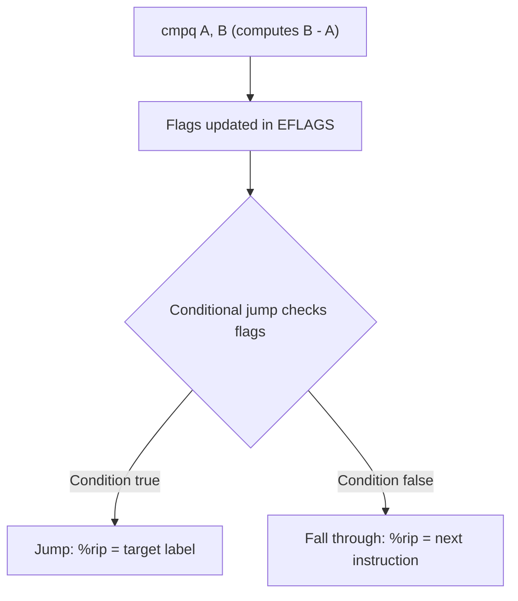

# CSE351: Jump Instructions

**Jump** (`j*`) and **Set** (`set*`) instructions work in conjunction with [[Condition Codes|condition codes]] to implement control flow in x86-64 assembly. They read the current flag state and either redirect execution or write a 0/1 boolean result.

## Jump Instructions (`j*`)

Jump instructions change the flow of execution by setting the **Program Counter** (`%rip`) to a new address if a specific condition is met.

| Instruction | Description | Condition Flag State |
|:---:|:---|:---|
| `jmp` | **Unconditional** | Always jumps |
| `je` | **Equal / Zero** | `ZF = 1` |
| `jne` | **Not Equal** | `ZF = 0` |
| `jg` | **Greater** (signed) | `SF = OF` and `ZF = 0` |
| `jge` | **Greater or Equal** (signed) | `SF = OF` |
| `jl` | **Less** (signed) | `SF ≠ OF` |
| `jle` | **Less or Equal** (signed) | `SF ≠ OF` or `ZF = 1` |
| `ja` | **Above** (unsigned) | `CF = 0` and `ZF = 0` |
| `jb` | **Below** (unsigned) | `CF = 1` |

The signed variants (`jg`, `jl`, etc.) combine the Overflow and Sign flags because signed overflow can invert the apparent sign of a subtraction result.

## Set Instructions (`set*`)

Set instructions write a 1-byte `0` or `1` into a register based on the current condition codes. They do **not** change the program counter.

```assembly
cmpq %rsi, %rdi         # Compare x and y (computes x - y, sets flags)
setg %al                # %al = 1 if x > y (signed), else 0
```

## Typical Usage Pattern

Conditional control flow always follows the same two-step sequence:

1. **Set condition codes** — use `cmp`, `test`, or an arithmetic instruction.
2. **Use the condition** — execute a `jump` or `set` based on those codes.

### Example: Conditional Jump

```assembly
cmpq %rsi, %rdi         # Compare x and y (x - y)
jg greater_label        # Jump to 'greater_label' if x > y (signed)
```

### Example: Testing for Zero

```assembly
testq %rax, %rax        # Sets ZF = 1 if %rax == 0 (AND with itself)
je is_zero              # Jump if zero
```

## Signed vs. Unsigned Jumps

Choosing the wrong family (signed vs. unsigned) is a common bug. Match the jump variant to the C type being compared.

| Signed Comparison | Unsigned Comparison | Meaning |
|:---:|:---:|:---|
| `jg` | `ja` | Greater / Above |
| `jl` | `jb` | Less / Below |
| `jge` | `jae` | Greater-or-equal / Above-or-equal |
| `jle` | `jbe` | Less-or-equal / Below-or-equal |

---



---

## Related

- [[Condition Codes|Condition Codes]]
- [[CSE351/x86-64 Assembly/Conditionals|Conditionals]]
- [[CSE351/x86-64 Assembly/Loops|Loops]]
- [[Labels|Labels]]
- [[Two's Complement|Two's Complement]]
- [[Unsigned Integers|Unsigned Integers]]

---

## Industry Standard Terms

| Course Term | Industry / Standard Term |
|:---|:---|
| `j*` jump instructions | Conditional branch instructions |
| `jmp` | Unconditional branch |
| `set*` instructions | Conditional set; Boolean materialization |
| Signed jumps (`jg`, `jl`) | Signed comparison branches |
| Unsigned jumps (`ja`, `jb`) | Unsigned comparison branches; used for pointer comparisons |
