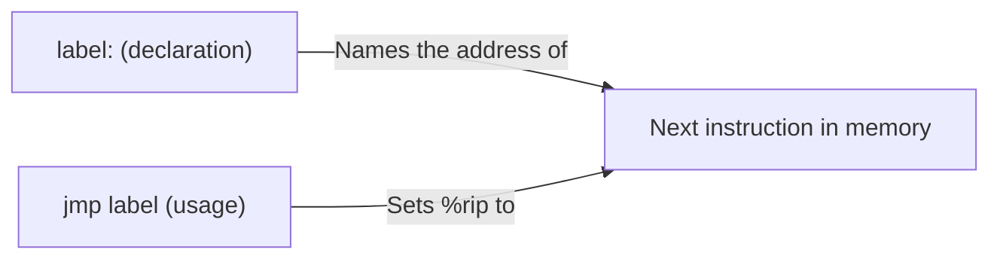

# CSE351: Labels

A **label** is a symbolic name for the memory address of the instruction that immediately follows it. Labels give human-readable names to locations in code so that jump and call instructions do not need to use raw numeric addresses.

---

## Syntax

- **Declaration:** `identifier:` (colon suffix, appears on its own line or before an instruction)
- **Usage:** `identifier` (no colon — used as the target of a jump or call)

---

## Examples

```assembly
main:               # Label declaration — 'main' names this address
    movq %rdi, %rax
    jmp done        # Label usage — jump to 'done'

done:               # Another label
    ret
```

---

## Auto-generated Labels

The compiler generates labels using a local-label convention to avoid name conflicts with programmer-defined symbols. GCC uses the format `.L#:` where `#` is a counter.

```assembly
.L1:                # Auto-generated label for loop top
    addq $1, %rax
.L2:                # Auto-generated label for loop exit
    ret
```

These labels are **not exported** from the object file (they are local to the translation unit), preventing linker conflicts.

---

## Label Association

A label is associated with the **next instruction** that follows it, ignoring blank lines and other labels. Multiple labels can name the same address (used in switch statements where multiple cases share the same code block).

---



---

## Related

- [[Jump Instructions|Jump Instructions]]
- [[CSE351/x86-64 Assembly/Conditionals|Conditionals]]
- [[CSE351/x86-64 Assembly/Loops|Loops]]
- [[Program Counter|Program Counter]]

---

## Industry Standard Terms

| Course Term | Industry / Standard Term |
|:---|:---|
| Label | Symbol; assembler label; branch target |
| `.L#:` auto-generated labels | Local labels; compiler-generated symbols (not in the symbol table) |
| Label as jump target | Branch target; code address |
| Multiple labels at same address | Aliased labels; used for fall-through cases in switch tables |
