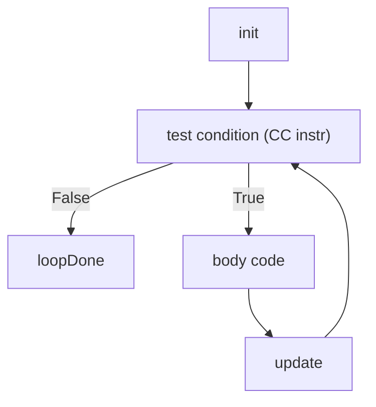

# CSE351: Loops

Loops use [[Labels|labels]] and [[Jump Instructions|jump instructions]] with **backward jumps** to repeat a block of code. The key difference from conditionals is that the jump target is earlier in the instruction stream, creating a cycle.

---

## Key Differences from If-Else

- **Backward jumps:** The jump target precedes the jump instruction in memory.
- **Timing:** Whether to evaluate the test condition before or after the body.
- **Efficiency:** Number of jump instructions executed per iteration.

---

## Do-While Loop

The body executes **first**, then the condition is tested. This is the most efficient assembly loop form because it requires only one conditional jump per iteration and no initial test.

```assembly
loopTop:
    <body code>         # Execute body first
    <CC instr>          # Set condition codes
    j* loopTop          # Jump back if condition true
loopDone:
```

**Characteristics:**
- Body executes **at least once**.
- Test at the **bottom**.
- Most efficient — one branch per iteration.

---

## While Loop (Version 1)

Tests the condition before each iteration. This adds an unconditional jump to skip back to the top.

```assembly
loopTop:
    <CC instr>          # Test first
    j*' loopDone        # Jump out if condition false (opposite jump)
    <body code>
    jmp loopTop         # Jump back unconditionally
loopDone:
```

---

## While Loop (Version 2 — Optimized)

GCC often uses this form: do one initial test, then drop into a do-while loop. This avoids the unconditional `jmp loopTop` on every iteration.

```assembly
    <CC instr>          # Initial test
    j*' loopDone        # Skip entire loop if condition initially false
loopTop:
    <body code>
    <CC instr>          # Test again at bottom
    j* loopTop          # Jump back if still true
loopDone:
```

**Why Version 2?** In the common case where the loop runs, there are fewer total jumps — the conditional branch at the bottom replaces both the backward jump and the exit check of Version 1.

---

## For Loop

A `for` loop is syntactic sugar for a while loop:

```c
for (init; test; update) { body; }
```

is equivalent to:

```c
init;
while (test) { body; update; }
```

The compiler applies the same while-loop transformation.

---

## Example: Counter Loop

```assembly
movq $0, %rcx           # counter = 0
jmp test
loop:
    # body code
    addq $1, %rcx       # counter++
test:
    cmpq $10, %rcx      # compare with limit
    jl loop             # continue if counter < 10
```

---

## Example: Array Traversal

```assembly
movq $0, %rsi           # index = 0
jmp test
loop:
    movq (%rdi,%rsi,8), %rax    # load array[index] (8-byte elements)
    # process element
    addq $1, %rsi       # index++
test:
    cmpq %rdx, %rsi     # compare index with size
    jl loop             # continue if index < size
```

---



---

## Related

- [[CSE351/x86-64 Assembly/Conditionals|Conditionals]]
- [[Jump Instructions|Jump Instructions]]
- [[Condition Codes|Condition Codes]]
- [[CSE351/Data Structures/Arrays|Arrays]]
- [[CSE351/Memory Fundamentals/Pointers|Pointer Arithmetic]]

---

## Industry Standard Terms

| Course Term | Industry / Standard Term |
|:---|:---|
| Backward jump | Backward branch; loop-closing branch |
| Do-while assembly pattern | Bottom-tested loop; post-test loop |
| While loop Version 2 | Peeled loop entry; do-while transformation (compiler optimization) |
| Loop induction variable | Induction variable; loop counter |
